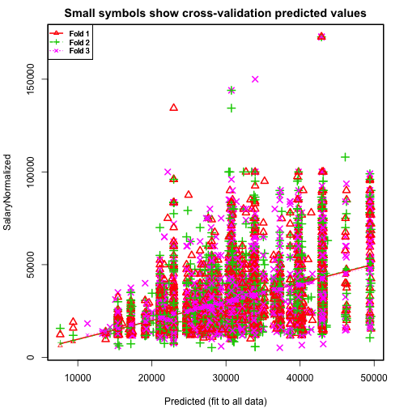

Homework 2
========================================================

[Assignment Details](https://github.com/arahuja/GADS4/wiki/Regression-Assignment)


```r
setwd("~/Documents/GeneralAssembly/GADS4/hw2/")
```


```r
trainfull <- read.csv("~/Documents/GeneralAssembly/arun/GADS4/data/kaggle_salary/train.csv")
str(trainfull)
```

```
## 'data.frame':	10000 obs. of  12 variables:
##  $ Id                : int  12612628 12612830 12612844 12613049 12613647 13179816 14131336 14663196 14663197 15395797 ...
##  $ Title             : Factor w/ 8274 levels ""," CHEF DE PARTIE  **** RED STAR  **** ROSETTE KITCHEN  **** to ****",..: 2298 7464 4177 2299 4903 2300 6854 5431 5421 7478 ...
##  $ FullDescription   : Factor w/ 9940 levels " A prestigious Broker has an opportunity for an experienced Commercial Insurance professional to work closely with some of its "| __truncated__,..: 2687 8354 4668 2686 6214 2688 237 8962 8994 448 ...
##  $ LocationRaw       : Factor w/ 2399 levels "Abbots Langley",..: 695 895 968 2061 2061 696 15 1379 1216 18 ...
##  $ LocationNormalized: Factor w/ 899 levels "Abbots Langley",..: 251 330 353 761 761 251 809 501 447 3 ...
##  $ ContractType      : Factor w/ 3 levels "","full_time",..: 1 1 1 1 1 1 1 1 1 1 ...
##  $ ContractTime      : Factor w/ 3 levels "","contract",..: 3 3 3 3 3 3 3 3 3 3 ...
##  $ Company           : Factor w/ 1198 levels "","1 1 Recruitment Limited",..: 478 478 478 478 478 478 542 265 265 542 ...
##  $ Category          : Factor w/ 28 levels "Accounting & Finance Jobs",..: 9 9 9 9 9 9 9 13 13 9 ...
##  $ SalaryRaw         : Factor w/ 5780 levels " 20 - 25k Basic,  70 - 75K OTE+++",..: 1368 2028 1386 2005 1368 1372 3478 1101 1105 3980 ...
##  $ SalaryNormalized  : int  25000 30000 30000 27500 25000 25000 75000 22000 23000 85000 ...
##  $ SourceName        : Factor w/ 74 levels "accountancyagejobs.com",..: 9 9 9 9 9 9 9 9 9 9 ...
```


Taken from [kaggle site](http://www.kaggle.com/c/job-salary-prediction/data).
* ID - key of the row, should be unique
* Title - Title of the job ad
* FullDescription - body of job add. Numerics have been replaced by astericks to
remove salary info, may have removed other numbers.
* LocationRaw - Location of job
* LocationNormalized - Adzuna's interpretaion of the location
* ContractType - Full time (2978), part time(578), or blank (6444)
* ContractTime - contract (605), permanent(4132), or blank (5263)
* Company - employer name
* Category - 30 standard jobs as defined by adzuna
* SalaryRaw - text of salary from employer 
* SalaryNormalized - value of salary - *Predict this*
* SourceName - website where job was advertised

We're prdiciting SalaryNormalized, so let's check it out a little:

```r
summary(trainfull$SalaryNormalized)
```

```
##    Min. 1st Qu.  Median    Mean 3rd Qu.    Max. 
##    5180   20600   27500   31500   37500  173000
```

```r
hist(trainfull$SalaryNormalized)
```

 

```r
hist(log(trainfull$SalaryNormalized))
```

 

SalaryNormalized is pretty skewed, but log(SalaryNormalized) looks pretty
gaussian, so let's predict that instead

```r
trainfull$LogSalary <- log(trainfull$SalaryNormalized)
```


### Problem 1: Split the data into training and test sets.

I'll do 90/10 train/validate. I liked Aaron's fold field that he showed in class.


```r

m = nrow(trainfull)  # number of rows
trainfull$fold <- sample(1:10, m, replace = T)

n = 1
validate <- trainfull[trainfull$fold == n]
```

```
## Error: undefined columns selected
```

```r
train <- trainfull[trainfull$fold != n, ]
```


### Problem 2: Build a simple linear regression using the available categorical variables.

Before doing the regression, let's define a coupe functions to make life cleaner:


```r

mae <- function(values, predictions) {
    return(mean(abs(values - predictions), na.rm = T))
}

hw2.cv <- function(form, data) {
    r.squares <- c()
    train_mae <- c()
    test_mae <- c()
    for (i in 1:max(data$fold)) {
        train <- data[data$fold != i, ]
        test <- data[data$fold == i, ]
        
        model <- lm(form, data = train)
        
        r.squares <- c(r.squares, summary(model)$r.squared)
        trainPredictions <- exp(predict(model, train))
        testPredictions <- exp(predict(model, test))
        
        train_mae <- c(train_mae, mae(train$SalaryNormalized, trainPredictions))
        test_mae <- c(test_mae, mae(test$SalaryNormalized, testPredictions))
    }
    cat("Mean R.Squared: ", mean(r.squares))
    cat(" Mean Training MAE: ", mean(train_mae))
    cat(" Mean Test Set MAE: ", mean(test_mae))
    return(model)
}

reduceFactors <- function(frame, field, newname, number) {
    factorsToKeep <- names(sort(summary(frame[, c(field)]), decreasing = T)[1:number])
    frame[, c(newname)] <- factor(frame[, c(field)], levels = factorsToKeep)
    return(frame)
}
```


Without some text parsing, title, full description, and LocationRaw are useless.
Company has 10% the number of values as we have jobs, and using the raw company name seems limiting. You could probably do something fun with classifying the employer by name, but that's for another time (and category probably already includes some of that information)
ContractTime and ContractType worry me since over half of the jobs have blanks for these fields, but there is some additional info for some of the listings.
Category, LocationNormalized, and SourceName look like the best places to start, even if category and LocationNormalized have Adzuna's intrepretation built in.


```r
model <- lm(LogSalary ~ Category + LocationNormalized + SourceName, data = train)
summary(model)$r.squared
```

```
## [1] 0.3965
```

```r
trainPredictions <- exp(predict(model, train))
mae(train$SalaryNormalized, trainPredictions)
```

```
## [1] 8529
```

```r
testPredictions <- exp(predict(model, validate))
```

```
## Error: object 'validate' not found
```

```r
mae(validate$SalaryNormalized, testPredictions)
```

```
## Error: error in evaluating the argument 'x' in selecting a method for
## function 'mean': Error: object 'validate' not found
```

This regression takes too long on the 10k set, and LocationNormalized has too
many levels (there are locations in the test set that don't appear in the traing set.) Let's ditch LocationNormalized for now and go back to just Category and
just SourceName


```r
form <- LogSalary ~ Category
model <- hw2.cv(form, trainfull)
```

```
## Mean R.Squared:  0.1832 Mean Training MAE:  10143 Mean Test Set MAE:  10164
```


The category factors alone are significant, but don't explain much of the variance, hence the low R squared and the relatively high MAE for both the training and test sets. Now just SourceName:


```r
form <- LogSalary ~ SourceNameReduced
trainfull <- reduceFactors(trainfull, "SourceName", "SourceNameReduced", 20)
model <- hw2.cv(form, trainfull)
```

```
## Mean R.Squared:  0.1912 Mean Training MAE:  9785 Mean Test Set MAE:  9805
```

The test set has some SourceName that aren't in the training set, blerg.
I set those to NA and had predict ignore them, and mae() ignores NA as well.

So SourceName does marginally better than Category, but has issues with
having enough data in each category. This could improve with more data.

Let's check out ContractType and ContractTime


```r
form <- LogSalary ~ ContractType + ContractTime
model <- hw2.cv(form, trainfull)
```

```
## Mean R.Squared:  0.1025 Mean Training MAE:  10565 Mean Test Set MAE:  10567
```


These are crap for R squared, but the coefficients are significant, so may be
worth including with category. Soooo, let's see what we have with 
category and contracttime/type


```r
form <- LogSalary ~ Category + ContractType + ContractTime
model <- hw2.cv(form, trainfull)
```

```
## Mean R.Squared:  0.238 Mean Training MAE:  9766 Mean Test Set MAE:  9788
```

Getting better, but 10k mean absolute error is pretty crap when the mean is 30k.
Last attempt for This problem: Category, ContractType/Time, and SourceName, and we'll ignore the mismatched SourceNames for now.


```r
trainfull <- reduceFactors(trainfull, "Category", "CategoryReduced", 20)
form <- LogSalary ~ SourceNameReduced + CategoryReduced + ContractTime + ContractTime
model <- hw2.cv(form, trainfull)
```

```
## Mean R.Squared:  0.2383 Mean Training MAE:  9512 Mean Test Set MAE:  9552
```


Well, this one has the best R-Squared of the fast models, 
and the training and test MAEs
are the lowest, but they still aren't impressive.

I just re-read the instructions and realize I forgot to try interaction terms.
Here it goes


```r
form <- LogSalary ~ SourceNameReduced + CategoryReduced + ContractTime + ContractType + 
    CategoryReduced:ContractTime + CategoryReduced:ContractType + ContractType:ContractTime
model <- hw2.cv(form, trainfull)
```

```
## Warning: prediction from a rank-deficient fit may be misleading
```

```
## Warning: prediction from a rank-deficient fit may be misleading
```

```
## Warning: prediction from a rank-deficient fit may be misleading
```

```
## Warning: prediction from a rank-deficient fit may be misleading
```

```
## Warning: prediction from a rank-deficient fit may be misleading
```

```
## Warning: prediction from a rank-deficient fit may be misleading
```

```
## Warning: prediction from a rank-deficient fit may be misleading
```

```
## Warning: prediction from a rank-deficient fit may be misleading
```

```
## Warning: prediction from a rank-deficient fit may be misleading
```

```
## Warning: prediction from a rank-deficient fit may be misleading
```

```
## Warning: prediction from a rank-deficient fit may be misleading
```

```
## Warning: prediction from a rank-deficient fit may be misleading
```

```
## Warning: prediction from a rank-deficient fit may be misleading
```

```
## Warning: prediction from a rank-deficient fit may be misleading
```

```
## Warning: prediction from a rank-deficient fit may be misleading
```

```
## Warning: prediction from a rank-deficient fit may be misleading
```

```
## Warning: prediction from a rank-deficient fit may be misleading
```

```
## Warning: prediction from a rank-deficient fit may be misleading
```

```
## Warning: prediction from a rank-deficient fit may be misleading
```

```
## Warning: prediction from a rank-deficient fit may be misleading
```

```
## Mean R.Squared:  0.3038 Mean Training MAE:  9046 Mean Test Set MAE:  9164
```

The R-Squared is better, and the training MAE is as well, but the test set MAE isn't significantly better, maybe this is approaching ooverfitting? There are plenty of Category:ContractType and Category:ContractTime that are missing in the training set. This model might be best attempted with a larger training set. I'll try a larger set before submitting the final predicitons.

### Problem 3: Install DAAG
Try out cv.lm to see about improving the models


```r
library("DAAG")
model <- lm(SalaryNormalized ~ Category + ContractType + ContractTime, data = trainfull)
test <- cv.lm(trainfull, model, m = 3)
```

```
## Analysis of Variance Table
## 
## Response: SalaryNormalized
##                Df   Sum Sq  Mean Sq F value Pr(>F)    
## Category       27 3.97e+11 1.47e+10    69.5 <2e-16 ***
## ContractType    2 3.27e+10 1.64e+10    77.3 <2e-16 ***
## ContractTime    2 6.99e+10 3.49e+10   165.1 <2e-16 ***
## Residuals    9968 2.11e+12 2.12e+08                   
## ---
## Signif. codes:  0 '***' 0.001 '**' 0.01 '*' 0.05 '.' 0.1 ' ' 1
```

```
## Warning:
## 
## As there is >1 explanatory variable, cross-validation predicted values for
## a fold are not a linear function of corresponding overall predicted
## values.  Lines that are shown for the different folds are approximate
```

 

```
## 
## fold 1 
## Observations in test set: 3333 
##                      2     3     4     7    12     16    17    19    22
## Predicted        33774 33774 33774 33774 36429  33774 33774 33774 21081
## cvpred           33935 33935 33935 33935 36124  33935 33935 33935 21227
## SalaryNormalized 30000 30000 27500 75000 37500  22000 85000 39500 17280
##                     23    24    30    31    43    50    52     54     55
## Predicted        33774 33774 21081 21081 40234 21683 42963  42963  49423
## cvpred           33935 33935 21227 21227 40971 21434 42716  42716  49752
## SalaryNormalized 41500 31500 31500 30000 76800 11673 35000  25000  28500
##                      57    62     63    71    77    79    81    85    88
## Predicted         42963 30380  30380 33774 21081 33774 21081 33774 21081
## cvpred            42716 30935  30935 33935 21227 33935 21227 33935 21227
## SalaryNormalized  25000 40000  20000 48500 17000 42000 18000 42000 17500
##                    101   103   109   110   113   117   119   123   124
## Predicted        21081 21081 21081 21081 21081 21081 21683 33774 33774
## cvpred           21227 21227 21227 21227 21227 21227 21434 33935 33935
## SalaryNormalized 22000 26500 18000 15500 14000 18000 12000 50000 42500
##                    126   127    129    134    136   137   141   145   146
## Predicted        21081 21081  30380  42963  42963 21081 21081 21081 21081
## cvpred           21227 21227  30935  42716  42716 21227 21227 21227 21227
## SalaryNormalized 17500 17000  20500  23500  25000 22500 23500 20000 15500
##                    147   155   160    163   164   168    169   170   171
## Predicted        30380 25366 21081  33774 33774 21683  28143 21110 21081
## cvpred           30935 25535 21227  33935 33935 21434  28471 20153 21227
## SalaryNormalized 50000 21000 23000  22000 66500 12000  10905 17377 16500
##                    174    175   176   181    184    186    191   192   196
## Predicted        33774  33774 33774 39634  30889  30889  30889 30889 30889
## cvpred           33935  33935 33935 39426  31129  31129  31129 31129 31129
## SalaryNormalized 24854  22617 24000 32500  14256  18000  18000 50000 30000
##                    197   202   203   204   210    215   219   228   232
## Predicted        30889 22945 30889 30889 30889  30889 30889 30889 30730
## cvpred           31129 22279 31129 31129 31129  31129 31129 31129 30710
## SalaryNormalized 27000 25267 23040 30500 22560  11673 25440 27000 33600
##                    236   238   240   241   247   249   252   254    255
## Predicted        30889 30889 22945 22945 30730 30889 30889 30730  30730
## cvpred           31129 31129 22279 22279 30710 31129 31129 30710  30710
## SalaryNormalized 42500 42500 14880 20160 48000 48000 22080 33600  13440
##                    257   258   262   263    265    267   272   274    277
## Predicted        30730 30730 30730 30889  30730  22945 30889 30889  30730
## cvpred           30710 30710 30710 31129  30710  22279 31129 31129  30710
## SalaryNormalized 44640 33600 33600 27206  11856  11856 26500 85000  15446
##                    283   284   285   291    292   293   294   297   298
## Predicted        30889 30889 22945 30889  30730 22945 22945 30889 30889
## cvpred           31129 31129 22279 31129  30710 22279 22279 31129 31129
## SalaryNormalized 36850 27000 15024 27206  11673 16320 34560 25500 26000
##                    299   300   309   316   318   324   325   327   328
## Predicted        30889 22945 22945 30889 22945 22945 22945 22945 30889
## cvpred           31129 22279 22279 31129 22279 22279 22279 22279 31129
## SalaryNormalized 25920 15523 16320 24000 17280 45120 15360 14880 29000
##                    330   331   334   344   345   346   347   348   354
## Predicted        22945 22945 22945 22945 22945 22945 30889 22945 22945
## cvpred           22279 22279 22279 22279 22279 22279 31129 22279 22279
## SalaryNormalized 13516 13440 13440 14476 15840 14476 32000 15360 13766
##                    361   364   365   366   368   371   373   374    375
## Predicted        30730 30889 22945 22945 22945 22945 30730 30730  30889
## cvpred           30710 31129 22279 22279 22279 22279 30710 30710  31129
## SalaryNormalized 44640 37500 16320 16320 16320 16320 39840 39840  19000
##                    377   378   381   382    385   386   387   388   398
## Predicted        30730 30889 22945 22945  30889 22945 30730 22945 22945
## cvpred           30710 31129 22279 22279  31129 22279 30710 22279 22279
## SalaryNormalized 39840 54720 17280 15523  12432 14400 67200 18240 36480
##                    403   404   408   411   413   414   417   421   422
## Predicted        30730 30730 22945 22945 22945 22945 22945 22945 30889
## cvpred           30710 30710 22279 22279 22279 22279 22279 22279 31129
## SalaryNormalized 42432 36480 48000 16694 47913 18240 15552 34560 56000
##                    423   426   431   434   435   438   439   442   447
## Predicted        22945 22945 30889 22945 22945 22945 22945 22945 22945
## cvpred           22279 22279 31129 22279 22279 22279 22279 22279 22279
## SalaryNormalized 34560 16320 22000 15360 15360 17280 17280 17280 17280
##                    448   449   451   459   461   465   467   468   469
## Predicted        30889 30730 22945 22945 22945 22945 22945 22945 22945
## cvpred           31129 30710 22279 22279 22279 22279 22279 22279 22279
## SalaryNormalized 22080 39840 15360 14016 15360 15552 16051 17875 17875
##                    470   472   473   474   476   478   481   482   485
## Predicted        22945 22945 22945 22945 22945 22945 22945 22945 22945
## cvpred           22279 22279 22279 22279 22279 22279 22279 22279 22279
## SalaryNormalized 17875 17875 17875 17875 17875 17875 17875 17875 16320
##                     486   487   488   489   493   496   497   498   502
## Predicted         30889 30730 30730 22945 30889 30889 30889 22945 30889
## cvpred            31129 30710 30710 22279 31129 31129 31129 22279 31129
## SalaryNormalized  16320 79680 79680 22080 24518 51840 26500 17280 23040
##                    503   507    509   510   511   514   516   517   518
## Predicted        30889 30889  30730 22945 22945 22945 30889 30889 30889
## cvpred           31129 31129  30710 22279 22279 22279 31129 31129 31129
## SalaryNormalized 39000 34000  19200 15360 15456 15360 22080 22080 22080
##                    519   521   525   526   528   529   530   533   536
## Predicted        30889 30730 22945 30889 30889 30889 30889 30730 22945
## cvpred           31129 30710 22279 31129 31129 31129 31129 30710 22279
## SalaryNormalized 39000 30528 14880 26400 45000 47500 28500 39840 12960
##                    537   539   541   542   543   544   547   548    550
## Predicted        22945 22945 30889 30889 30889 30889 22945 22945  30730
## cvpred           22279 22279 31129 31129 31129 31129 22279 22279  30710
## SalaryNormalized 17328 13996 34000 42500 42500 25500 39360 38400  12345
##                    551   552   555   556   558    559    560   561   563
## Predicted        30889 30889 22945 30889 22945  30730  30889 22945 22945
## cvpred           31129 31129 22279 31129 22279  30710  31129 22279 22279
## SalaryNormalized 24000 24000 14688 39000 15360  15014  15024 14544 15360
##                    567   570    571   574   575   577   581   584   586
## Predicted        22945 22945  30730 30889 22945 22945 30730 30730 30889
## cvpred           22279 22279  30710 31129 22279 22279 30710 30710 31129
## SalaryNormalized 17280 13440  17145 47040 15552 13843 45120 45600 24000
##                    592   593   594   597   601   605   609   610    615
## Predicted        22945 30889 30889 22945 22945 22945 30889 30889  30889
## cvpred           22279 31129 31129 22279 22279 22279 31129 31129  31129
## SalaryNormalized 12345 24000 24000 20160 14640 18240 37000 42500  12345
##                    620   623   625   637   638   639   642    651   660
## Predicted        22945 22945 22945 22945 30889 30889 22945  30889 30889
## cvpred           22279 22279 22279 22279 31129 31129 22279  31129 31129
## SalaryNormalized 15792 17990 19872 20160 23280 23040 21120  17280 25000
##                    663   664    671    673   677   679   687   692   695
## Predicted        30889 30889  30889  30889 30889 30889 30889 30889 30889
## cvpred           31129 31129  31129  31129 31129 31129 31129 31129 31129
## SalaryNormalized 23151 28500  12556  11884 35500 40500 24500 24100 40000
##                    697   698   701   705   713   718   719   723   726
## Predicted        30889 30889 30889 30889 30889 30889 30889 30889 30889
## cvpred           31129 31129 31129 31129 31129 31129 31129 31129 31129
## SalaryNormalized 80500 25000 42500 24250 40000 24000 50000 47500 41000
##                     728   730   742   745   746   749   754   755   756
## Predicted         30889 30889 30889 22945 30889 30889 30889 30889 22945
## cvpred            31129 31129 31129 22279 31129 31129 31129 31129 22279
## SalaryNormalized  18000 40000 24350 30000 31500 26500 37000 24480 16041
##                    757   762   765   769   777   784   791   794    800
## Predicted        30889 22945 30889 30889 30889 30889 30889 22945  30889
## cvpred           31129 22279 31129 31129 31129 31129 31129 22279  31129
## SalaryNormalized 30000 19000 37500 24000 28500 22080 39000 17875  12576
##                    807   815   831    833   834   845   850   853   854
## Predicted        22945 30889 22945  22945 22945 30730 30730 30889 30889
## cvpred           22279 31129 22279  22279 22279 30710 30710 31129 31129
## SalaryNormalized 18624 47500 12960  11673 21120 41500 24500 24000 26000
##                    863    868   870   872   873    876   878   883   885
## Predicted        30889  30889 30730 30889 30889  30889 30889 30889 30889
## cvpred           31129  31129 30710 31129 31129  31129 31129 31129 31129
## SalaryNormalized 28500  16250 35500 28000 26000  13708 26000 32000 60000
##                    898   900   905   907   913   916   918    919   922
## Predicted        30730 30889 30730 30889 22945 22945 30889  30889 30730
## cvpred           30710 31129 30710 31129 22279 22279 31129  31129 30710
## SalaryNormalized 42240 34500 30528 27500 15408 14160 37500  21120 25575
##                    924   931   935   938   942   943   945   946    958
## Predicted        30730 22945 30730 30730 22945 22945 30730 30889  30730
## cvpred           30710 22279 30710 30710 22279 22279 30710 31129  30710
## SalaryNormalized 42240 14256 21500 25920 17280 38400 24300 23040  15360
##                    959   961   968   979    981    984   997  1002  1007
## Predicted        30730 22945 30889 30889  30889  30889 30889 30889 30889
## cvpred           30710 22279 31129 31129  31129  31129 31129 31129 31129
## SalaryNormalized 25000 50000 24500 28500  17280  15360 25250 27000 26880
##                   1012  1014  1019  1022  1027  1034  1041  1042  1052
## Predicted        30889 30889 22945 22945 30889 30889 30889 30889 30889
## cvpred           31129 31129 22279 22279 31129 31129 31129 31129 31129
## SalaryNormalized 28500 24500 19200 15408 23040 35500 51840 36500 31680
##                   1053  1055  1057  1061  1066  1069  1070   1071  1074
## Predicted        30889 30889 30889 30889 30889 30889 22945  30889 30889
## cvpred           31129 31129 31129 31129 31129 31129 22279  31129 31129
## SalaryNormalized 42500 52800 24500 31000 41000 44000 21120  13996 28500
##                   1076  1079   1080  1083  1085  1088  1092  1094  1096
## Predicted        30889 30730  30889 30889 22945 30889 30889 30730 30889
## cvpred           31129 30710  31129 31129 22279 31129 31129 30710 31129
## SalaryNormalized 25000 24336  20000 51840 15360 42500 42500 42240 38000
##                   1101  1105  1109  1112  1114  1117  1118  1119  1120
## Predicted        30889 30889 30889 30730 30730 30730 30730 30730 30889
## cvpred           31129 31129 31129 30710 30710 30710 30710 30710 31129
## SalaryNormalized 35000 24000 62500 29000 24960 28500 27500 23040 27500
##                   1126  1128  1129  1135  1137  1144  1148   1156  1159
## Predicted        30730 30889 30730 30889 30730 30730 30730  30730 30730
## cvpred           30710 31129 30710 31129 30710 30710 30710  30710 30710
## SalaryNormalized 39360 52500 43728 24000 40320 60480 32500  17500 29750
##                   1163  1164  1166  1170  1172  1175  1177  1178  1190
## Predicted        30889 30889 30889 30730 30730 30889 30889 30730 30730
## cvpred           31129 31129 31129 30710 30710 31129 31129 30710 30710
## SalaryNormalized 27500 36000 35000 30000 53760 62500 77500 30500 26500
##                   1192  1202  1203  1204  1207  1211  1215  1216  1218
## Predicted        30889 30730 30730 30730 30730 30730 22945 30730 30730
## cvpred           31129 30710 30710 30710 30710 30710 22279 30710 30710
## SalaryNormalized 21500 29000 25000 25500 26000 52500 83520 34000 27000
##                   1219  1220   1223  1224  1226  1227  1235  1244  1248
## Predicted        30730 30730  30730 30730 30730 30730 30730 30730 30889
## cvpred           30710 30710  30710 30710 30710 30710 30710 30710 31129
## SalaryNormalized 26000 24500  14586 24000 22080 24500 26000 26000 36000
##                   1249  1250  1252  1253  1254   1263  1265  1266  1268
## Predicted        30730 30730 30730 30730 30730  30730 30730 30730 30730
## cvpred           30710 30710 30710 30710 30710  30710 30710 30710 30710
## SalaryNormalized 24000 26000 25500 57000 24440  17500 39435 28000 23500
##                   1269  1270  1272  1278  1281   1284  1285  1286   1288
## Predicted        30730 30730 30730 30889 30730  30730 30730 30730  30730
## cvpred           30710 30710 30710 31129 30710  30710 30710 30710  30710
## SalaryNormalized 27500 26000 28333 32500 24232  13500 25974 41280  19650
##                   1292  1293  1294  1298  1301  1306   1307  1308  1313
## Predicted        30730 30889 30730 30889 30889 30730  30730 30730 30889
## cvpred           30710 31129 30710 31129 31129 30710  30710 30710 31129
## SalaryNormalized 24500 45000 23088 46500 33500 30250  16200 35500 26500
##                   1317  1318  1322  1323  1325  1326  1327  1330  1336
## Predicted        30730 30730 30730 30730 30730 30730 30889 30889 30889
## cvpred           30710 30710 30710 30710 30710 30710 31129 31129 31129
## SalaryNormalized 41000 41000 26325 40000 25000 25920 37500 23500 40000
##                   1339  1351   1352  1357  1359  1362  1364  1366  1367
## Predicted        30730 30730  30730 30730 30730 30730 30889 30889 30730
## cvpred           30710 30710  30710 30710 30710 30710 31129 31129 30710
## SalaryNormalized 28250 55680  15360 25500 22000 24500 28800 27250 24500
##                   1368  1369  1371  1374  1375  1376  1378  1379  1380
## Predicted        30889 30889 30730 30889 30889 30730 22945 30889 30889
## cvpred           31129 31129 30710 31129 31129 30710 22279 31129 31129
## SalaryNormalized 27250 27500 24500 28500 29500 42500 18240 22500 22500
##                   1381  1390  1391  1394  1403  1404  1406  1408  1415
## Predicted        30730 30730 30730 30730 42963 21081 30730 30889 30889
## cvpred           30710 30710 30710 30710 42716 21227 30710 31129 31129
## SalaryNormalized 23040 26500 83520 83520 37500 36000 23810 26000 25250
##                   1416  1420  1422  1426  1428  1429  1430  1431   1436
## Predicted        30730 30730 30889 30730 30730 30889 30889 30730  30730
## cvpred           30710 30710 31129 30710 30710 31129 31129 30710  30710
## SalaryNormalized 24000 42000 29000 24336 27131 23000 37500 29500  19500
##                   1437  1438  1439   1445  1447  1451  1455  1457  1458
## Predicted        30730 30730 30730  30730 30730 30730 30730 30730 30730
## cvpred           30710 30710 30710  30710 30710 30710 30710 30710 30710
## SalaryNormalized 55000 23500 24500  20160 22700 25450 21000 27000 25500
##                   1473  1489  1492   1495  1498  1499  1503  1504  1507
## Predicted        30889 30730 30730  30889 30730 30730 30730 30730 30730
## cvpred           31129 30710 30710  31129 30710 30710 30710 30710 30710
## SalaryNormalized 36500 34000 42240  15360 25500 30500 25000 28000 25500
##                   1509  1514  1515  1522  1523  1524  1527  1528  1536
## Predicted        30730 30730 30730 30730 30889 30730 30889 30889 21081
## cvpred           30710 30710 30710 30710 31129 30710 31129 31129 21227
## SalaryNormalized 27000 24000 23000 24000 22500 24364 38500 47500 47500
##                   1552  1556  1560  1561  1562  1563  1566  1570  1574
## Predicted        30889 30730 30730 30889 30730 30730 22945 22945 30730
## cvpred           31129 30710 30710 31129 30710 30710 22279 22279 30710
## SalaryNormalized 62500 24000 28520 41000 23250 42500 13824 13977 45000
##                   1575  1577  1581  1583  1584  1591  1592  1595  1599
## Predicted        30730 30889 30730 30889 30730 30730 30730 30730 33774
## cvpred           30710 31129 30710 31129 30710 30710 30710 30710 33935
## SalaryNormalized 22000 37500 44160 31000 33500 33500 21120 25920 52500
##                   1605   1612  1614  1620   1623  1624  1625  1629  1637
## Predicted        21081  30889 30889 30889  30730 30730 30730 30730 21081
## cvpred           21227  31129 31129 31129  30710 30710 30710 30710 21227
## SalaryNormalized 17000  18710 42500 24000  13500 27840 26500 38400 15500
##                   1639  1640  1642  1643   1644  1649   1659  1661  1665
## Predicted        22945 22945 30889 30730  30730 30730  39634 30889 30730
## cvpred           22279 22279 31129 30710  30710 30710  39426 31129 30710
## SalaryNormalized 18048 18048 42500 42500  10000 42000  17500 42000 25000
##                   1670  1671  1673  1674  1676   1677  1680  1685  1686
## Predicted        30730 30889 30730 30730 30730  30730 30730 30730 30730
## cvpred           30710 31129 30710 30710 30710  30710 30710 30710 30710
## SalaryNormalized 24429 30750 22145 35000 22932  14000 28000 26500 21307
##                   1687   1690  1693  1695  1696  1697   1702   1705  1707
## Predicted        30730  30730 30730 30730 22945 22945  30730  30730 30730
## cvpred           30710  30710 30710 30710 22279 22279  30710  30710 30710
## SalaryNormalized 27118  17000 22080 23000 83520 83520  19512  17150 35500
##                   1714  1715  1716  1718  1719  1725   1729  1732  1733
## Predicted        30730 30730 30730 30730 30730 30730  40234 25366 21081
## cvpred           30710 30710 30710 30710 30710 30710  40971 25535 21227
## SalaryNormalized 24960 22464 37408 22500 42240 20729  23040 55000 19000
##                   1742  1745  1747  1748  1749  1760  1762   1764   1766
## Predicted        21081 30889 30730 30730 30730 30730 30730  33774  33774
## cvpred           21227 31129 30710 30710 30710 30710 30710  33935  33935
## SalaryNormalized 16000 42500 28823 26880 42500 36750 32200  19200  19200
##                    1767  1768  1771  1772  1777  1778   1780  1782  1786
## Predicted         33774 42963 42963 42963 21081 21683  30906 21081 22945
## cvpred            33935 42716 42716 42716 21227 21434  30530 21227 22279
## SalaryNormalized  19200 63750 63750 47500 15500 32500  19000 31000 19000
##                   1787   1790  1792   1794  1798  1800  1803  1804   1807
## Predicted        30889  30730 30730  30889 30730 30730 30730 30730  30889
## cvpred           31129  30710 30710  31129 30710 30710 30710 30710  31129
## SalaryNormalized 25000  20600 28000  18000 28000 30000 28750 22500  14880
##                   1808  1810  1815  1818  1821   1823   1824   1826  1829
## Predicted        30889 30730 22945 30730 46094  30889  30889  39634 21110
## cvpred           31129 30710 22279 30710 46462  31129  31129  39426 20153
## SalaryNormalized 33000 26500 18240 40000 57600  13440  13440  20000 14500
##                   1831  1837  1839  1841  1843  1848   1849  1850  1852
## Predicted        21110 21110 30380 42963 21683 30730  30730 30730 30889
## cvpred           20153 20153 30935 42716 21434 30710  30710 30710 31129
## SalaryNormalized 27500 19750 29925 33000 17250 22500  13516 28000 25920
##                   1856  1863  1864  1868  1870  1873  1874  1879  1881
## Predicted        30730 30730 30730 30730 30889 30889 30889 30889 22945
## cvpred           30710 30710 30710 30710 31129 31129 31129 31129 22279
## SalaryNormalized 23500 23500 22744 39000 26000 26000 26000 26000 18240
##                   1883  1890  1893  1899   1902  1904  1910  1911  1917
## Predicted        30889 30730 30889 30730  30730 30730 30889 30889 30730
## cvpred           31129 30710 31129 30710  30710 30710 31129 31129 30710
## SalaryNormalized 25000 29500 30000 36000  17000 28000 25500 38000 37500
##                   1920  1921  1922  1925  1930  1931  1932  1935  1936
## Predicted        30730 30730 30730 22945 30889 30730 30730 30889 30730
## cvpred           30710 30710 30710 22279 31129 30710 30710 31129 30710
## SalaryNormalized 56640 25250 52800 17280 27500 24746 26500 23000 23400
##                   1937  1940  1943  1945  1946  1948   1949  1950  1951
## Predicted        30730 33774 39634 31585 21683 30889  30730 22945 30889
## cvpred           30710 33935 39426 29144 21434 31129  30710 22279 31129
## SalaryNormalized 42500 42500 30000 55000 20000 28500  14880 15360 28500
##                   1954   1958  1967  1968  1970  1978  1980   1987  1989
## Predicted        30889  30730 30730 30889 21081 22945 22945  22945 22945
## cvpred           31129  30710 30710 31129 21227 22279 22279  22279 22279
## SalaryNormalized 26000  14676 33000 28500 25000 14880 14880   8160 17280
##                   1990  1992  1995  1996  2001  2002  2004  2005  2010
## Predicted        30889 30730 30730 30730 30730 30730 30730 30730 30730
## cvpred           31129 30710 30710 30710 30710 30710 30710 30710 30710
## SalaryNormalized 57500 38400 49920 60480 24000 27840 27840 24960 29000
##                   2014  2016  2019  2020   2024  2027  2029  2030  2033
## Predicted        30730 30730 21081 21081  38663 32204 32204 32204 32204
## cvpred           30710 30710 21227 21227  38998 31962 31962 31962 31962
## SalaryNormalized 25209 24500 17000 18000  11673 35000 35000 22000 40000
##                   2036  2037  2038  2040  2042  2043  2044  2045  2047
## Predicted        32204 32204 32204 22945 22945 21081 21081 21081 33935
## cvpred           31962 31962 31962 22279 22279 21227 21227 21227 34012
## SalaryNormalized 39000 37500 35000 21600 21600 18500 16000 25000 65000
##                   2048  2049  2051  2057  2058  2059  2061  2070  2072
## Predicted        39634 33774 32204 30730 30730 30730 30730 30730 30730
## cvpred           39426 33935 31962 30710 30710 30710 30710 30710 30710
## SalaryNormalized 55000 32500 47500 28337 23000 21120 30000 35000 39000
##                   2075  2078  2080   2088  2089   2092  2093  2094   2097
## Predicted        30730 30730 30730  30730 21081  39634 21081 27179  30730
## cvpred           30710 30710 30710  30710 21227  39426 21227 27004  30710
## SalaryNormalized 74880 24100 23400  15184 26500  29000 18000 20000  19500
##                   2100  2102  2106  2109  2111  2116   2120   2121   2123
## Predicted        30730 30730 30730 30730 21081 21081  33774  40234  33774
## cvpred           30710 30710 30710 30710 21227 21227  33935  40971  33935
## SalaryNormalized 26000 23500 34549 36480 16000 16500  21120  23040  19200
##                   2126  2128  2130  2134  2135  2143  2151   2152  2165
## Predicted        30730 30730 30730 30730 30889 30730 21081  39634 30730
## cvpred           30710 30710 30710 30710 31129 30710 21227  39426 30710
## SalaryNormalized 28500 39063 35000 34000 28250 43200 23000  25000 28080
##                   2168  2172  2174  2177  2178   2179  2180  2182  2185
## Predicted        30730 21081 30906 46124 21081  31585 33774 22945 22945
## cvpred           30710 21227 30530 44493 21227  29144 33935 22279 22279
## SalaryNormalized 40000 22500 60000 57500 21000  15000 27000 15360 13440
##                   2190   2192  2195  2201  2202  2203   2204   2207  2209
## Predicted        30730  30730 30730 30730 30889 30730  30730  30730 30889
## cvpred           30710  30710 30710 30710 31129 30710  30710  30710 31129
## SalaryNormalized 57600  20400 48000 83520 25250 25500  11593  14550 52500
##                   2213  2214  2218  2219  2221  2225  2235  2236  2238
## Predicted        30730 21081 21081 21081 21081 21081 30730 30730 21110
## cvpred           30710 21227 21227 21227 21227 21227 30710 30710 20153
## SalaryNormalized 28500 17500 13500 16500 17000 45000 25000 24000 14894
##                    2239  2241  2242  2248  2254   2255  2262  2265  2266
## Predicted         42963 37103 33774 30730 30889  30889 30730 30730 21081
## cvpred            42716 36431 33935 30710 31129  31129 30710 30710 21227
## SalaryNormalized  30000 45000 25000 22080 28500  19750 23744 28250 19000
##                   2274  2278  2280  2285  2286   2290  2293  2295  2301
## Predicted        21081 22945 30889 30730 22945  30730 30889 30730 30889
## cvpred           21227 22279 31129 30710 22279  30710 31129 30710 31129
## SalaryNormalized 14000 12864 32500 34000 36000  20650 27500 36480 27840
##                    2304  2308  2313  2316  2317  2318  2321  2323  2324
## Predicted         30730 21081 30889 30730 30889 30889 30730 30730 30730
## cvpred            30710 21227 31129 30710 31129 31129 30710 30710 30710
## SalaryNormalized  10678 27000 27000 42500 62500 40000 32000 38400 24000
##                   2325  2327  2329  2332  2334  2335  2337  2338  2346
## Predicted        30730 30730 30889 30889 30730 30730 30730 21081 33774
## cvpred           30710 30710 31129 31129 30710 30710 30710 21227 33935
## SalaryNormalized 24040 21000 42500 33750 28800 28800 28800 21500 40000
##                   2347  2353   2354   2357  2361  2362  2363  2365   2367
## Predicted        30889 30730  30730  30730 30730 30889 30889 30730  30730
## cvpred           31129 30710  30710  30710 30710 31129 31129 30710  30710
## SalaryNormalized 33000 42240  13552  14500 29000 26250 33000 31500  18900
##                    2368  2371  2373  2374  2376  2378  2385  2386  2392
## Predicted         30889 30889 21081 42963 21081 32204 21081 21081 21683
## cvpred            31129 31129 21227 42716 21227 31962 21227 21227 21434
## SalaryNormalized  19200 24500 24000 40000 24000 35000 17000 23000 37500
##                   2395   2396  2398  2401  2402  2405  2410   2416  2422
## Predicted        24785  40234 30730 30730 30889 30730 46253  30730 30730
## cvpred           23710  40971 30710 30710 31129 30710 46881  30710 30710
## SalaryNormalized 17250  24500 35500 32500 22000 83520 90000  20650 48000
##                   2425  2427  2432  2435   2444  2447  2448  2455  2456
## Predicted        30730 22945 22945 22945  30889 22945 22945 22945 22945
## cvpred           30710 22279 22279 22279  31129 22279 22279 22279 22279
## SalaryNormalized 24000 18600 18500 18500  18500 18500 18500 18500 18500
##                   2457  2458  2463   2464   2466   2468  2469  2482  2484
## Predicted        22945 22945 49583  49583  43123  43123 43123 43123 43123
## cvpred           22279 22279 50171  50171  43134  43134 43134 43134 43134
## SalaryNormalized 18500 18500 42500  15360  29000  31000 36000 45000 40000
##                   2486  2496  2500  2504  2511  2513  2518   2519  2520
## Predicted        43123 43123 43123 43123 49583 37525 43123  43123 43123
## cvpred           43134 43134 43134 43134 50171 37985 43134  43134 43134
## SalaryNormalized 60000 60000 55000 44999 62400 74880 50000  25000 55000
##                   2528   2530  2531  2534  2536  2537  2545  2546  2558
## Predicted        43123  43123 43123 43123 43123 43123 43123 43123 43123
## cvpred           43134  43134 43134 43134 43134 43134 43134 43134 43134
## SalaryNormalized 55000  22000 35000 35938 45000 35000 45000 40000 45000
##                    2562  2563  2566  2568  2570  2576   2579  2581   2583
## Predicted         43123 43123 43123 43123 43123 43123  43123 49583  43123
## cvpred            43134 43134 43134 43134 43134 43134  43134 50171  43134
## SalaryNormalized  30000 35000 60000 75000 60000 55000  25000 68400  30000
##                   2584  2585   2586   2588  2589  2597  2599  2600  2603
## Predicted        43123 43123  43123  43123 33934 37262 43123 43123 33934
## cvpred           43134 43134  43134  43134 34354 36850 43134 43134 34354
## SalaryNormalized 50000 40000  14144  27000 40000 50000 85000 45000 35000
##                    2605   2606  2608  2611  2613  2621  2636   2638  2639
## Predicted         43123  43123 43123 43123 43123 43123 43123  43123 43123
## cvpred            43134  43134 43134 43134 43134 43134 43134  43134 43134
## SalaryNormalized  32500  31000 65000 65000 35000 45000 33500  23000 65000
##                   2641  2642  2645  2647  2654  2657  2664  2667  2669
## Predicted        43123 43123 43123 43123 49583 43123 43123 43123 43123
## cvpred           43134 43134 43134 43134 50171 43134 43134 43134 43134
## SalaryNormalized 60000 42000 35000 45000 76800 55000 60000 75000 40000
##                   2679  2680  2681  2685  2687   2689  2690  2692  2693
## Predicted        43123 43123 43123 31065 43123  43123 37262 43123 37262
## cvpred           43134 43134 43134 30949 43134  43134 36850 43134 36850
## SalaryNormalized 35000 36000 45000 50000 44999  25000 47500 90000 50000
##                   2697   2699   2700   2701   2703  2706  2709  2710  2711
## Predicted        21269  30539  30539  30539  30539 30539 30539 30539 30539
## cvpred           20572  31354  31354  31354  31354 31354 31354 31354 31354
## SalaryNormalized 44000  20000  15000  14000  14999 40000 25000 65000 40000
##                   2715  2718  2720  2722  2723  2724  2725  2727  2729
## Predicted        30539 30539 30539 30539 26939 30539 21269 30539 33934
## cvpred           31354 31354 31354 31354 27060 31354 20572 31354 34354
## SalaryNormalized 30000 32000 50000 80000 40000 40000 22000 24999 25000
##                   2731   2735  2738  2739  2742  2745  2749  2756  2757
## Predicted        35205  30681 31065 31065 30380 42963 21081 30730 30889
## cvpred           35166  32886 30949 30949 30935 42716 21227 30710 31129
## SalaryNormalized 30000  19500 30000 27360 40000 89000 28500 24000 32000
##                   2758  2760  2763  2767  2771  2772   2773  2775   2777
## Predicted        30889 30730 30730 30730 30730 30889  30730 22945  30889
## cvpred           31129 30710 30710 30710 30710 31129  30710 22279  31129
## SalaryNormalized 24000 27840 22000 27000 30269 55000  15360 18163  19592
##                   2778  2783  2786  2793  2797  2798  2799  2807   2820
## Predicted        30730 22945 30889 22945 30730 30730 30730 30730  32204
## cvpred           30710 22279 31129 22279 30710 30710 30710 30710  31962
## SalaryNormalized 24960 14400 21250 14371 40320 24336 30888 60480  18000
##                   2821  2824  2830  2832  2834  2836  2838  2839  2840
## Predicted        21081 21081 30730 30730 30730 30889 30730 30730 30730
## cvpred           21227 21227 30710 30710 30710 31129 30710 30710 30710
## SalaryNormalized 15500 16000 35500 56640 43200 38000 30000 36500 40320
##                   2844   2848  2860  2863   2870  2875  2879  2883  2884
## Predicted        30730  30730 30730 30730  39794 39794 39794 39794 39794
## cvpred           30710  30710 30710 30710  39845 39845 39845 39845 39845
## SalaryNormalized 58000  13750 27500 28500  21400 50000 32500 60000 65000
##                   2885  2889  2890  2898   2900  2901  2905  2906  2909
## Predicted        39794 39794 39794 33440  33440 33440 33934 33934 33440
## cvpred           39845 39845 39845 33998  33998 33998 34354 34354 33998
## SalaryNormalized 80000 46000 45000 26000  22581 31000 40000 31500 37000
##                   2914  2919  2920  2922  2926  2928  2929  2932  2935
## Predicted        33440 33440 33440 33440 33934 33934 33934 33934 33934
## cvpred           33998 33998 33998 33998 34354 34354 34354 34354 34354
## SalaryNormalized 38000 26000 35000 51000 32500 37000 30000 37000 30000
##                   2937   2940  2946  2947  2948  2950  2956  2958  2960
## Predicted        31065  33440 33934 46284 33934 33934 31065 33934 33934
## cvpred           30949  33998 34354 44912 34354 34354 30949 34354 34354
## SalaryNormalized 50000  14999 35000 85000 50000 69000 38500 40000 42500
##                   2969  2974  2976  2977  2979  2981  2983  2984  2985
## Predicted        33934 33934 33934 33469 33934 33934 33934 33469 33774
## cvpred           34354 34354 34354 33701 34354 34354 34354 33701 33935
## SalaryNormalized 32500 26000 29500 28000 40000 45000 50000 26000 31000
##                   2987  2988   2990  2991   2994  2995   2996  2997  3002
## Predicted        33774 33774  40234 33774  39634 33798  33798 27338 33798
## cvpred           33935 33935  40971 33935  39426 34459  34459 27423 34459
## SalaryNormalized 30000 85000  27254 85000  21000 31200  15360 17717 28800
##                   3004  3006  3008  3013  3014  3017  3022  3025  3032
## Predicted        33798 33798 27338 27338 27338 33798 27338 27338 27338
## cvpred           34459 34459 27423 27423 27423 34459 27423 27423 27423
## SalaryNormalized 28200 31200 35345 35345 35345 28200 33716 33716 24999
##                   3033  3036  3037  3041  3042  3043  3045  3050  3053
## Predicted        33798 19615 27338 27338 27338 27338 30730 30730 21081
## cvpred           34459 18761 27423 27423 27423 27423 30710 30710 21227
## SalaryNormalized 28800 29400 28800 28800 28800 30000 25920 40000 16000
##                   3054  3055  3059  3060  3062  3065   3067  3070   3071
## Predicted        21683 28075 33774 21081 30539 30539  39634 21081  39794
## cvpred           21434 28521 33935 21227 31354 31354  39426 21227  39845
## SalaryNormalized 37500 74250 24000 18500 40000 25000  21500 27000  20000
##                   3073  3074   3075  3077  3085  3087  3088  3089  3094
## Predicted        22945 22945  30889 30889 30730 30730 30730 30730 22945
## cvpred           22279 22279  31129 31129 30710 30710 30710 30710 22279
## SalaryNormalized 21696 21696  18710 22800 21120 30000 23500 30000 62400
##                   3095  3096  3099   3100    3101  3103  3104  3105  3107
## Predicted        30730 22945 30889  30730 30729.5 39634 21683 49423 27834
## cvpred           30710 22279 31129  30710 30710.4 39426 21434 49752 28520
## SalaryNormalized 29000 62400 23500   9500 30750.0 41250 35000 72000 25000
##                   3110  3114  3117  3119  3120  3123   3131   3133  3134
## Predicted        33440 33934 33934 33934 37262 39794  39634  39769 39794
## cvpred           33998 34354 34354 34354 36850 39845  39426  40319 39845
## SalaryNormalized 29500 42000 58000 45000 45000 40000  13000  15360 40000
##                   3135  3142  3148  3154  3155  3156  3164  3166  3167
## Predicted        39794 30730 30889 30730 30730 30889 30889 30730 30730
## cvpred           39845 30710 31129 30710 30710 31129 31129 30710 30710
## SalaryNormalized 35000 24950 21500 30500 42500 21250 23500 42500 22482
##                    3170  3172  3173   3181  3183  3185  3193  3195  3197
## Predicted         39634 21683 21683  38663 32204 42963 30730 30730 30730
## cvpred            39426 21434 21434  38998 31962 42716 30710 30710 30710
## SalaryNormalized  21500 16000 17500  14102 45000 52500 22500 43200 27000
##                   3205  3216  3219  3225  3227  3228  3229   3233  3234
## Predicted        30730 30730 30730 33774 42963 42963 42963  33774 33798
## cvpred           30710 30710 30710 33935 42716 42716 42716  33935 34459
## SalaryNormalized 26732 50880 24960 39500 42500 65000 60000  20160 25800
##                   3237  3238  3239  3241   3242   3245  3253  3255  3257
## Predicted        46124 21081 21081 30889  38663  38663 30889 30730 30889
## cvpred           44493 21227 21227 31129  38998  38998 31129 30710 31129
## SalaryNormalized 40000 30500 15750 28800  18000  22080 25750 27456 30000
##                    3259  3260  3263  3267  3272   3280  3283  3285  3286
## Predicted         30730 30889 22945 30730 30730  33774 33934 24945 46124
## cvpred            30710 31129 22279 30710 30710  33935 34354 24129 44493
## SalaryNormalized  19776 31000 12691 25750 25500  22080 25000 25000 67500
##                   3287   3288   3290   3292   3295  3297  3298   3300
## Predicted        30889  30889  32204  30380  30539 30539 33638  29317
## cvpred           31129  31129  31962  30935  31354 31354 34041  29367
## SalaryNormalized 29760  11673  20500  15000  14999 24999 37200  15571
##                    3304  3306  3307  3314  3319  3323   3329  3331   3333
## Predicted         39794 39794 30889 30730 30730 30730  30730 30730  30730
## cvpred            39845 39845 31129 30710 30710 30710  30710 30710  30710
## SalaryNormalized  22000 45000 27500 55680 32500 25950  14400 37440  19650
##                   3336  3342  3343   3346  3351  3352  3353  3357  3358
## Predicted        42963 21683 21683  40234 33440 33440 33440 21081 42963
## cvpred           42716 21434 21434  40971 33998 33998 33998 21227 42716
## SalaryNormalized 40000 19500 13000  23875 29000 27300 31500 25000 65000
##                   3363  3364  3367  3369  3374  3375   3377   3379  3380
## Predicted        33440 30380 30380 30539 30730 30730  42963  43123 33469
## cvpred           33998 30935 30935 31354 30710 30710  42716  43134 33701
## SalaryNormalized 26000 40000 21000 34999 30000 30500  20000  28000 32500
##                   3384   3390  3392  3393   3396  3398  3399  3400   3403
## Predicted        27834  31245 33774 21081  43123 43123 43123 43123  33774
## cvpred           28520  30746 33935 21227  43134 43134 43134 43134  33935
## SalaryNormalized 35000  19680 42000 14000  22500 70000 60000 50000  17500
##                   3404  3405  3409  3415  3420  3422  3435  3436   3441
## Predicted        39634 33774 33934 32204 30539 21081 22945 22945  30730
## cvpred           39426 33935 34354 31962 31354 21227 22279 22279  30710
## SalaryNormalized 55000 24960 35000 35000 32000 25000 96000 96000  20000
##                   3447   3449  3450  3453   3461  3462  3463  3464   3467
## Predicted        30889  30730 30730 30730  30730 30730 30730 30730  22945
## cvpred           31129  30710 30710 30710  30710 30710 30710 30710  22279
## SalaryNormalized 26500  14500 25500 83520  20500 24000 30000 37500 134400
##                   3470  3482  3484  3486  3488  3489  3496  3498  3507
## Predicted        30730 30730 30730 30730 30730 30889 43123 43123 21683
## cvpred           30710 30710 30710 30710 30710 31129 43134 43134 21434
## SalaryNormalized 45500 53760 31000 30000 28000 32500 35000 35000 20000
##                   3511   3513   3514  3515  3521  3525  3527  3528  3532
## Predicted        28485  33774  33774 33774 33934 33440 33440 33440 39794
## cvpred           27873  33935  33935 33935 34354 33998 33998 33998 39845
## SalaryNormalized 30000  21120  21750 26500 54000 56420 32000 35000 55000
##                   3537  3538  3539  3540  3547  3548   3554   3557  3558
## Predicted        21081 39794 32204 27834 28485 21081  30730  30730 30730
## cvpred           21227 39845 31962 28520 27873 21227  30710  30710 30710
## SalaryNormalized 28500 65000 25000 25000 26500 18000  13694  13694 44160
##                    3561  3562  3564  3571   3575  3576  3577  3581  3583
## Predicted         30730 30730 30889 43123  43123 43123 33774 42963 33774
## cvpred            30710 30710 31129 43134  43134 43134 33935 42716 33935
## SalaryNormalized  20160 55680 30500 33500 100000 80000 50000 37500 30000
##                   3586  3592  3594  3595  3596  3597  3599  3601  3607
## Predicted        33934 46124 32204 32204 32204 32204 33638 33638 21081
## cvpred           34354 44493 31962 31962 31962 31962 34041 34041 21227
## SalaryNormalized 35000 75000 55000 25000 34000 42500 33000 33000 18000
##                   3617  3620  3627  3630  3638  3642  3649  3655  3664
## Predicted        30730 30730 30730 30730 30730 30730 49583 43123 21683
## cvpred           30710 30710 30710 30710 30710 30710 50171 43134 21434
## SalaryNormalized 42240 24960 25688 23040 23040 28500 81000 41500 17750
##                   3665  3669  3673  3679  3680  3686  3687  3690  3693
## Predicted        33774 33774 33774 33774 21683 33774 33774 33934 33440
## cvpred           33935 33935 33935 33935 21434 33935 33935 34354 33998
## SalaryNormalized 42500 33500 30000 30000 18000 42500 42500 28500 28000
##                   3698  3699  3700  3704  3705   3706  3713  3719  3722
## Predicted        43123 43123 43123 43123 43123  43123 30730 30730 30889
## cvpred           43134 43134 43134 43134 43134  43134 30710 30710 31129
## SalaryNormalized 39000 45000 42500 45000 45000  28500 23040 42240 27682
##                   3725  3727  3731  3732  3734   3740  3743  3746   3747
## Predicted        21081 21683 21081 21081 39794  38663 32204 32204  32697
## cvpred           21227 21434 21227 21227 39845  38998 31962 31962  30860
## SalaryNormalized 16000 30000 40000 25000 65000  18000 27500 36500 100000
##                   3753  3756  3759  3761  3770  3773   3777  3781  3786
## Predicted        30730 30730 30730 21081 42963 32204  26780 33638 24785
## cvpred           30710 30710 30710 21227 42716 31962  26641 34041 23710
## SalaryNormalized 28000 83520 26000 18000 41500 35000  16500 30000 40000
##                    3789  3794  3795  3799  3801  3804  3807  3808  3810
## Predicted         30730 30889 30730 30889 30730 30730 30730 30730 30730
## cvpred            30710 31129 30710 31129 30710 30710 30710 30710 30710
## SalaryNormalized  15000 30750 24960 25000 25920 47040 83520 83520 41000
##                   3812  3815  3820  3821  3827  3838   3841   3842  3843
## Predicted        30730 30889 21081 30539 32204 27338  33638  33638 33774
## cvpred           30710 31129 21227 31354 31962 27423  34041  34041 33935
## SalaryNormalized 32500 29000 16000 90000 32500 19387  15600  13000 26000
##                    3853  3855  3856  3858  3859  3860  3862  3863  3866
## Predicted         40393 33774 33934 33934 28644 30380 30730 30730 30889
## cvpred            41390 33935 34354 34354 28292 30935 30710 30710 31129
## SalaryNormalized  15000 35000 45000 34999 18500 35000 31000 24500 26304
##                   3870  3872  3873  3874  3885  3889  3891  3894  3896
## Predicted        22945 22945 22945 22945 30730 30730 30889 22945 30730
## cvpred           22279 22279 22279 22279 30710 30710 31129 22279 30710
## SalaryNormalized 16320 16320 22435 17280 25000 29000 28000 28000 28000
##                   3897   3898   3904  3906  3908  3910  3913  3915  3920
## Predicted        22945  30730  42963 21081 21081 21081 33774 32204 27179
## cvpred           22279  30710  42716 21227 21227 21227 33935 31962 27004
## SalaryNormalized 83520  17280  25000 19000 22500 14000 26303 55000 25625
##                   3921  3922  3924  3925  3927   3928  3929  3930  3937
## Predicted        30380 27570 30380 21110 30906  49423 33774 33934 30730
## cvpred           30935 27189 30935 20153 30530  49752 33935 34354 30710
## SalaryNormalized 32500 21000 30650 23000 47500  30000 28700 33500 44000
##                   3939  3944  3948  3950  3957  3961   3962  3967   3970
## Predicted        30730 30730 30730 30730 30730 43123  43123 32363  39794
## cvpred           30710 30710 30710 30710 30710 43134  43134 32381  39845
## SalaryNormalized 23884 25500 26500 40000 24000 34500  24500 35000 100000
##                    3980   3981  3985  3986  3990   3991   3993  3998
## Predicted         43123  32363 32204 32204 22945  33934  39634 27338
## cvpred            43134  32381 31962 31962 22279  34354  39426 27423
## SalaryNormalized  29500  20000 40000 30000 26169  20000  20000 25800
##                    3999  4001  4002  4003  4004  4007  4008  4011  4012
## Predicted         33798 33440 33934 33934 33440 33440 33440 33934 33934
## cvpred            34459 33998 34354 34354 33998 33998 33998 34354 34354
## SalaryNormalized  14880 26000 28000 30000 28000 45000 50000 50000 83000
##                   4018   4022  4025  4027  4028  4029  4031  4034  4035
## Predicted        33469  30730 30730 30730 30730 30730 30730 30730 30730
## cvpred           33701  30710 30710 30710 30710 30710 30710 30710 30710
## SalaryNormalized 26000  13804 36500 42500 35000 25000 22500 27000 23700
##                   4036  4038  4039  4041  4044  4046  4052  4053   4055
## Predicted        30730 30730 30730 30730 21081 21081 42963 38663  40393
## cvpred           30710 30710 30710 30710 21227 21227 42716 38998  41390
## SalaryNormalized 23500 24500 21910 24000 12646 16500 35000 72000  20736
##                   4056  4058   4060   4062   4065  4072   4073  4074
## Predicted        40393 33934  31404  33934  33934 31404  33934 32363
## cvpred           41390 34354  31165  34354  34354 31165  34354 32381
## SalaryNormalized 42000 28500  19500  22000  19332 40000  22500 22500
##                    4077   4081  4082  4083  4087  4088  4091   4092   4093
## Predicted         46253  39794 33935 33935 30889 30889 30889  34792  40393
## cvpred            46881  39845 34012 34012 31129 31129 31129  35330  41390
## SalaryNormalized  16100  22000 72500 70000 36000 24000 27000  25000  15000
##                    4095   4103   4105  4110   4119  4120   4123  4124
## Predicted         33638  39634  33935 33440  43123 22945  30380 22945
## cvpred            34041  39426  34012 33998  43134 22279  30935 22279
## SalaryNormalized  12480  19000  21500 28000  24000 36096  18000 16992
##                    4126  4129  4130   4133  4137  4144   4147  4149  4150
## Predicted         30889 30730 30730  30730 30730 30730  30730 30889 30730
## cvpred            31129 30710 30710  30710 30710 30710  30710 31129 30710
## SalaryNormalized  14112 27240 28000  19500 25000 24500  12480 32500 51840
##                   4152  4154  4156  4157   4161  4163  4164   4165  4166
## Predicted        21081 21269 21081 21081  35045 27834 32204  32204 32204
## cvpred           21227 20572 21227 21227  34747 28520 31962  31962 31962
## SalaryNormalized 14000 15000 22500 22500  23500 21500 37500  19000 37500
##                    4169   4170  4176  4179  4181  4183  4184  4187  4189
## Predicted         36429  30889 33934 33469 33469 33469 33469 21081 21081
## cvpred            36124  31129 34354 33701 33701 33701 33701 21227 21227
## SalaryNormalized  24336  11884 32000 30000 30000 27000 30000 16500 22000
##                   4190  4191  4192  4193   4195  4200   4202   4205   4208
## Predicted        21081 39794 32363 27834  42963 33774  39794  41093  39634
## cvpred           21227 39845 32381 28520  42716 33935  39845  41947  39426
## SalaryNormalized 18000 35000 35000 19500  32500 75000  22500  25000  27500
##                   4209  4216  4217  4219  4222  4223  4224   4229  4231
## Predicted        27834 33638 33638 33638 32204 33440 33440  33469 33469
## cvpred           28520 34041 34041 34041 31962 33998 33998  33701 33701
## SalaryNormalized 30000 33000 33000 33000 40000 50000 36000  22000 40000
##                   4233   4234  4235  4237   4240   4242  4243   4248
## Predicted        33469  33469 30906 43123  30889  30889 30889  30730
## cvpred           33701  33701 30530 43134  31129  31129 31129  30710
## SalaryNormalized 28000  20000 27500 37500  14976  20750 32000  14400
##                    4249   4251  4254  4256  4258  4259  4260  4268  4270
## Predicted         30730  30730 30889 30889 30730 30730 30730 21081 33774
## cvpred            30710  30710 31129 31129 30710 30710 30710 21227 33935
## SalaryNormalized  14400  19622 35000 47500 83520 29000 21000 20000 26000
##                    4278  4279  4280  4283  4286   4288  4289  4290  4294
## Predicted         30539 24785 31585 30906 24785  34945 30906 42963 21683
## cvpred            31354 23710 29144 30530 23710  34909 30530 42716 21434
## SalaryNormalized  20000 27000 24186 27500 26000  21600 42500 42500 19000
##                   4296  4299   4309   4310  4311   4312  4313   4314  4316
## Predicted        21683 33469  46284  33469 33469  46284 33469  33469 33469
## cvpred           21434 33701  44912  33701 33701  44912 33701  33701 33701
## SalaryNormalized 17250 26000  28000  20000 27000  20000 28000  20000 28000
##                   4319  4321  4322   4327   4329   4331  4333  4334   4337
## Predicted        33469 33469 33469  33469  33469  46284 33469 49583  30730
## cvpred           33701 33701 33701  33701  33701  44912 33701 50171  30710
## SalaryNormalized 28000 28000 28000  20000  20000  28000 28000 72000  17500
##                   4338  4344  4348  4349  4353  4361  4366  4371  4374
## Predicted        30730 30889 30730 30730 21081 21081 25366 33935 23017
## cvpred           30710 31129 30710 30710 21227 21227 25535 34012 22750
## SalaryNormalized 24200 35000 40000 40000 19000 25500 34000 40000 27500
##                   4375  4377  4379  4381  4383   4386   4387   4389   4392
## Predicted        35205 21110 31585 35205 42963  30380  30380  25854  33440
## cvpred           35166 20153 29144 35166 42716  30935  30935  25609  33998
## SalaryNormalized 27500 21000 52500 32000 47500  12500  12500  12000  20000
##                    4393  4398  4404  4412  4413   4414  4415  4421  4427
## Predicted         33440 22945 30730 42963 42963  42963 42963 39794 21081
## cvpred            33998 22279 30710 42716 42716  42716 42716 39845 21227
## SalaryNormalized  20000 15552 28000 35000 38000  30000 45000 47500 16500
##                   4429  4430  4431  4432  4436  4437  4445  4448  4449
## Predicted        21081 21081 21081 33774 43123 28485 39634 27834 39634
## cvpred           21227 21227 21227 33935 43134 27873 39426 28520 39426
## SalaryNormalized 25000 28500 35000 28050 41000 42500 30000 30000 58000
##                   4453  4455   4462  4463  4466  4468  4469  4472  4476
## Predicted        33934 37365  30889 30730 22945 30730 30730 30889 30730
## cvpred           34354 37567  31129 30710 22279 30710 30710 31129 30710
## SalaryNormalized 35000 27840  16250 40320 24960 23500 36000 32500 66240
##                   4477  4481  4482  4483  4485  4489  4491  4493  4496
## Predicted        30730 30730 30730 22945 30730 30730 30730 22945 22945
## cvpred           30710 30710 30710 22279 30710 30710 30710 22279 22279
## SalaryNormalized 32000 24500 31750 40320 44000 24000 21600 28800 28800
##                   4498  4499  4501  4502  4503  4505   4510  4512  4516
## Predicted        30730 30730 30889 30730 42963 42963  37264 33935 24680
## cvpred           30710 30710 31129 30710 42716 42716  37301 34012 25521
## SalaryNormalized 21600 23040 35000 43500 35000 35000  19564 60000 16000
##                   4520  4521   4524   4527   4530   4531   4534  4538
## Predicted        24680 24680  33935  26998  37264  24680  37264 15411
## cvpred           25521 25521  34012  25446  37301  25521  37301 14739
## SalaryNormalized 22000 25000  22500  14000  24627  14000  20000 12250
##                   4540   4545   4547   4549  4557  4560  4568  4573  4575
## Predicted        21479  33935  37264  33935 15411 29346 27581 26504 17158
## cvpred           21590  34012  37301  34012 14739 29333 28165 26548 16917
## SalaryNormalized 27578  24000  26995  20000 14100 40000 32448 17000 19500
##                   4583   4584   4585  4591   4595  4608  4609  4610  4611
## Predicted        26504  33935  33935 26504  33935 15411 26504 19086 26504
## cvpred           26548  34012  34012 26548  34012 14739 26548 18296 26548
## SalaryNormalized 25000  15000  18000 35000  21120 22000 31500 19200 26000
##                   4617  4621  4622  4626  4627  4628  4630   4633  4634
## Predicted        28075 19086 26504 26504 26504 26504 26504  28075 26504
## cvpred           28521 18296 26548 26548 26548 26548 26548  28521 26548
## SalaryNormalized 53760 20160 35000 22500 25000 22500 24000  14400 29000
##                   4636  4640   4641  4642   4646  4648  4649  4651  4656
## Predicted        15411 15411  28075 29346  28075 15411 15411 15411 15411
## cvpred           14739 14739  28521 29333  28521 14739 14739 14739 14739
## SalaryNormalized 13000 18000  18240 30000  14400 14000 19000 14000 22000
##                   4658   4660  4661  4662  4664  4666  4671  4672  4674
## Predicted        21479  28075 28075 26504 26504 25886 24680 26504 24680
## cvpred           21590  28521 28521 26548 26548 23730 25521 26548 25521
## SalaryNormalized 35872  15360 60000 21500 20000 19000 20000 25000 20000
##                     4677  4678  4682  4686  4690  4695  4697  4699  4701
## Predicted        15410.7 17158 26504 26504 24680 24680 17158 26504 24680
## cvpred           14738.8 16917 26548 26548 25521 25521 16917 26548 25521
## SalaryNormalized 14659.0 18000 25000 21000 20000 25000 15360 23500 26000
##                   4704   4707  4708  4710  4715  4717  4720  4724  4725
## Predicted        24680  33935 26504 15411 21479 21479 21479 21479 15411
## cvpred           25521  34012 26548 14739 21590 21590 21590 21590 14739
## SalaryNormalized 18000  17000 22000 19000 28800 28800 28800 28800 20000
##                   4731  4734  4738  4739  4740    4741  4746  4748  4749
## Predicted        37264 15411 26504 17158 15411 17158.3 26504 15411 15411
## cvpred           37301 14739 26548 16917 14739 16916.6 26548 14739 14739
## SalaryNormalized 42500 22000 40000 13500 22000 17000.0 27500 14300 22500
##                    4754  4758  4762  4767  4768   4769  4773   4774  4777
## Predicted         28075 19086 26504 26504 21479  37264 21479  33935 26504
## cvpred            28521 18296 26548 26548 21590  37301 21590  34012 26548
## SalaryNormalized  15360 17280 33000 22500 34800  22500 29400  22500 35000
##                   4778  4784  4785  4791  4794  4795  4803  4806  4809
## Predicted        28075 26504 26504 26504 26504 24680 17158 17158 21479
## cvpred           28521 26548 26548 26548 26548 25521 16917 16917 21590
## SalaryNormalized 55000 32000 25000 40000 25000 16000 13440 14500 28000
##                   4810  4812  4817  4818  4820  4822    4825  4829   4831
## Predicted        24680 24680 17158 24680 26504 26504 19085.8 28075  37264
## cvpred           25521 25521 16917 25521 26548 26548 18295.9 28521  37301
## SalaryNormalized 35000 21500 11673 26000 28500 28000 18240.0 22000  24500
##                   4841  4842   4843  4846  4851  4852  4856  4857  4858
## Predicted        26504 26504  33935 17158 15411 26504 26504 26504 26504
## cvpred           26548 26548  34012 16917 14739 26548 26548 26548 26548
## SalaryNormalized 27500 40000  18000 14880 18000 35000 25000 30000 25000
##                    4862  4863  4868  4871  4875  4880  4887  4888  4889
## Predicted         33935 15411 26504 26504 26504 26504 15411 22786 24680
## cvpred            34012 14739 26548 26548 26548 26548 14739 22459 25521
## SalaryNormalized  14400 22000 27500 22500 37500 20000 16000 12960 27500
##                   4891  4898  4909  4914  4916  4917  4918  4920  4921
## Predicted        24680 26504 26504 24680 17158 26504 26504 26504 26504
## cvpred           25521 26548 26548 25521 16917 26548 26548 26548 26548
## SalaryNormalized 15600 22500 30000 18000 15000 21500 21000 25000 21500
##                   4922  4923  4927  4928  4929  4933  4934  4935  4936
## Predicted        26504 26504 21479 21479 26504 26504 24680 28075 17158
## cvpred           26548 26548 21590 21590 26548 26548 25521 28521 16917
## SalaryNormalized 30000 24000 29400 31080 23000 45000 24000 30500 16000
##                   4937   4938  4939  4941  4947  4948  4949  4961  4962
## Predicted        26504  24680 26504 26504 26504 26504 26504 26504 26504
## cvpred           26548  25521 26548 26548 26548 26548 26548 26548 26548
## SalaryNormalized 57500  14400 26000 22500 30000 22000 36000 32000 23000
##                   4963  4964  4965  4971  4972  4976  4978  4980   4981
## Predicted        26504 26504 26504 26504 26504 26504 26504 26504  26504
## cvpred           26548 26548 26548 26548 26548 26548 26548 26548  26548
## SalaryNormalized 32000 40000 23000 32500 32000 35000 25000 22500  14000
##                   4985  4991  4993  4994  4997  4998  5007  5013  5014
## Predicted        26504 26504 26504 21479 26504 26504 26504 26504 17158
## cvpred           26548 26548 26548 21590 26548 26548 26548 26548 16917
## SalaryNormalized 35000 27500 27500 28200 26000 26000 25000 22000 15000
##                   5015  5016  5018  5020  5024  5028  5030   5032  5035
## Predicted        15411 26504 26504 26504 26504 26504 28075  28075 37264
## cvpred           14739 26548 26548 26548 26548 26548 28521  28521 37301
## SalaryNormalized 16000 26000 26000 30000 23500 23000 20000  17068 35000
##                   5036  5038   5043  5045  5047  5048  5054  5059  5063
## Predicted        37264 19086  37264 15411 26504 15411 26504 28075 17158
## cvpred           37301 18296  37301 14739 26548 14739 26548 28521 16917
## SalaryNormalized 45000 24192  25000 12480 31500 16000 25000 30000 16000
##                   5065  5067  5068  5069   5071  5072  5073  5076   5077
## Predicted        21479 31403 22786 24680  29346 21081 15411 37264  24680
## cvpred           21590 31017 22459 25521  29333 21227 14739 37301  25521
## SalaryNormalized 31080 44000 27500 17280  17280 23000 21735 31000  14000
##                    5080   5083  5084  5085  5101  5102  5106  5107   5111
## Predicted         29346  33935 24680 15411 21479 17158 21081 31403  37264
## cvpred            29333  34012 25521 14739 21590 16917 21227 31017  37301
## SalaryNormalized  17280  15250 17280 12096 22882 12960 15206 35347  16358
##                   5112   5113  5116   5117  5118  5119  5120   5123  5124
## Predicted        21479  29346 22135  28934 15411 24680 26504  29346 28075
## cvpred           21590  29333 23106  29497 14739 25521 26548  29333 28521
## SalaryNormalized 16934  17280 16358  13197 15000 22000 23000  16320 60000
##                   5126  5127  5130  5132  5133  5140  5141  5143  5144
## Predicted        15411 24680 21479 28075 27610 28075 24680 25886 24680
## cvpred           14739 25521 21590 28521 27868 28521 25521 23730 25521
## SalaryNormalized 15245 17280 37843 26000 26000 35000 17280 19200 17280
##                    5149  5150  5151  5155  5156  5163  5165  5166   5167
## Predicted         33935 28075 15411 15411 22786 28075 28075 28075  30730
## cvpred            34012 28521 14739 14739 22459 28521 28521 28521  30710
## SalaryNormalized  16000 19000 15245 23000 31000 21974 22080 20160  15705
##                   5172  5173  5175  5177  5191  5193  5194  5197   5199
## Predicted        31403 30730 15411 30730 26504 28075 28075 15411  33935
## cvpred           31017 30710 14739 30710 26548 28521 28521 14739  34012
## SalaryNormalized 25305 22752 17000 23040 21500 25500 21000 20000  16250
##                    5200  5205  5209  5210  5213  5214  5216  5217  5219
## Predicted         33935 19086 30730 27610 24680 15411 17158 15411 24680
## cvpred            34012 18296 30710 27868 25521 14739 16917 14739 25521
## SalaryNormalized  16000 13852 22233 26000 30000 13440 26000 17000 35000
##                   5223  5227  5228   5229   5232  5239  5246  5248   5251
## Predicted        19086 19086 19086  30730  30730 15411 19086 24680  33935
## cvpred           18296 18296 18296  30710  30710 14739 18296 25521  34012
## SalaryNormalized 15360 15360 15360  16320  11520 17500 16320 35000  13000
##                    5252  5254  5258   5264  5270   5271  5274  5282  5284
## Predicted         33935 28075 15411  33935 27610  33935 19086 19086 24680
## cvpred            34012 28521 14739  34012 27868  34012 18296 18296 25521
## SalaryNormalized  14000 24000 16320  19000 21000  15600 19200 16000 22000
##                   5285   5290  5291   5294  5297   5299   5300   5307
## Predicted        24680  28075 15411  33935 19086  33935  33935  33935
## cvpred           25521  28521 14739  34012 18296  34012  34012  34012
## SalaryNormalized 22000  18028 14500  16500 15840  18100  18100  15000
##                    5310  5314   5315  5316  5324  5327   5330  5337  5338
## Predicted         33935 17158  33935 19086 17158 22786  24680 31403 25886
## cvpred            34012 16917  34012 18296 16917 22459  25521 31017 23730
## SalaryNormalized  14000 16300  15000 14880 28800 21000  15500 57830 38553
##                    5345  5347  5353   5354  5358  5360  5361  5364  5365
## Predicted         28075 27610 21081  33935 22786 31403 26504 27610 28075
## cvpred            28521 27868 21227  34012 22459 31017 26548 27868 28521
## SalaryNormalized  17000 75000 25000  17000 13824 27000 22500 33945 28800
##                    5368  5373  5376  5378  5379  5381  5383  5403  5405
## Predicted         37264 21479 31403 27581 22786 28075 28075 21479 21479
## cvpred            37301 21590 31017 28165 22459 28521 28521 21590 21590
## SalaryNormalized  26745 20000 41126 25000 18000 25000 29650 20000 20000
##                   5410  5415  5416  5417   5420  5422  5434  5438  5439
## Predicted        28075 28934 30730 21479  24680 21479 28934 28934 28934
## cvpred           28521 29497 30710 21590  25521 21590 29497 29497 29497
## SalaryNormalized 30000 28000 28000 20000  13440 14400 52500 37500 37500
##                   5450  5454  5458  5460  5465  5467  5474   5478  5481
## Predicted        28934 28934 28934 15411 24680 24680 33935  27581 31403
## cvpred           29497 29497 29497 14739 25521 25521 34012  28165 31017
## SalaryNormalized 35000 37500 45000 21000 21000 21000 26250  17000 37500
##                   5484  5485  5487  5490  5494  5495  5506  5508  5509
## Predicted        21081 17158 21081 31403 22135 22135 37264 21081 28075
## cvpred           21227 16917 21227 31017 23106 23106 37301 21227 28521
## SalaryNormalized 21120 20000 14500 23846 15686 15686 35000 16000 31000
##                   5512  5513  5515  5517  5518  5519  5522  5526  5527
## Predicted        21081 21081 33935 28075 33935 33935 15411 37264 37264
## cvpred           21227 21227 34012 28521 34012 34012 14739 37301 37301
## SalaryNormalized 16500 11884 35000 22118 53500 35500 23000 40000 40000
##                   5532  5533   5538  5547  5557  5558  5559  5560  5562
## Predicted        26504 37264  33935 19086 15411 33935 28075 28075 15411
## cvpred           26548 37301  34012 18296 14739 34012 28521 28521 14739
## SalaryNormalized 18000 35000  22000 30720 12800 60000 33500 50000 18000
##                   5563  5566  5573   5576   5577  5583   5584  5595   5598
## Predicted        15411 15411 24680  26998  33935 15411  33935 37264  33935
## cvpred           14739 14739 25521  25446  34012 14739  34012 37301  34012
## SalaryNormalized 16500 25800 22000  15379  15500 19200  13000 42912  15000
##                   5601  5602  5604  5610  5617  5620  5623  5626  5630
## Predicted        28075 25206 21081 21081 24680 24680 24680 33935 37264
## cvpred           28521 25116 21227 21227 25521 25521 25521 34012 37301
## SalaryNormalized 32620 30230 17500 18500 24000 18000 47500 40000 30000
##                   5632  5633  5635  5636  5639  5643  5646  5647  5648
## Predicted        21081 37264 21081 27610 21081 21081 21081 21081 24680
## cvpred           21227 37301 21227 27868 21227 21227 21227 21227 25521
## SalaryNormalized 29000 35000 18000 60000 11673 16500 25000 16250 20000
##                    5659  5660  5661   5667  5670  5675  5677  5683  5686
## Predicted         29346 15411 33935  30730 30730 30730 30730 30730 30730
## cvpred            29333 14739 34012  30710 30710 30710 30710 30710 30710
## SalaryNormalized  16000 24000 28000  15360 24960 28800 34598 21513 21513
##                   5687  5689  5691  5694  5700   5705  5707  5708  5710
## Predicted        30730 30730 30730 21081 33935  33935 33935 17158 17158
## cvpred           30710 30710 30710 21227 34012  34012 34012 16917 16917
## SalaryNormalized 44160 34598 34464 17250 32500  19000 42500 27500 20000
##                   5711  5712  5714  5719   5721  5722  5725  5726  5727
## Predicted        17158 17158 17158 33935  33935 33935 33935 33935 33935
## cvpred           16917 16917 16917 34012  34012 34012 34012 34012 34012
## SalaryNormalized 21000 14500 30500 37500  22500 40000 27500 42500 42500
##                    5728  5729   5730   5731   5732  5738  5739  5740
## Predicted         33935 33935  33935  33935  33935 17158 17158 33935
## cvpred            34012 34012  34012  34012  34012 16917 16917 34012
## SalaryNormalized  16500 50000  21500  17500  23000 21500 26000 24500
##                    5741  5743  5745  5748   5749  5750  5751  5762   5763
## Predicted         33935 33935 33935 33935  33935 15411 37264 17158  33935
## cvpred            34012 34012 34012 34012  34012 14739 37301 16917  34012
## SalaryNormalized  21500 29500 30000 37500  23000 32500 30000 27500  20000
##                   5767  5770  5771  5773  5776  5780   5785  5788  5794
## Predicted        33935 33935 33935 33935 33935 33935  33935 26998 26998
## cvpred           34012 34012 34012 34012 34012 34012  34012 25446 25446
## SalaryNormalized 30000 38500 67500 30000 46000 50000  22500 17500 30000
##                   5798   5805  5807  5811  5813  5820   5821  5824  5826
## Predicted        26998  26998 26998 42963 21081 27994  33774 33774 33774
## cvpred           25446  25446 25446 42716 21227 28939  33935 33935 33935
## SalaryNormalized 26000  12500 21500 35000 21000 25000  22080 31500 37500
##                   5833  5834  5836  5842  5843  5844  5852  5855   5857
## Predicted        15570 15570 15570 33280 31065 33934 33934 43123  27338
## cvpred           15158 15158 15158 33579 30949 34354 34354 43134  27423
## SalaryNormalized 22000 22000 18000 26610 27000 45000 35000 84000  14400
##                   5859  5860   5862  5865   5870  5871  5877  5879  5882
## Predicted        27338 27338  30681 31065  39794 43123 27338 31065 27338
## cvpred           27423 27423  32886 30949  39845 43134 27423 30949 27423
## SalaryNormalized 32520 22800  20000 31500  26500 50000 28800 46000 32400
##                   5884  5886   5890  5891   5893  5894  5896   5898  5899
## Predicted        27338 39794  43123 43123  27338 30539 27338  39794 39794
## cvpred           27423 39845  43134 43134  27423 31354 27423  39845 39845
## SalaryNormalized 31800 31500  32500 40600  14400 55000 31200  25000 47500
##                   5901   5904  5908  5909  5912  5914  5915  5916  5918
## Predicted        39794  27338 27338 27338 27338 31065 33440 31065 23017
## cvpred           39845  27423 27423 27423 27423 30949 33998 30949 22750
## SalaryNormalized 43500  16800 33600 29200 36500 32500 32500 32500 32500
##                   5921  5922   5926   5927   5932   5934   5941   5946
## Predicted        27338 33934  39794  30539  43123  39794  27338  27338
## cvpred           27423 34354  39845  31354  43134  39845  27423  27423
## SalaryNormalized 31200 37500  28500  21120  14400  28500  14400  15600
##                   5949  5952  5953   5960  5961  5962  5966  5971  5972
## Predicted        39794 27338 43123  27338 43123 33934 31065 39794 39794
## cvpred           39845 27423 43134  27423 43134 34354 30949 39845 39845
## SalaryNormalized 85000 30000 55000  12000 38000 41500 40000 60000 37500
##                   5973  5975   5976  5978  5987  5988  5996  6003  6005
## Predicted        39794 39794  43123 31065 39794 21269 33934 27338 33934
## cvpred           39845 39845  43134 30949 39845 20572 34354 27423 34354
## SalaryNormalized 42500 38750  25000 28500 70000 25000 28000 33600 37500
##                   6010  6011   6015  6019  6024   6027  6028  6029  6036
## Predicted        31065 27338  43123 30681 27338  27338 33934 33934 33934
## cvpred           30949 27423  43134 32886 27423  27423 34354 34354 34354
## SalaryNormalized 22500 32400  25000 27500 34800  14400 45000 30000 26880
##                   6038  6039  6040  6043  6048  6049  6052   6054  6055
## Predicted        19394 27338 27338 19394 28644 27338 27338  30539 27338
## cvpred           18573 27423 27423 18573 28292 27423 27423  31354 27423
## SalaryNormalized 28800 26400 26400 24600 20640 28800 26570  20500 30600
##                   6062   6071  6074  6077  6086  6087  6094  6095  6097
## Predicted        27338  43123 27338 39794 30681 30681 30681 43123 33934
## cvpred           27423  43134 27423 39845 32886 32886 32886 43134 34354
## SalaryNormalized 30000  21500 22500 30000 32500 25000 37500 36000 84000
##                   6104  6107  6111  6113  6114  6117  6118  6119  6126
## Predicted        27338 27338 33934 27338 33934 33934 27338 33934 33934
## cvpred           27423 27423 34354 27423 34354 34354 27423 34354 34354
## SalaryNormalized 32400 32400 41500 26400 45000 45000 31800 45000 45000
##                   6127   6129  6131  6132   6133  6136  6139  6141  6145
## Predicted        39794  39794 39794 33934  43123 23017 31065 27338 27338
## cvpred           39845  39845 39845 34354  43134 22750 30949 27423 27423
## SalaryNormalized 52500  27000 75000 32500  32500 30000 32500 32520 36000
##                   6147  6152   6153  6155  6159  6165  6171  6172  6173
## Predicted        27338 33934  43123 31065 31065 30539 31065 23017 22737
## cvpred           27423 34354  43134 30949 30949 31354 30949 22750 24035
## SalaryNormalized 45323 30000  24000 28500 24960 37500 31500 19000 42500
##                   6176  6181   6191   6192  6193  6195  6197   6200  6203
## Predicted        33440 27338  43123  31065 33934 33934 24945  33934 35205
## cvpred           33998 27423  43134  30949 34354 34354 24129  34354 35166
## SalaryNormalized 26000 31200  30000  18000 25000 32500 47500  22000 42500
##                   6209  6211  6214   6217  6220  6229  6232  6242  6244
## Predicted        39794 31585 37365  39634 21683 30380 21081 13757 37264
## cvpred           39845 29144 37567  39426 21434 30935 21227 12928 37301
## SalaryNormalized 67500 50000 49920  28500 42000 47500 40000 13917 43500
##                   6245   6250  6251  6255   6256  6257  6260  6263   6265
## Predicted        31403  26998 15411 39794  46094 33774 32204 28485  39794
## cvpred           31017  25446 14739 39845  46462 33935 31962 27873  39845
## SalaryNormalized 28000  10500 23040 45000  25000 48500 29500 27500  29000
##                   6266   6270  6273  6274  6279  6280   6289  6291  6294
## Predicted        30889  30380 33774 28075 28075 33774  39794 30889 30730
## cvpred           31129  30935 33935 28521 28521 33935  39845 31129 30710
## SalaryNormalized 40000  15000 55000 35000 42500 37500  22500 29000 71040
##                   6303  6304  6305  6315  6319  6320   6321  6325  6335
## Predicted        30730 30730 30730 33774 33774 28075  28075 21081 30889
## cvpred           30710 30710 30710 33935 33935 28521  28521 21227 31129
## SalaryNormalized 83520 83520 23500 36500 44500 62500  18000 16500 36000
##                   6338   6339   6344   6347  6348  6349  6351   6353  6356
## Predicted        39794  39634  42963  42963 42963 42963 49423  36840 30889
## cvpred           39845  39426  42716  42716 42716 42716 49752  37972 31129
## SalaryNormalized 57500  28500  32500  32500 34000 45000 54000  18000 29500
##                   6361  6368  6372  6376  6377  6379   6381   6392  6400
## Predicted        17158 21081 32179 31065 30889 28302  42963  30730 21081
## cvpred           16917 21227 32613 30949 31129 28890  42716  30710 21227
## SalaryNormalized 11904 17000 28800 55000 23040 20000  30000  17088 25000
##                   6401  6403  6407  6408  6416  6418   6422  6426   6427
## Predicted        28644 28644 28644 33774 42963 33934  33798 13757  33935
## cvpred           28292 28292 28292 33935 42716 34354  34459 12928  34012
## SalaryNormalized 25000 45000 20000 27500 34000 42500  12480  9670  15500
##                   6429    6431   6435  6436   6438  6440  6443  6446  6456
## Predicted        26504 13756.5  31245 31585  42889 22945 30889 30889 42889
## cvpred           26548 12927.8  30746 29144  43161 22279 31129 31129 43161
## SalaryNormalized 31891 12896.0  14688 30000  32640 48960 46000 23308 48000
##                    6457  6459  6460  6464  6470  6472  6473   6477  6480
## Predicted         33934 21269 24785 42963 21110 26998 25886  33774 33774
## cvpred            34354 20572 23710 42716 20153 25446 23730  33935 33935
## SalaryNormalized  15000 20000 32500 55000 29500 28000 28396  23920 28500
##                   6483  6488  6489  6490  6491  6492   6498  6499  6504
## Predicted        33774 33774 33774 33774 33774 33774  40234 33774 33774
## cvpred           33935 33935 33935 33935 33935 33935  40971 33935 33935
## SalaryNormalized 37500 29000 33500 30000 33500 32000  24000 31000 29000
##                   6515   6516  6517  6520  6521  6538   6539  6541  6553
## Predicted        33774  33774 33774 40234 33774 33934  46284 21081 33935
## cvpred           33935  33935 33935 40971 33935 34354  44912 21227 34012
## SalaryNormalized 25000  22000 33240 34560 40000 37500  23000 29500 75000
##                   6563  6565  6568  6573   6576  6583  6589  6591  6593
## Predicted        38663 38663 32204 38663  32204 38663 32204 32204 32204
## cvpred           38998 38998 31962 38998  31962 38998 31962 31962 31962
## SalaryNormalized 66000 42000 27500 60000  20000 78000 42500 30000 30000
##                   6594   6595  6598   6599  6601   6602  6603  6606  6607
## Predicted        32204  38663 32204  38663 32204  32204 32204 32204 32204
## cvpred           31962  38998 31962  38998 31962  31962 31962 31962 31962
## SalaryNormalized 25000  27500 35000  24000 42000  21000 34500 37500 25000
##                   6610  6611  6613  6614  6620  6621  6622  6625  6627
## Predicted        32204 32204 32204 32204 32204 39794 25856 35045 21683
## cvpred           31962 31962 31962 31962 31962 39845 25551 34747 21434
## SalaryNormalized 25000 50000 22000 30000 34000 40000 26100 41500 50000
##                   6632  6633   6636  6637   6645   6647   6649  6650
## Predicted        42889 42889  42889 33280  43123  43123  43123 43123
## cvpred           43161 43161  43161 33579  43134  43134  43134 43134
## SalaryNormalized 81600 81600 172800 37500  26000  15000  26000 50000
##                    6651  6655   6656  6659  6665  6673  6675   6678   6681
## Predicted         43123 43123  43123 43123 42963 42963 42963  42963  42963
## cvpred            43134 43134  43134 43134 42716 42716 42716  42716  42716
## SalaryNormalized  15000 50000  24500 80000 50000 34000 70000  26000  29000
##                   6685   6689  6693   6694   6695  6699   6702  6703
## Predicted        49423  42963 42963  42963  42963 42963  42963 42963
## cvpred           49752  42716 42716  42716  42716 42716  42716 42716
## SalaryNormalized 56400  30000 40500  29000  20000 45000  17000 42500
##                    6709  6710  6714  6717  6718   6725  6727  6728   6729
## Predicted         30730 30730 30889 30730 30730  27570 25879 43123  43123
## cvpred            30710 30710 31129 30710 30710  27189 25996 43134  43134
## SalaryNormalized  19200 39840 22080 28500 51840  14400 34500 69500  25500
##                    6732   6734   6736  6737  6739   6740  6743  6746
## Predicted         32363  30380  30380 30380 21683  33774 42963 42963
## cvpred            32381  30935  30935 30935 21434  33935 42716 42716
## SalaryNormalized  20000  20500  20000 24000 19000  23000 45000 55000
##                    6747  6750  6753  6762   6763  6771  6773  6774  6777
## Predicted         40393 24680 17158 21081  33309 42963 49423 42963 33798
## cvpred            41390 25521 16917 21227  33282 42716 49752 42716 34459
## SalaryNormalized  15000 25000 20000 12960  10000 75000 78000 34000 36000
##                   6778   6783  6785  6786  6801  6803  6807   6813   6814
## Predicted        33798  30380 42963 27994 49423 42963 42963  30889  30889
## cvpred           34459  30935 42716 28939 49752 42716 42716  31129  31129
## SalaryNormalized 36600  15215 80000 20000 72000 42500 42500  21000  21000
##                   6819   6820  6821  6823  6826  6827   6832   6833  6836
## Predicted        33774  46284 32363 32363 32363 32363  32363  32363 32363
## cvpred           33935  44912 32381 32381 32381 32381  32381  32381 32381
## SalaryNormalized 39500  25500 30000 30000 35000 80000  13500  20000 50000
##                   6838  6844  6847  6850  6853  6854   6856  6857   6860
## Predicted        32363 32363 31065 31065 35205 30539  43123 26150  39794
## cvpred           32381 32381 30949 30949 35166 31354  43134 25580  39845
## SalaryNormalized 35000 30000 50000 50000 28000 25000  30000 30000  25000
##                    6868   6870  6872   6876  6878   6879  6880   6887
## Predicted         33934  32363 32363  35205 43123  32363 43123  43123
## cvpred            34354  32381 32381  35166 43134  32381 43134  43134
## SalaryNormalized  24000  20000 40000  23000 64500  15000 44500  23500
##                   6888  6889  6894  6895  6897  6898  6900  6907   6908
## Predicted        40234 26939 26939 26939 26939 26939 26939 30380  30380
## cvpred           40971 27060 27060 27060 27060 27060 27060 30935  30935
## SalaryNormalized 42000 20000 23000 25000 30000 23000 21000 22000  18000
##                   6909   6911   6912   6914  6916  6924  6929  6930  6931
## Predicted        30380  30380  30380  42963 37264 26998 26998 26998 26998
## cvpred           30935  30935  30935  42716 37301 25446 25446 25446 25446
## SalaryNormalized 27500  19000  19000  32500 42220 16000 50000 28000 28000
##                   6932   6936  6941   6942  6945  6955  6958   6959  6960
## Predicted        26998  31065 27338  27338 33934 33309 21081  43123 42963
## cvpred           25446  30949 27423  27423 34354 33282 21227  43134 42716
## SalaryNormalized 30000  14250 31320  14400 28500 85000 23000  15000 65000
##                   6964  6965   6966  6967  6968  6972   6973  6974  6976
## Predicted        49423 49423  42963 42963 42963 42963  42963 33798 26664
## cvpred           49752 49752  42716 42716 42716 42716  42716 34459 26966
## SalaryNormalized 82560 66000  28500 36000 37500 37500  30000 31800 50000
##                    6979  6990  6992  6996  6997  6998   7000   7001  7005
## Predicted         33774 33774 43123 30380 30380 16896  30380  30380 30380
## cvpred            33935 33935 43134 30935 30935 17090  30935  30935 30935
## SalaryNormalized  23000 37500 69500 21000 28500 15000  17500  13500 21000
##                   7006  7008  7009  7012   7014   7022  7029  7031  7032
## Predicted        36429 30906 27834 33798  40393  49423 21110 38823 33774
## cvpred           36124 30530 28520 34459  41390  49752 20153 39417 33935
## SalaryNormalized 28000 40000 22000 34200  30011  19750 24000 35000 42500
##                   7035  7040  7041  7043  7047  7048  7050  7051  7052
## Predicted        33774 33934 31065 33440 39634 39634 31065 33935 33935
## cvpred           33935 34354 30949 33998 39426 39426 30949 34012 34012
## SalaryNormalized 30000 29000 27351 26000 42000 65000 35000 54000 80000
##                   7053  7054   7057  7062  7064   7065  7066  7067  7068
## Predicted        39634 39634  42889 43123 43123  43123 43123 43123 43123
## cvpred           39426 39426  43161 43134 43134  43134 43134 43134 43134
## SalaryNormalized 55000 61000 172800 47500 40500  20000 45000 67500 75000
##                    7070  7074   7076  7078   7081   7084  7098   7100
## Predicted         43123 39794  43123 49583  43123  43123 42963  42963
## cvpred            43134 39845  43134 50171  43134  43134 42716  42716
## SalaryNormalized  22000 32000  27500 52800  21500  99999 45500  29500
##                   7102  7104  7105  7107   7109  7111  7114  7119  7132
## Predicted        42963 49423 42963 42963  42963 42963 42963 42963 27338
## cvpred           42716 49752 42716 42716  42716 42716 42716 42716 27423
## SalaryNormalized 57500 84000 50000 37500  27500 55000 36000 50000 45000
##                   7136  7137  7139  7143  7145  7146  7148  7155  7158
## Predicted        22945 22945 30730 30730 30730 30730 30889 30730 30730
## cvpred           22279 22279 30710 30710 30710 30710 31129 30710 30710
## SalaryNormalized 14400 14400 56640 45000 46080 31000 31300 27000 27500
##                    7159  7163  7165  7166   7167  7170  7171  7172  7174
## Predicted         30730 30730 30889 30730  30730 30730 30730 30730 30889
## cvpred            30710 30710 31129 30710  30710 30710 30710 30710 31129
## SalaryNormalized  15360 58560 24000 25000  18000 22963 26500 41500 42500
##                   7175  7179  7184  7190  7191   7192  7197   7204  7208
## Predicted        30889 30730 30730 33934 32363  32363 42963  30380 39634
## cvpred           31129 30710 30710 34354 32381  32381 42716  30935 39426
## SalaryNormalized 26500 25500 27840 34500 40000  18000 65000  14000 45000
##                   7210   7214  7215   7219  7221   7224  7228  7229  7230
## Predicted        39634  37365 30906  27570 27179  30906 42963 42963 42963
## cvpred           39426  37567 30530  27189 27004  30530 42716 42716 42716
## SalaryNormalized 37500  24796 41500  15360 34000  13920 80000 52500 62500
##                   7232   7237  7243    7248  7251  7254  7256  7258   7259
## Predicted        41093  49423 21683 21682.8 21683 30889 39794 27834  34294
## cvpred           41947  49752 21434 21434.4 21434 31129 39845 28520  35556
## SalaryNormalized 52800  37500 21000 21500.0 26000 29260 33500 40000  14400
##                   7261  7262  7265  7269  7270  7272  7273  7276  7278
## Predicted        33774 25632 24785 33774 40234 33774 33774 26998 15411
## cvpred           33935 25078 23710 33935 40971 33935 33935 25446 14739
## SalaryNormalized 42500 27500 42500 41500 48000 32500 25000 31500 21000
##                    7279  7293  7296  7300  7305  7309  7310   7317  7320
## Predicted         33935 28075 37264 17158 24680 26998 24680  33935 35045
## cvpred            34012 28521 37301 16917 25521 25446 25521  34012 34747
## SalaryNormalized  20000 29000 45000 15379 18000 22000 26000  20500 29000
##                   7321   7323   7324   7326   7328  7336   7337  7338
## Predicted        29317  49423  49423  49423  41505 21110  42963 37262
## cvpred           29367  49752  49752  49752  41784 20153  42716 36850
## SalaryNormalized 25000  19750  22000  22000  24000 20600  22500 38000
##                   7340  7347  7350  7352  7356  7357  7360  7361  7363
## Predicted        25791 33934 33934 33934 22945 21081 21081 21081 21081
## cvpred           25497 34354 34354 34354 22279 21227 21227 21227 21227
## SalaryNormalized 28000 26400 26000 25920 15280 13070 19000 16000 35000
##                   7377  7378   7380   7381  7382   7383  7387  7388  7391
## Predicted        27769 27769  28075  31404 43123  43123 36588 36588 39794
## cvpred           28287 28287  28521  31165 43134  43134 36543 36543 39845
## SalaryNormalized 22500 49920  16281  19968 55000  20000 28400 28250 55000
##                   7394  7400  7403   7407  7409  7410  7412  7413  7426
## Predicted        32204 32204 32204  38663 32204 32204 32204 32204 39634
## cvpred           31962 31962 31962  38998 31962 31962 31962 31962 39426
## SalaryNormalized 22500 45000 42500  25000 27500 52500 25305 22000 65000
##                   7428  7430  7431  7445   7447   7448   7451  7453  7455
## Predicted        33935 25856 25856 28143  25366  25366  25366 29477 32697
## cvpred           34012 25551 25551 28471  25535  25535  25535 29786 30860
## SalaryNormalized 92500 27500 25000 54000  14227  13920  12480 20000 37500
##                   7457  7460   7464   7465  7467   7468  7472  7475   7476
## Predicted        32697 21081  43123  43123 43123  39794 43123 43123  41665
## cvpred           30860 21227  43134  43134 43134  39845 43134 43134  42203
## SalaryNormalized 47500 52500  29000  31000 60000  21000 37500 42500  20000
##                   7482  7484  7485  7487  7488  7489  7497  7498  7499
## Predicted        27834 33638 33638 30539 30539 30539 42963 42963 42963
## cvpred           28520 34041 34041 31354 31354 31354 42716 42716 42716
## SalaryNormalized 29000 24600 24600 54500 35000 35000 40000 37500 60000
##                   7501   7502  7504   7505  7512  7521  7526  7529   7530
## Predicted        42963  42963 42963  42963 42963 42963 49423 42963  42963
## cvpred           42716  42716 42716  42716 42716 42716 49752 42716  42716
## SalaryNormalized 47500  19500 60000  27500 45000 45000 90000 67500  32500
##                   7531  7542   7545  7546  7549  7551   7553  7555  7560
## Predicted        42963 42963  42963 42963 42963 42963  49423 42963 49423
## cvpred           42716 42716  42716 42716 42716 42716  49752 42716 49752
## SalaryNormalized 57500 60000  25000 57500 71000 40000  33000 35000 90000
##                   7566   7569  7570   7573   7577  7581   7583  7585  7598
## Predicted        49423  42963 42963  42963  42963 42963  42963 42963 42963
## cvpred           49752  42716 42716  42716  42716 42716  42716 42716 42716
## SalaryNormalized 69000  27500 34500  27500  32000 55000  19500 45000 35000
##                   7599  7610  7611  7612  7615  7617  7618  7621  7625
## Predicted        42963 49423 42963 42963 42963 42963 42963 42963 42963
## cvpred           42716 49752 42716 42716 42716 42716 42716 42716 42716
## SalaryNormalized 55000 48000 37500 67500 37000 35000 36500 90000 85000
##                   7634  7646   7648   7651  7652  7658  7659  7660  7661
## Predicted        33798 30889  30889  30730 30730 30730 33774 33774 33774
## cvpred           34459 31129  31129  30710 30710 30710 33935 33935 33935
## SalaryNormalized 31800 30000  17000  12850 30000 23744 38500 32500 45500
##                    7668  7669  7676  7680   7684   7685  7690   7693  7694
## Predicted         33774 33774 33774 40234  33774  33774 33774  33774 33774
## cvpred            33935 33935 33935 40971  33935  33935 33935  33935 33935
## SalaryNormalized  23000 46500 38000 52800  20000  12825 41500  22500 40000
##                   7700   7704  7706   7708   7709  7710   7711  7713
## Predicted        40234  33774 35045  33774  33774 33774  42963 33774
## cvpred           40971  33935 34747  33935  33935 33935  42716 33935
## SalaryNormalized 40000  15456 42500  22800  17000 30500  17500 60000
##                    7715  7717  7721  7725  7727  7729  7737   7738  7741
## Predicted         33774 33774 33774 33774 33774 33774 33774  40234 33774
## cvpred            33935 33935 33935 33935 33935 33935 33935  40971 33935
## SalaryNormalized  21500 30500 33500 37500 36000 35000 26500  15000 35000
##                   7742  7743  7744  7745  7750   7751  7752  7754  7756
## Predicted        33774 33774 40234 33774 33774  43123 46094 39794 46284
## cvpred           33935 33935 40971 33935 33935  43134 46462 39845 44912
## SalaryNormalized 25000 24000 52800 47500 38000  24500 40000 45000 39500
##                   7757  7761  7764   7771  7781   7783  7786  7787  7788
## Predicted        30380 39634 30906  37365 22858  27179 28485 25719 36429
## cvpred           30935 39426 30530  37567 22331  27004 27873 25577 36124
## SalaryNormalized 32500 35000 37500  15360 37500  12960 23000 16500 35500
##                   7790  7793   7794  7795   7797  7802  7803   7809  7813
## Predicted        36429 36429  37365 30906  32204 30906 22858  27834 27834
## cvpred           36124 36124  37567 30530  31962 30530 22331  28520 28520
## SalaryNormalized 39500 35000  22080 22000  18000 37500 14000  15000 21000
##                    7817  7821   7824  7827   7829  7830  7835  7839  7840
## Predicted         35045 34633  34633 41093  34633 42963 42963 42963 42963
## cvpred            34747 34911  34911 41947  34911 42716 42716 42716 42716
## SalaryNormalized  22500 25920  17000 41280  16543 52500 35000 60000 47500
##                   7843  7844  7848  7849  7850  7852  7857  7862  7863
## Predicted        21683 21683 39634 33774 27834 27834 21269 33798 33798
## cvpred           21434 21434 39426 33935 28520 28520 20572 34459 34459
## SalaryNormalized 20000 20000 35000 35000 24000 28000 15000 34800 33000
##                   7869  7872  7875  7879  7881  7885  7886   7887  7890
## Predicted        27610 29346 37264 24680 15411 15411 17158  33935 19086
## cvpred           27868 29333 37301 25521 14739 14739 16917  34012 18296
## SalaryNormalized 21600 24000 37500 18000 19500 18000 21868  18485 11884
##                   7892   7893  7898  7902  7903  7906   7909  7910  7911
## Predicted        26998  25206 28075 17158 26998 17158  33935 24680 19086
## cvpred           25446  25116 28521 16917 25446 16917  34012 25521 18296
## SalaryNormalized 28000  11884 34560 22080 28000 26000  12872 22000 13440
##                   7914  7918  7924  7926  7927  7929  7930  7932  7933
## Predicted        42963 33774 28644 40425 40425 31585 24945 28485 28485
## cvpred           42716 33935 28292 39079 39079 29144 24129 27873 27873
## SalaryNormalized 44999 27000 25000 29217 34070 45000 87500 36000 52500
##                    7936   7938  7940  7951  7952  7953  7954   7958  7961
## Predicted         30681  31065 25791 42963 42963 42963 42963  31563 17318
## cvpred            32886  30949 25497 42716 42716 42716 42716  31436 17335
## SalaryNormalized  20000  16500 20160 52500 65000 35000 50000  18000 12902
##                   7963   7965  7966  7973   7982  7983  7985  7988  7990
## Predicted        15570  37103 35045 21110  42963 21081 33469 33469 33934
## cvpred           15158  36431 34747 20153  42716 21227 33701 33701 34354
## SalaryNormalized 12076  18000 72500 24000  17500 17000 42000 80000 37500
##                    7991  7993   7994   7997  8002  8004  8006  8013  8017
## Predicted         33934 33934  33934  28644 46284 33934 31065 21081 21081
## cvpred            34354 34354  34354  28292 44912 34354 30949 21227 21227
## SalaryNormalized  21500 47500  23520  17000 37500 26000 35000 14500 18000
##                   8021  8024   8026  8027  8032  8037  8038  8039  8040
## Predicted        32204 32204  38663 35045 46253 39634 39634  9374  9374
## cvpred           31962 31962  38998 34747 46881 39426 39426  8485  8485
## SalaryNormalized 25000 37500  18095 35000 47500 45000 55000 19027 15840
##                   8044  8045  8046  8047  8051  8052  8054   8058  8067
## Predicted        28644 30380 25856 19245 19245 22945 39634  36429 32697
## cvpred           28292 30935 25551 18715 18715 22878 39426  36124 30860
## SalaryNormalized 40000 22500 30500 19200 23520 35000 85000  17500 35000
##                   8071  8074  8080   8084   8085  8087   8092  8093  8096
## Predicted        21081 21081 21081  43123  43123 43123  42963 33309 26939
## cvpred           21227 21227 21227  43134  43134 43134  42716 33282 27060
## SalaryNormalized 28000 18000 33000  32500  32500 34000  32500 25000 19500
##                   8097  8098   8100  8103  8104  8107  8114   8116  8117
## Predicted        42963 42963  42963 42963 49423 49423 42963  42963 42963
## cvpred           42716 42716  42716 42716 49752 49752 42716  42716 42716
## SalaryNormalized 35000 72500  22000 37500 63000 72000 67500  22500 45000
##                    8118  8120   8121   8125  8135  8137  8140  8142   8148
## Predicted         42963 42963  42963  42963 42963 42963 42963 42963  42963
## cvpred            42716 42716  42716  42716 42716 42716 42716 42716  42716
## SalaryNormalized  22500 35000  24000  32500 60000 35000 35000 75000  26500
##                   8149  8151  8153   8159   8163  8164   8165  8166  8170
## Predicted        49423 42963 42963  42963  42963 42963  42963 42963 42963
## cvpred           49752 42716 42716  42716  42716 42716  42716 42716 42716
## SalaryNormalized 96000 55000 35000  25000  27500 47500  16500 52500 67500
##                    8177   8179  8182   8183   8193  8200  8202  8203  8205
## Predicted         42963  42963 42963  42963  42963 49423 49423 42963 42963
## cvpred            42716  42716 42716  42716  42716 49752 49752 42716 42716
## SalaryNormalized  27000  27500 35000  32500  25000 81000 66000 35000 50000
##                   8208   8211  8218   8220  8221  8225  8227  8230  8240
## Predicted        49423  42963 49423  42963 42963 42963 49423 33798 24840
## cvpred           49752  42716 49752  42716 42716 42716 49752 34459 25940
## SalaryNormalized 72000  21500 78000  22500 50000 50000 66000 31800 45000
##                    8244  8245  8252   8255  8256  8258  8259  8262   8269
## Predicted         30889 30889 30730  30730 30730 30730 30730 30730  30730
## cvpred            31129 31129 30710  30710 30710 30710 30710 30710  30710
## SalaryNormalized  16100 42500 60480  17150 23000 23040 34000 24192  14496
##                   8270  8283   8285  8291  8293  8294  8295  8297  8300
## Predicted        30889 30730  30730 33774 33774 33774 33774 33774 33774
## cvpred           31129 30710  30710 33935 33935 33935 33935 33935 33935
## SalaryNormalized 37500 28500  14840 28500 37500 24000 28000 38500 27500
##                   8303  8307  8308  8313    8314   8319  8320  8322   8323
## Predicted        33774 33774 33774 33774 33774.1  33774 33774 33774  39634
## cvpred           33935 33935 33935 33935 33935.1  33935 33935 33935  39426
## SalaryNormalized 26688 40000 42500 39500 34000.0  15500 25000 35000  19000
##                    8327  8328  8334  8335  8343  8345  8353   8355   8358
## Predicted         40234 33774 32204 33774 33774 33774 33774  40234  33774
## cvpred            40971 33935 31962 33935 33935 33935 33935  40971  33935
## SalaryNormalized  27840 25000 23000 52000 25000 30000 30000  15360  20000
##                   8364  8365  8371   8372  8375  8379  8383  8384   8388
## Predicted        33774 40234 33774  33774 33774 33774 33774 33774  40234
## cvpred           33935 40971 33935  33935 33935 33935 33935 33935  40971
## SalaryNormalized 24000 39360 40000  20000 27000 40000 24000 32500  11884
##                    8390  8391  8392  8396  8399  8406  8411  8412   8416
## Predicted         40234 33774 21110 21110 33774 33774 39794 39794  39794
## cvpred            40971 33935 20153 20153 33935 33935 39845 39845  39845
## SalaryNormalized  11884 33000 25000 15724 45000 45000 45000 35000  25000
##                   8418  8419  8424  8426  8427  8435  8436   8441  8444
## Predicted        39794 39794 39794 39794 39794 39794 39794  39794 39794
## cvpred           39845 39845 39845 39845 39845 39845 39845  39845 39845
## SalaryNormalized 70000 52000 35000 30000 30000 35000 50000  25000 50000
##                   8448  8463   8465  8466  8468  8475  8477   8481   8483
## Predicted        39794 39794  39794 39794 25879 30380 30380  39634  39634
## cvpred           39845 39845  39845 39845 25996 30935 30935  39426  39426
## SalaryNormalized 50000 40000  22000 45000 34500 25000 39000  21000  16000
##                    8484   8485  8487  8488  8493  8499  8502  8506  8508
## Predicted         39634  39634 30906 30906 26780 33638 25719 36429 36429
## cvpred            39426  39426 30530 30530 26641 34041 25577 36124 36124
## SalaryNormalized  18000  20000 23000 36500 18500 28200 18000 38000 35000
##                   8509  8513   8515  8521  8522   8524  8525  8526  8531
## Predicted        36429 36429  36429 30906 30906  32204 32204 32204 31585
## cvpred           36124 36124  36124 30530 30530  31962 31962 31962 29144
## SalaryNormalized 52500 31500  26000 50500 45000  21500 28500 30000 28500
##                   8532  8533  8541  8542   8543  8544  8546   8548  8556
## Predicted        31585 31585 39769 33309  34294 27834 35045  37365 42963
## cvpred           29144 29144 40319 33282  35556 28520 34747  37567 42716
## SalaryNormalized 24000 30903 31680 41500  20000 27000 27500  25676 45000
##                   8571  8573  8574  8579  8581  8585  8587  8589  8591
## Predicted        30889 30889 39634 33774 33774 35205 33774 33774 27338
## cvpred           31129 31129 39426 33935 33935 35166 33935 33935 27423
## SalaryNormalized 23520 28800 97500 37500 37500 37500 52500 33500 25000
##                   8592  8595  8597  8598  8599  8603  8604   8605   8606
## Predicted        15411 21479 17158 29346 24680 33935 21479  24680  30730
## cvpred           14739 21590 16917 29333 25521 34012 21590  25521  30710
## SalaryNormalized 11884 30731 18000 25000 16000 57600 22000  14100  14707
##                   8607  8613  8614   8616  8618  8619  8626  8631  8632
## Predicted        25886 17158 28075  33935 28075 24680 26504 39634 39634
## cvpred           23730 16917 28521  34012 28521 25521 26548 39426 39426
## SalaryNormalized 14668 12480 22500  18000 45000 18000 22000 41000 41000
##                   8634  8635  8637  8639  8641  8644  8649  8650  8652
## Predicted        28644 28644 21081 21081 21081 21081 21081 21081 21081
## cvpred           28292 28292 21227 21227 21227 21227 21227 21227 21227
## SalaryNormalized 30000 30000 20000 22000 16500 18000 16000 14000 23000
##                   8653  8656  8660  8665  8667  8672  8675  8677  8678
## Predicted        21081 21081 21081 21081 21081 33934 21240 33934 42889
## cvpred           21227 21227 21227 21227 21227 34354 21646 34354 43161
## SalaryNormalized 12960 17500 13500 26500 22000 40000 23500 32500 40800
##                   8685  8686  8687  8692  8696  8697  8698  8704  8705
## Predicted        36588 30380 19245 19245 19245 19245 28485 21081 21081
## cvpred           36543 30935 18715 18715 18715 18715 27873 21227 21227
## SalaryNormalized 36000 55000 22080 23635 18240 19200 24000 50000 18000
##                   8706   8718  8720   8723   8725  8727  8733  8739  8745
## Predicted        21081  43123 25886  38663  38663 32204 32204 33798 24680
## cvpred           21227  43134 23730  38998  38998 31962 31962 34459 25521
## SalaryNormalized 18500  27500 45000  22000  24000 27500 34000 31800 28500
##                   8751  8753  8756  8759  8763  8771  8774  8785   8786
## Predicted        42963 42963 49423 42963 49423 49423 42963 42963  49423
## cvpred           42716 42716 49752 42716 49752 49752 42716 42716  49752
## SalaryNormalized 40000 45000 95400 60000 66000 90000 42500 42500  24000
##                   8792  8793   8794  8799   8800   8801  8804  8808  8811
## Predicted        33774 33774  42963 42963  40234  40234 33774 33774 33774
## cvpred           33935 33935  42716 42716  40971  40971 33935 33935 33935
## SalaryNormalized 26000 26000  25000 42500  12076  19200 30500 24000 37500
##                    8815  8817  8819  8824  8827   8829  8830  8833   8834
## Predicted         33774 33774 33774 33774 33774  33774 33774 33774  40234
## cvpred            33935 33935 33935 33935 33935  33935 33935 33935  40971
## SalaryNormalized  23000 55000 45000 32500 42500  23000 40000 42500  20352
##                    8837   8842   8843   8844  8846  8848  8850   8852
## Predicted         40234  33774  33774  33774 33774 33774 33774  40234
## cvpred            40971  33935  33935  33935 33935 33935 33935  40971
## SalaryNormalized  21120  21120  19200  19200 52500 26000 33000  16500
##                   8854  8858   8860  8861  8862  8863  8865  8867  8868
## Predicted        33774 33774  40234 35045 33774 21110 33774 33774 33774
## cvpred           33935 33935  40971 34747 33935 20153 33935 33935 33935
## SalaryNormalized 30000 30000  16000 67500 25000 17500 26000 27500 32500
##                   8869  8872  8877  8878  8880  8881   8889  8891  8896
## Predicted        35045 33774 33774 33774 33774 33774  30730 30730 30889
## cvpred           34747 33935 33935 33935 33935 33935  30710 30710 31129
## SalaryNormalized 45000 50000 45000 33500 28500 42500  19490 27500 23500
##                    8897   8899   8900  8902  8903  8909   8918  8920  8926
## Predicted         30730  30889  30730 30730 30730 33934  42963 42963 30889
## cvpred            30710  31129  30710 30710 30710 34354  42716 42716 31129
## SalaryNormalized  19000  20500  16600 35000 31000 69500  18000 35000 24000
##                   8928  8935  8936  8940   8943    8944  8946  8949  8951
## Predicted        30889 33774 33774 33774  33774 33774.1 40234 33774 33774
## cvpred           31129 33935 33935 33935  33935 33935.1 40971 33935 33935
## SalaryNormalized 24960 39500 27500 34361  23639 33961.0 55000 28500 28500
##                    8957  8959  8961  8962   8968  8973  8974  8975  8984
## Predicted         40234 21081 33440 26939  43123 25886 26939 26939 42963
## cvpred            40971 21227 33998 27060  43134 23730 27060 27060 42716
## SalaryNormalized  20160 24000 38000 30000  25000 35000 23373 20373 37500
##                    8985   8993   8994  8999  9002  9006  9007   9012  9013
## Predicted         42963  42963  42963 42963 42963 49423 42963  42963 49423
## cvpred            42716  42716  42716 42716 42716 49752 42716  42716 49752
## SalaryNormalized 100000  29750  20500 50000 39000 78000 42500  30000 76800
##                   9016   9017  9024  9026  9031  9035  9037  9039   9043
## Predicted        42963  42963 49423 49423 42963 49423 42963 42963  42963
## cvpred           42716  42716 49752 49752 42716 49752 42716 42716  42716
## SalaryNormalized 52500  32500 54000 72000 40000 78000 42500 45000  22500
##                   9044  9046  9047  9049   9050   9051  9052   9053  9062
## Predicted        42963 42963 49423 42963  42963  42963 42963  42963 42963
## cvpred           42716 42716 49752 42716  42716  42716 42716  42716 42716
## SalaryNormalized 40000 45000 96000 45000  32500  23500 37500  25000 52500
##                   9063  9068  9069   9070   9071  9073  9074  9085  9086
## Predicted        42963 42963 49423  42963  42963 42963 42963 30380 30380
## cvpred           42716 42716 49752  42716  42716 42716 42716 30935 30935
## SalaryNormalized 57500 40000 78000  31500  30000 45000 45000 32500 27500
##                   9087  9093  9099   9101   9103  9108  9109  9113  9116
## Predicted        30380 30906 42963  42963  42963 40425 30889 27994 33774
## cvpred           30935 30530 42716  42716  42716 39079 31129 28939 33935
## SalaryNormalized 23000 28000 50000  17000  23000 90000 76800 20000 24768
##                   9118  9121  9123  9131  9132   9142   9144   9146  9148
## Predicted        33774 33774 33774 33774 33774  40234  33774  33774 40234
## cvpred           33935 33935 33935 33935 33935  40971  33935  33935 40971
## SalaryNormalized 25500 30000 35000 29952 29952  22500  21120  21331 49920
##                   9152  9154  9155   9156  9159  9160   9164  9165   9166
## Predicted        40234 33798 32856  36999 37264 15984  37264 37264  38663
## cvpred           40971 34459 31279  38391 37301 16020  37301 37301  38998
## SalaryNormalized 34560 33000 30000  20000 29760 18412  25000 40000  25000
##                    9172  9175  9177  9178   9184   9186  9187  9196  9202
## Predicted         31563 31563  7626 17318  22945  22945 17038 33934 33934
## cvpred            31436 31436  6307 17335  22878  22878 18621 34354 34354
## SalaryNormalized  21000 22500 12288 12480  11884  12844 12480 45000 45000
##                    9203  9205  9207   9210   9213  9214  9217  9218  9220
## Predicted         33934 33440 33935  25366  28485 28485 42963 42963 35045
## cvpred            34354 33998 34012  25535  27873 27873 42716 42716 34747
## SalaryNormalized  22500 25000 55000  12576  17000 30000 90000 75000 35000
##                    9221  9222  9224  9225  9229  9232   9238   9239  9241
## Predicted         37103 37103 39634 39634 21081 27729  43123  43123 43123
## cvpred            36431 36431 39426 39426 21227 27608  43134  43134 43134
## SalaryNormalized  25000 55000 42500 66000 28000 22000  27500  26000 36500
##                   9242  9244   9245  9246  9247  9251  9255  9258  9264
## Predicted        42963 30380  42963 22858 27570 21110 21110 30906 21110
## cvpred           42716 30935  42716 22331 27189 20153 20153 30530 20153
## SalaryNormalized 45000 29000  31000 28000 17500 23000 22000 37500 13750
##                    9265  9269  9271  9273   9275   9281  9283  9286  9288
## Predicted         38663 35205 24785 39634  33774  33774 40234 28075 33774
## cvpred            38998 35166 23710 39426  33935  33935 40971 28521 33935
## SalaryNormalized  25000 95000 16500 55000  19000  22080 38400 28857 55000
##                   9291  9293  9295  9299  9301  9309  9313  9315  9317
## Predicted        28075 28075 28075 37365 32697 25632 33798 33798 24680
## cvpred           28521 28521 28521 37567 30860 25078 34459 34459 25521
## SalaryNormalized 40000 40000 26880 28800 78000 32000 32400 30600 27500
##                   9318  9322  9324   9325  9326  9328  9330   9332  9335
## Predicted        24680 30380 30380  30380 30380 30380 30380  30380 30380
## cvpred           25521 30935 30935  30935 30935 30935 30935  30935 30935
## SalaryNormalized 50000 23000 65000  18000 25000 28000 45500  20000 26000
##                   9336  9338   9339  9340   9342  9343  9352  9353  9354
## Predicted        30380 30380  36840 30380  30380 30380 33774 33774 33774
## cvpred           30935 30935  37972 30935  30935 30935 33935 33935 33935
## SalaryNormalized 35000 32000  15360 37500  14500 23000 50000 28000 37500
##                   9356  9357   9366  9372  9376   9380   9382  9385  9386
## Predicted        33774 33774  33774 42963 42963  42963  42963 42963 42963
## cvpred           33935 33935  33935 42716 42716  42716  42716 42716 42716
## SalaryNormalized 47500 26500  19200 50000 37500  25000  15000 55000 37000
##                   9388  9393  9394   9396   9399  9402  9403  9405  9406
## Predicted        42963 42963 42963  42963  42963 42963 42963 42963 42963
## cvpred           42716 42716 42716  42716  42716 42716 42716 42716 42716
## SalaryNormalized 40000 55000 35000  29000  22500 47500 37500 65000 37500
##                    9407  9410  9412  9414  9420  9426  9431  9432  9435
## Predicted         42963 49423 42963 42963 49423 42963 42963 42963 42963
## cvpred            42716 49752 42716 42716 49752 42716 42716 42716 42716
## SalaryNormalized  31500 59520 51000 45000 72000 50000 55000 50599 45000
##                   9439  9442  9450   9452  9455  9456  9458   9461  9468
## Predicted        42963 49423 42963  42963 42963 42963 42963  42963 37365
## cvpred           42716 49752 42716  42716 42716 42716 42716  42716 37567
## SalaryNormalized 45000 84000 70000  29000 61500 37500 42500  27500 45120
##                    9469  9470   9471  9475  9477   9487   9488  9489  9491
## Predicted         26780 26780  26780 37103 28485  32204  43123 29317 22858
## cvpred            26641 26641  26641 36431 27873  31962  43134 29367 22331
## SalaryNormalized  13875 17760  15250 26500 30000  20000  27000 24960 16000
##                   9493  9495  9497  9499   9500  9503   9505  9514  9515
## Predicted        33309 41505 36429 42963  42963 42963  42963 21683 21683
## cvpred           33282 41784 36124 42716  42716 42716  42716 21434 21434
## SalaryNormalized 28000 78000 55000 37500  31000 42500  31500 14208 14208
##                    9519  9520  9521  9522  9523   9525  9527   9528  9534
## Predicted         31065 22294 22294 27834 32363  40393 39794  27994 33774
## cvpred            30949 23525 23525 28520 32381  41390 39845  28939 33935
## SalaryNormalized  18500 24500 26000 32500 30000  15000 52500  15000 32250
##                   9536  9538  9541  9542  9543  9544   9546   9548  9549
## Predicted        33774 33774 33774 33774 33774 33774  33774  40234 33774
## cvpred           33935 33935 33935 33935 33935 33935  33935  40971 33935
## SalaryNormalized 33000 40500 33000 30500 30500 32000  23500  27360 37500
##                   9552   9557   9558  9562  9565   9567  9569  9572  9573
## Predicted        33774  41252  31065 30730 22786  30730 28075 30730 22135
## cvpred           33935  42366  30949 30710 22459  30710 28521 30710 23106
## SalaryNormalized 30000  24100  17485 23040 25000  13440 25000 21120 75000
##                   9579   9580  9582  9583  9584  9592  9594  9596  9603
## Predicted        27610  33935 17158 25886 33935 33935 28075 21479 21479
## cvpred           27868  34012 16917 23730 34012 34012 28521 21590 21590
## SalaryNormalized 33830  14707 19660 26995 28800 40000 25000 28200 16200
##                   9605   9608  9614  9616   9621   9623  9630   9632  9633
## Predicted        32204  34094 28234 28234  37423  37423 24823  37365 33934
## cvpred           31962  34431 28940 28940  37720  37720 27053  37567 34354
## SalaryNormalized 60000  16000 21600 28800  20000  17000 20342  20000 50000
##                    9634   9636  9638  9643  9645  9647   9649   9654  9656
## Predicted         26939  40393 33934 21081 21081 21081  33935  39794 33935
## cvpred            27060  41390 34354 21227 21227 21227  34012  39845 34012
## SalaryNormalized  15000  14400 26500 37500 12500 36000  12000  22000 75000
##                   9659  9660   9661  9662  9667  9670   9673  9674   9675
## Predicted        33935 33935  33935 33935 17422 21639  29477 23017  29477
## cvpred           34012 34012  34012 34012 16685 22009  29786 22750  29786
## SalaryNormalized 45500 47500 100000 67500 13680 14544  15000 20000  15000
##                    9677  9684  9689  9690  9691   9694   9696  9699  9700
## Predicted         31065 36588 30539 36588 36588  36588  36588 28485 28485
## cvpred            30949 36543 31354 36543 36543  36543  36543 27873 27873
## SalaryNormalized  20644 31500 23500 33000 39000  25500  23000 35000 25000
##                   9701  9703  9707  9714   9718   9719  9720  9721  9729
## Predicted        28485 28485 43123 39634  33774  33774 21081 21081 27834
## cvpred           27873 27873 43134 39426  33935  33935 21227 21227 28520
## SalaryNormalized 35000 67500 60000 38000  18000  17000 19500 25500 22523
##                    9736   9744  9753  9754  9755  9756  9762   9767  9770
## Predicted         43123  43123 49583 43123 43123 43123 21110  39634 21110
## cvpred            43134  43134 50171 43134 43134 43134 20153  39426 20153
## SalaryNormalized  32500  30000 66000 40000 47500 37500 33500  17500 23000
##                   9774   9779   9787  9788   9791  9792  9799  9803  9814
## Predicted        21110  35205  38663 38663  28143 33774 32204 32204 32204
## cvpred           20153  35166  38998 38998  28471 33935 31962 31962 31962
## SalaryNormalized 24500  25000  22500 42000  15600 43500 40000 24500 40000
##                    9816   9817   9823  9826  9827  9829  9833  9835  9837
## Predicted         37262  35205  37365 32697 46124 30380 30380 30380 30380
## cvpred            36850  35166  37567 30860 44493 30935 30935 30935 30935
## SalaryNormalized  25500  22500  18432 50000 65000 37500 25000 22000 53500
##                   9840  9844  9848   9851  9862  9864  9866  9869   9872
## Predicted        36840 30380 30380  30380 33774 33774 33774 33774  30889
## cvpred           37972 30935 30935  30935 33935 33935 33935 33935  31129
## SalaryNormalized 33600 47500 25000  15000 32500 32500 42500 27500  15888
##                   9873   9874  9875  9882   9885  9888   9895  9899   9901
## Predicted        30889  30889 22945 30730  30889 30730  30889 30889  30889
## cvpred           31129  31129 22279 30710  31129 30710  31129 31129  31129
## SalaryNormalized 36000  16000 13200 29086  19929 46080  20500 26000  11923
##                   9907  9908  9911  9913   9920  9930   9935  9942   9946
## Predicted        30889 30889 30889 30889  30889 30889  30730 30889  30730
## cvpred           31129 31129 31129 31129  31129 31129  30710 31129  30710
## SalaryNormalized 25500 31000 26000 25500  14400 22000  14400 25200  14400
##                   9948   9949   9951   9953   9957   9960  9961  9963
## Predicted        30730  30730  30889  30889  30889  30730 30889 30889
## cvpred           30710  30710  31129  31129  31129  30710 31129 31129
## SalaryNormalized 26000  12000  11848  12437  12728  12000 25500 25500
##                   9968   9972  9975  9981  9986  9987  9988  9989  9990
## Predicted        30730  30889 22945 22945 22945 22945 22945 22945 22945
## cvpred           30710  31129 22279 22279 22279 22279 22279 22279 22279
## SalaryNormalized 23000  14380 18480 15840 70000 50000 50000 60000 60000
##                   9994  9997 10000
## Predicted        22945 22945 30889
## cvpred           22279 22279 31129
## SalaryNormalized 55000 60000 29000
##  [ reached getOption("max.print") -- omitted 1 row ]
## 
## Sum of squares = 6.87e+11    Mean square = 2.06e+08    n = 3333 
## 
## fold 2 
## Observations in test set: 3334 
##                      1     5     6     11    13    14    18    21    25
## Predicted        33774 33774 33774  39634 30906 30906 21081 33774 33774
## cvpred           33799 33799 33799  40256 31052 31052 21159 33799 33799
##                     26    28     32    33     34     35    37    38     39
## Predicted        21081 21081  42963 42963  42963  42963 21081 21081  42963
## cvpred           21159 21159  43684 43684  43684  43684 21159 21159  43684
##                     41    46    47     53     56    58    59     61     65
## Predicted        21110 21683 28143  42963  42963 33774 33774  42963  30380
## cvpred           21802 23178 30187  43684  43684 33799 33799  43684  30113
##                     69    72    80    83     84    89    91    92    93
## Predicted        33774 21683 28485 21081  42963 21081 21081 21683 34945
## cvpred           33799 23178 28531 21159  43684 21159 21159 23178 35540
##                     94    96   100    102   105   107   108   111   114
## Predicted        42963 21081 21081  42963 21081 21081 21081 21081 39634
## cvpred           43684 21159 21159  43684 21159 21159 21159 21159 40256
##                    115   118   120    121   125   130    133    135   139
## Predicted        39634 21081 21081  42963 33774 21081  21683  42963 21081
## cvpred           40256 21159 21159  43684 33799 21159  23178  43684 21159
##                    140   143   144   149   151   152   156   159   161
## Predicted        21081 21081 21081 30380 30380 30380 33935 21081 21081
## cvpred           21159 21159 21159 30113 30113 30113 34374 21159 21159
##                    162    166   173   178   179   185   188   190   193
## Predicted        21081  21683 33935 25366 25366 30889 30889 30889 30889
## cvpred           21159  23178 34374 24987 24987 30542 30542 30542 30542
##                    195   199   205    208    209   213   214   221   222
## Predicted        30889 30889 22945  30730  30730 30889 30889 30889 30889
## cvpred           30542 30542 22793  30725  30725 30542 30542 30542 30542
##                    224   226    230   233   234   235   239   245   248
## Predicted        30889 30889  30730 30889 30889 30889 30889 30889 30889
## cvpred           30542 30542  30725 30542 30542 30542 30542 30542 30542
##                    253    264   269   270   271   273   275    276    278
## Predicted        30730  22945 22945 22945 22945 22945 30889  30889  30730
## cvpred           30725  22793 22793 22793 22793 22793 30542  30542  30725
##                     279   281   282   286   287   295    296   302   303
## Predicted         30730 30889 30889 22945 22945 22945  30730 22945 22945
## cvpred            30725 30542 30542 22793 22793 22793  30725 22793 22793
##                    305   306   307   308   311   312   317   319   322
## Predicted        30889 30889 30889 30889 22945 30889 30889 22945 22945
## cvpred           30542 30542 30542 30542 22793 30542 30542 22793 22793
##                    329   333   335   339   340   341   342   351   352
## Predicted        30889 22945 22945 22945 22945 22945 22945 30889 22945
## cvpred           30542 22793 22793 22793 22793 22793 22793 30542 22793
##                    353   356    357    358   360   367   372   376    380
## Predicted        22945 30730  30730  30730 30730 22945 22945 30889  30730
## cvpred           22793 30725  30725  30725 30725 22793 22793 30542  30725
##                    383   389    396   400   401   402   405   406   412
## Predicted        22945 22945  22945 30730 30730 30730 30730 30730 22945
## cvpred           22793 22793  22793 30725 30725 30725 30725 30725 22793
##                    415   418   419   427   429   430   432   436   437
## Predicted        22945 30889 30889 30889 30730 30889 22945 22945 22945
## cvpred           22793 30542 30542 30542 30725 30542 22793 22793 22793
##                    444   450   452   453    454   457    458   460   462
## Predicted        22945 22945 22945 22945  22945 22945  22945 22945 22945
## cvpred           22793 22793 22793 22793  22793 22793  22793 22793 22793
##                    466   479   484   492   495   499   500   504   506
## Predicted        22945 22945 22945 22945 30889 22945 22945 30889 30889
## cvpred           22793 22793 22793 22793 30542 22793 22793 30542 30542
##                    508   512   527   531   534   535    540   549   562
## Predicted        30730 22945 30889 30889 22945 22945  30889 22945 22945
## cvpred           30725 22793 30542 30542 22793 22793  30542 22793 22793
##                    564   569   573   576    578   579   582   585   589
## Predicted        22945 22945 30889 30889  30730 30889 30730 22945 30889
## cvpred           22793 22793 30542 30542  30725 30542 30725 22793 30542
##                    591   595   596   599    600   603   604   606   607
## Predicted        22945 22945 22945 30889  30730 30889 30889 22945 22945
## cvpred           22793 22793 22793 30542  30725 30542 30542 22793 22793
##                    608    611   613    617   619   621   622   624   627
## Predicted        22945  30889 30889  30889 22945 22945 22945 22945 30889
## cvpred           22793  30542 30542  30542 22793 22793 22793 22793 30542
##                    629   630   632   633   634   640   641   643   644
## Predicted        22945 22945 30889 22945 22945 22945 30889 22945 30889
## cvpred           22793 22793 30542 22793 22793 22793 30542 22793 30542
##                    646   652   653   656   657   662    666    669    672
## Predicted        30889 30889 30889 30889 30889 30889  30889  30889  30889
## cvpred           30542 30542 30542 30542 30542 30542  30542  30542  30542
##                    676   680   681   682   684   685   686   688   690
## Predicted        30889 30889 30889 30889 22945 30889 30889 30889 30889
## cvpred           30542 30542 30542 30542 22793 30542 30542 30542 30542
##                    691   693   694   696   700   704    707   709   711
## Predicted        30889 30889 30889 30889 30889 30889  30889 30889 30889
## cvpred           30542 30542 30542 30542 30542 30542  30542 30542 30542
##                    717   722   724   727   737   738   739   741   743
## Predicted        30889 30889 22945 30889 30889 30889 30889 30889 30889
## cvpred           30542 30542 22793 30542 30542 30542 30542 30542 30542
##                    744   747   748   750   751    758   759   763    766
## Predicted        30889 30889 30889 30889 30889  30730 22945 30889  30889
## cvpred           30542 30542 30542 30542 30542  30725 22793 30542  30542
##                    773   775   776   779   785   787   788   789    799
## Predicted        30889 30889 30889 30889 30889 30889 30889 30889  30730
## cvpred           30542 30542 30542 30542 30542 30542 30542 30542  30725
##                    803   804   808   816   817   821   822   823   824
## Predicted        22945 22945 22945 30889 30889 30889 30889 30889 30889
## cvpred           22793 22793 22793 30542 30542 30542 30542 30542 30542
##                    825   827   836   837   840   842   843   844   846
## Predicted        30889 22945 30889 30889 22945 22945 22945 30730 30730
## cvpred           30542 22793 30542 30542 22793 22793 22793 30725 30725
##                    847   849   851   855   856   858   859   861   866
## Predicted        30730 22945 30889 30889 30730 30730 30730 30889 30889
## cvpred           30725 22793 30542 30542 30725 30725 30725 30542 30542
##                    867   869   879   881    882   886   887   890   891
## Predicted        30730 30889 30889 30889  30889 30730 30730 30730 30730
## cvpred           30725 30542 30542 30542  30542 30725 30725 30725 30725
##                    892   893   895   896   902   906   909   911   914
## Predicted        30730 30730 30730 30730 30730 30889 30889 30889 30889
## cvpred           30725 30725 30725 30725 30725 30542 30542 30542 30542
##                    915   920   925   926   927   928   930    932   933
## Predicted        22945 30889 30730 30730 30730 30730 30730  30730 22945
## cvpred           22793 30542 30725 30725 30725 30725 30725  30725 22793
##                    934    936   939   940   941   944   947   950    951
## Predicted        30730  30889 30730 30730 22945 30730 30889 22945  30730
## cvpred           30725  30542 30725 30725 22793 30725 30542 22793  30725
##                    952   953    954    957   960   966   969   970   971
## Predicted        30730 30730  30730  30730 30730 30889 30889 30889 30889
## cvpred           30725 30725  30725  30725 30725 30542 30542 30542 30542
##                    973   978   982   985   986   987   988   989   991
## Predicted        30889 30730 30889 22945 22945 22945 30889 30889 30889
## cvpred           30542 30725 30542 22793 22793 22793 30542 30542 30542
##                    993   994   995  1000  1001  1008   1011  1013  1016
## Predicted        22945 22945 30889 30889 30889 30889  30889 30889 22945
## cvpred           22793 22793 30542 30542 30542 30542  30542 30542 22793
##                   1020  1023  1029  1035  1037  1038  1039  1040  1049
## Predicted        30889 22945 30889 30889 30889 30889 30889 30889 30889
## cvpred           30542 22793 30542 30542 30542 30542 30542 30542 30542
##                   1050  1051  1056  1058  1059  1060  1063  1067  1068
## Predicted        30889 30889 22945 30889 30889 30889 30889 30889 30889
## cvpred           30542 30542 22793 30542 30542 30542 30542 30542 30542
##                   1073  1075  1077  1078  1081  1084  1090   1095  1103
## Predicted        30889 30889 30889 30889 30889 30889 30889  22945 30730
## cvpred           30542 30542 30542 30542 30542 30542 30542  22793 30725
##                   1106  1107  1108  1110  1111  1115  1121  1122  1125
## Predicted        30730 30889 30730 30730 30730 30730 30730 30730 30730
## cvpred           30725 30542 30725 30725 30725 30725 30725 30725 30725
##                   1127  1130  1131  1133  1136  1138  1142  1146  1147
## Predicted        30889 30730 30889 30889 30889 30889 30730 30730 30730
## cvpred           30542 30725 30542 30542 30542 30542 30725 30725 30725
##                   1150  1151  1154  1155  1160  1165  1167  1168  1171
## Predicted        30730 30889 30889 22945 30730 30730 30730 30730 30730
## cvpred           30725 30542 30542 22793 30725 30725 30725 30725 30725
##                   1176  1179  1181  1183  1184  1188  1193  1195  1198
## Predicted        30730 30889 30889 30889 30889 30730 30730 30730 30730
## cvpred           30725 30542 30542 30542 30542 30725 30725 30725 30725
##                   1199  1200  1201  1205  1208  1209  1210  1212  1213
## Predicted        30730 30730 30730 30889 30730 30730 30889 30889 30730
## cvpred           30725 30725 30725 30542 30725 30725 30542 30542 30725
##                   1217    1221  1222  1228  1230  1234   1236  1237  1239
## Predicted        30730 30889.0 30889 30730 30730 30730  30730 30730 30889
## cvpred           30725 30541.7 30542 30725 30725 30725  30725 30725 30542
##                    1240  1242  1245   1247  1251  1255  1256  1257  1258
## Predicted         30730 30730 30730  30889 30730 30730 30730 30730 30730
## cvpred            30725 30725 30725  30542 30725 30725 30725 30725 30725
##                   1259  1262  1273  1275   1276  1280  1282  1287  1289
## Predicted        30730 30889 30730 30730  30730 30730 30889 30889 30730
## cvpred           30725 30542 30725 30725  30725 30725 30542 30542 30725
##                   1291  1295  1299  1300  1302  1303   1304   1305  1309
## Predicted        30730 30730 30730 22945 30730 30730  30730  30730 30889
## cvpred           30725 30725 30725 22793 30725 30725  30725  30725 30542
##                   1310  1315  1316  1320  1321  1341  1342  1344  1345
## Predicted        30889 30889 30730 30730 30730 30889 30730 30730 30730
## cvpred           30542 30542 30725 30725 30725 30542 30725 30725 30725
##                   1347  1350   1355  1358  1361  1363  1365  1377  1384
## Predicted        22945 30730  30730 30730 30730 30730 30730 30889 30730
## cvpred           22793 30725  30725 30725 30725 30725 30725 30542 30725
##                   1385  1388  1389  1398  1399  1400  1402  1405  1407
## Predicted        30730 30730 30730 30730 30730 30730 30730 33935 30889
## cvpred           30725 30725 30725 30725 30725 30725 30725 34374 30542
##                   1409  1411  1419  1421  1424   1432  1433  1434  1435
## Predicted        30889 30730 30730 30730 30730  30730 21081 21683 32204
## cvpred           30542 30725 30725 30725 30725  30725 21159 23178 32342
##                   1441  1444  1446  1450  1452  1453   1456   1459  1460
## Predicted        30730 30730 30730 30730 30889 30730  30730  30730 30730
## cvpred           30725 30725 30725 30725 30542 30725  30725  30725 30725
##                    1461   1464  1465  1469   1471  1472  1474  1476  1480
## Predicted         30730  30730 30906 21081  30889 30730 30889 30730 30730
## cvpred            30725  30725 31052 21159  30542 30725 30542 30725 30725
##                   1481   1484  1485  1488  1490  1491  1493  1494  1496
## Predicted        30730  42963 30380 22945 30730 30730 30730 30730 30889
## cvpred           30725  43684 30113 22793 30725 30725 30725 30725 30542
##                   1497  1501  1502  1508  1511  1512  1513  1516  1517
## Predicted        30730 30730 30730 30730 30730 30730 30730 30730 30730
## cvpred           30725 30725 30725 30725 30725 30725 30725 30725 30725
##                   1530  1531  1532  1537  1538  1540  1542  1543  1548
## Predicted        30730 22945 21081 32204 39634 21081 22945 22945 30889
## cvpred           30725 22793 21159 32342 40256 21159 22793 22793 30542
##                   1550  1551  1553  1557  1558  1559  1573  1578   1579
## Predicted        30730 30889 30730 22945 22945 30730 30730 22945  30730
## cvpred           30725 30542 30725 22793 22793 30725 30725 22793  30725
##                   1582  1586  1588  1589  1594  1596  1597  1600  1603
## Predicted        30730 30730 30889 30889 30730 30730 30730 33774 21081
## cvpred           30725 30725 30542 30542 30725 30725 30725 33799 21159
##                   1604  1608   1610   1613  1616  1619  1622  1626  1632
## Predicted        21081 30730  30889  30889 30889 30889 30889 30730 30730
## cvpred           21159 30725  30542  30542 30542 30542 30542 30725 30725
##                    1634  1635  1636  1641  1647  1648  1650  1652  1653
## Predicted         30730 21081 21081 22945 30730 30730 30889 30889 30730
## cvpred            30725 21159 21159 22793 30725 30725 30542 30542 30725
##                   1654  1655   1656  1660  1662  1663  1667   1675   1678
## Predicted        30730 33774  42963 30889 30730 30730 22945  30730  30730
## cvpred           30725 33799  43684 30542 30725 30725 22793  30725  30725
##                   1679  1681  1682  1688  1691  1692  1694   1698  1699
## Predicted        30889 28075 21081 30730 30889 30889 30889  30730 30730
## cvpred           30542 27916 21159 30725 30542 30542 30542  30725 30725
##                   1701   1706  1712  1717   1720  1721  1724  1728  1736
## Predicted        30730  30730 30889 30730  30730 30889 22945 30730 21081
## cvpred           30725  30725 30542 30725  30725 30542 22793 30725 21159
##                   1740  1741   1743  1746   1750  1753   1759  1769  1770
## Predicted        21081 21081  29317 30889  30730 30730  30730 42963 42963
## cvpred           21159 21159  29919 30542  30725 30725  30725 43684 43684
##                   1773  1775  1776  1781  1784  1785  1789  1799  1802
## Predicted        42963 21081 21081 42963 22858 22945 30730 30730 30730
## cvpred           43684 21159 21159 43684 22910 22793 30725 30725 30725
##                   1809  1812  1817  1820  1822   1825   1827  1828  1830
## Predicted        30730 30730 30889 28485 22945  33774  30380 21110 30380
## cvpred           30725 30725 30542 28531 22793  33799  30113 21802 30113
##                    1832   1834   1835  1836  1838   1840  1842  1844
## Predicted         30906  30906  42963 21110 30380  42963 21110 33774
## cvpred            31052  31052  43684 21802 30113  43684 21802 33799
##                    1846  1855  1857   1860  1865  1867  1869  1876  1877
## Predicted         30730 30730 30730  30730 22945 30730 30730 30730 30730
## cvpred            30725 30725 30725  30725 22793 30725 30725 30725 30725
##                   1878  1880  1884  1885   1887  1896  1897  1900   1901
## Predicted        30730 30730 30730 30730  30730 22945 30730 30730  30730
## cvpred           30725 30725 30725 30725  30725 22793 30725 30725  30725
##                   1905  1906  1912  1914   1915   1916  1919  1926  1927
## Predicted        30730 30730 30889 30730  30730  30730 30889 22945 30730
## cvpred           30725 30725 30542 30725  30725  30725 30542 22793 30725
##                    1928   1933  1934  1938   1942  1944  1947  1952   1953
## Predicted         30730  30730 30730 32697  42963 39634 34945 30730  30889
## cvpred            30725  30725 30725 33803  43684 40256 35540 30725  30542
##                   1956  1957  1960  1961  1962  1966  1969  1973  1974
## Predicted        30889 30889 30889 30889 30730 30730 21081 21081 21081
## cvpred           30542 30542 30542 30542 30725 30725 21159 21159 21159
##                   1977  1979  1982  1983  1988  1994  1999  2006  2007
## Predicted        27834 22945 22945 33774 22945 30730 30730 30730 30730
## cvpred           29101 22793 22793 33799 22793 30725 30725 30725 30725
##                    2009  2012  2013  2017   2018  2021  2022  2026  2028
## Predicted         30730 30730 30730 21081  42963 39794 33774 32204 32204
## cvpred            30725 30725 30725 21159  43684 40073 33799 32342 32342
##                   2031  2032  2039  2041  2050  2060  2062  2063  2069
## Predicted        32204 32204 22945 22945 33774 30730 30730 30730 30730
## cvpred           32342 32342 22793 22793 33799 30725 30725 30725 30725
##                   2073  2077   2079  2083   2084  2091  2096   2099  2101
## Predicted        30730 30730  30730 30730  30730 42963 27834  30730 30730
## cvpred           30725 30725  30725 30725  30725 43684 29101  30725 30725
##                   2103  2104  2107  2112  2113  2114  2115  2118   2125
## Predicted        30889 30889 30730 21081 21081 25366 39634 37103  32204
## cvpred           30542 30542 30725 21159 21159 24987 40256 38401  32342
##                   2127  2131   2136  2138  2139  2141  2142  2145  2146
## Predicted        30889 30730  30730 30730 30730 30730 30889 30730 30730
## cvpred           30542 30725  30725 30725 30725 30725 30542 30725 30725
##                   2147  2148  2149  2150   2153  2154  2155  2157  2158
## Predicted        30889 30730 30730 30730  21683 33774 30730 30730 30889
## cvpred           30542 30725 30725 30725  23178 33799 30725 30725 30542
##                   2159  2160  2164  2169  2173  2181  2183  2188  2191
## Predicted        30889 30730 30730 21081 21110 22945 22945 30730 30730
## cvpred           30542 30725 30725 21159 21802 22793 22793 30725 30725
##                   2197  2199  2200  2205   2208  2215  2216  2217  2223
## Predicted        30730 30730 30730 30730  30730 21081 21081 21081 42963
## cvpred           30725 30725 30725 30725  30725 21159 21159 21159 43684
##                   2226  2227  2229   2231  2232  2233  2237  2243  2244
## Predicted        21081 21683 39794  40234 27834 27834 30730 32204 30889
## cvpred           21159 23178 40073  40807 29101 29101 30725 32342 30542
##                    2245  2249  2251  2256  2260  2263  2264  2270  2271
## Predicted         30730 30730 30730 30889 30889 30730 30889 21081 21110
## cvpred            30725 30725 30725 30542 30542 30725 30542 21159 21802
##                   2273  2276  2277  2279  2282  2283  2284  2287   2288
## Predicted        32204 21081 28075 30730 30730 30889 22945 30889  30889
## cvpred           32342 21159 27916 30725 30725 30542 22793 30542  30542
##                   2294  2298  2300   2302  2303  2305  2306   2309  2311
## Predicted        30730 30889 30730  30730 30730 30730 30730  29317 32204
## cvpred           30725 30542 30725  30725 30725 30725 30725  29919 32342
##                   2315  2319  2320  2322  2326  2328  2330  2331  2333
## Predicted        30889 22945 30730 30730 30730 30730 30730 30730 30730
## cvpred           30542 22793 30725 30725 30725 30725 30725 30725 30725
##                   2340  2343  2344  2345  2349  2351  2360  2366  2372
## Predicted        33935 33774 40234 33774 30730 30730 30730 30730 30889
## cvpred           34374 33799 40807 33799 30725 30725 30725 30725 30542
##                   2379  2380  2383  2389  2397   2399  2403  2406   2408
## Predicted        32204 32204 30889 21081 33774  30730 30889 30730  30730
## cvpred           32342 32342 30542 21159 33799  30725 30542 30725  30725
##                    2409   2419  2420  2421  2428  2429  2433  2434  2436
## Predicted         25366  30730 30889 30730 22945 22945 22945 22945 22945
## cvpred            24987  30725 30542 30725 22793 22793 22793 22793 22793
##                   2438  2439  2441  2450  2452  2459   2465   2467  2470
## Predicted        22945 22945 22945 22945 22945 22945  49583  43123 33934
## cvpred           22793 22793 22793 22793 22793 22793  50510  43501 33615
##                   2474   2477  2479   2481  2487   2493   2494  2497  2498
## Predicted        43123  43123 43123  43123 43123  49583  43123 43123 43123
## cvpred           43501  43501 43501  43501 43501  50510  43501 43501 43501
##                    2509  2515  2516  2517  2521  2522  2524  2525  2533
## Predicted         43123 31065 43123 37525 43123 43123 43123 43123 43123
## cvpred            43501 30869 43501 37878 43501 43501 43501 43501 43501
##                   2535  2543  2544  2547   2551  2554  2555  2559  2561
## Predicted        43123 43123 43123 43123  37262 43123 43123 43123 43123
## cvpred           43501 43501 43501 43501  38218 43501 43501 43501 43501
##                   2564  2575  2577  2590  2594  2595  2596  2601  2602
## Predicted        35205 43123 43123 33934 43123 43123 43123 43123 43123
## cvpred           35254 43501 43501 33615 43501 43501 43501 43501 43501
##                   2604  2607  2612  2616  2618  2619  2620  2622   2623
## Predicted        33934 43123 43123 43123 21269 37262 43123 43123  43123
## cvpred           33615 43501 43501 43501 21619 38218 43501 43501  43501
##                   2624   2625  2628  2629  2631  2633  2634   2635  2643
## Predicted        21269  43123 43123 43123 43123 33934 33934  43123 43123
## cvpred           21619  43501 43501 43501 43501 33615 33615  43501 43501
##                   2646  2648  2651  2653   2655   2659   2661  2662  2663
## Predicted        43123 43123 43123 33934  43123  43123  43123 43123 43123
## cvpred           43501 43501 43501 33615  43501  43501  43501 43501 43501
##                   2666  2668  2672   2673   2674  2675  2676  2677  2682
## Predicted        43123 43123 43123  43123  43123 43123 39794 49583 31065
## cvpred           43501 43501 43501  43501  43501 43501 40073 50510 30869
##                    2684  2688  2691  2696  2702    2707  2714  2719  2721
## Predicted         43123 43123 43123 21842 21269 30539.2 33440 30539 21269
## cvpred            43501 43501 43501 22995 21619 29929.7 33090 29930 21619
##                   2726    2728  2732   2733  2734  2736  2740  2741  2747
## Predicted        27729 30539.2 30539  26939 33469 31065 31065 31065 21081
## cvpred           28628 29929.7 29930  26858 32490 30869 30869 30869 21159
##                   2748  2751  2752  2753  2754  2761  2762   2765  2768
## Predicted        21081 21081 21683 39794 30730 30730 30730  30730 30730
## cvpred           21159 21159 23178 40073 30725 30725 30725  30725 30725
##                   2769  2770  2774  2779  2780  2781  2782  2784  2788
## Predicted        30730 30730 30730 33774 21081 21081 37365 22945 30889
## cvpred           30725 30725 30725 33799 21159 21159 38061 22793 30542
##                   2790  2794  2795  2800  2802  2804  2805  2806  2808
## Predicted        30730 30889 30730 22945 30730 30730 30730 30730 30730
## cvpred           30725 30542 30725 22793 30725 30725 30725 30725 30725
##                   2810  2811  2814  2817   2818  2819  2822  2823  2828
## Predicted        30730 30730 39794 28485  30906 32204 21081 21081 33935
## cvpred           30725 30725 40073 28531  31052 32342 21159 21159 34374
##                   2837  2843  2845  2846  2847  2849   2850  2852  2853
## Predicted        30730 30730 30730 30730 30730 22945  30730 30730 30730
## cvpred           30725 30725 30725 30725 30725 22793  30725 30725 30725
##                    2854  2855  2858  2861  2862  2866  2868  2871  2872
## Predicted         30730 30730 30730 30730 30730 27994 19615 39794 39794
## cvpred            30725 30725 30725 30725 30725 28917 20077 40073 40073
##                     2873    2877   2878  2886   2893  2895  2903  2904
## Predicted        39793.5 39793.5  39794 39794  39634 32204 33440 33469
## cvpred           40072.6 40072.6  40073 40073  40256 32342 33090 32490
##                   2910  2911  2915  2916  2923  2925  2939  2941  2942
## Predicted        33440 33440 33440 33440 33440 40393 33440 33934 33469
## cvpred           33090 33090 33090 33090 33090 40624 33090 33615 32490
##                    2943  2944  2951  2952  2954  2959     2961  2963  2966
## Predicted         33440 31065 33469 33469 31065 33934 33468.64 33469 33934
## cvpred            33090 30869 32490 32490 30869 33615 32490.22 32490 33615
##                   2968  2971  2973  2978  2992  3001   3005  3009  3018
## Predicted        33469 33934 33934 33934 21081 33798  33798 27338 33798
## cvpred           32490 33615 33615 33615 21159 34155  34155 27146 34155
##                   3021  3023  3024  3026   3029  3035  3039  3040   3047
## Predicted        27338 27338 27338 27338  33798 27338 27338 27338  30730
## cvpred           27146 27146 27146 27146  34155 27146 27146 27146  30725
##                    3048   3049  3051  3052   3057  3058  3064   3068
## Predicted         30889  30730 33774 21081  33774 33774 30539  26780
## cvpred            30542  30725 33799 21159  33799 33799 29930  27041
##                    3069  3076  3079  3080  3082  3093  3102  3108  3109
## Predicted         23460 22945 30889 30889 30889 30730 43123 33774 33440
## cvpred            24861 22793 30542 30542 30542 30725 43501 33799 33090
##                   3111  3113  3115  3116  3127  3138  3139  3143  3144
## Predicted        33934 33934 33934 33934 21269 30730 30730 30730 30730
## cvpred           33615 33615 33615 33615 21619 30725 30725 30725 30725
##                   3145  3146  3147  3149  3150  3151  3152  3153  3157
## Predicted        30730 30730 30730 30889 30730 30889 30730 30730 30889
## cvpred           30725 30725 30725 30542 30725 30542 30725 30725 30542
##                   3158  3159  3162  3165  3168   3171   3174  3175   3179
## Predicted        30889 30889 30889 30730 30730  28143  33774 21081  32204
## cvpred           30542 30542 30542 30725 30725  30187  33799 21159  32342
##                    3180  3182   3188   3189  3190  3191  3196  3198  3199
## Predicted         32204 32204  30539  33638 28485 22858 30889 30730 30889
## cvpred            32342 32342  29930  34338 28531 22910 30542 30725 30542
##                   3200  3201  3202  3206  3210   3211  3212  3213  3217
## Predicted        30889 30730 30730 30730 30889  30730 30889 30730 30730
## cvpred           30542 30725 30725 30725 30542  30725 30542 30725 30725
##                    3218   3222   3223  3230   3231   3247   3248  3250
## Predicted         30730  21683  21683 42963  40234  24785  32697 33935
## cvpred            30725  23178  23178 43684  40807  25784  33803 34374
##                   3254  3256  3261  3266  3269  3271  3274   3276  3279
## Predicted        30889 30889 30730 30730 30730 30730 30730  30730 21683
## cvpred           30542 30542 30725 30725 30725 30725 30725  30725 23178
##                   3281  3282  3289    3296   3299  3301  3302  3310  3313
## Predicted        33774 33934 32204 30539.2  40234 21081 21081 30730 30730
## cvpred           33799 33615 32342 29929.7  40807 21159 21159 30725 30725
##                   3315     3317  3321  3324  3335  3338  3339   3340  3341
## Predicted        30730 30729.53 30889 30730 30730 43123 43123  43123 43123
## cvpred           30725 30724.87 30542 30725 30725 43501 43501  43501 43501
##                    3345  3354  3360  3361  3365  3370  3376  3383   3386
## Predicted         40234 33440 32204 28485 21081 21269 30730 42889  30906
## cvpred            40807 33090 32342 28531 21159 21619 30725 43616  31052
##                   3387  3391  3394  3395  3401  3406  3407  3410  3411
## Predicted        21110 27179 21081 21081 33774 33774 33774 33934 21269
## cvpred           21802 27329 21159 21159 33799 33799 33799 33615 21619
##                   3412  3413  3414   3416  3419  3421  3423  3429  3431
## Predicted        46124 21081 30889  38663 30539 33309 21081 30730 30889
## cvpred           47938 21159 30542  39351 29930 32673 21159 30725 30542
##                   3433  3434  3437  3438  3440  3442  3444  3445  3446
## Predicted        30730 30730 22945 30730 30889 30730 30730 30889 30730
## cvpred           30725 30725 22793 30725 30542 30725 30725 30542 30725
##                    3451   3452  3460  3468  3471  3475  3476  3480  3483
## Predicted         30730  30889 30730 22945 30730 30889 30730 30889 30730
## cvpred            30725  30542 30725 22793 30725 30542 30725 30542 30725
##                   3485  3487  3490   3491  3492   3493  3494  3497  3505
## Predicted        30730 30730 30730  30730 30730  43123 43123 43123 43123
## cvpred           30725 30725 30725  30725 30725  43501 43501 43501 43501
##                   3506  3516    3517    3518  3519  3524  3526  3531  3536
## Predicted        43123 33469 33439.5 33439.5 33440 33440 33440 33469 21081
## cvpred           43501 32490 33090.4 33090.4 33090 33090 33090 32490 21159
##                   3544  3545  3550  3551  3553  3560  3565  3566  3567
## Predicted        30539 30539 30730 30730 30730 30889 30730 30730 35205
## cvpred           29930 29930 30725 30725 30725 30542 30725 30725 35254
##                   3569   3570  3572  3578   3579   3584  3588  3589  3590
## Predicted        33934  43123 43123 33774  33774  33774 37365 37365 37365
## cvpred           33615  43501 43501 33799  33799  33799 38061 38061 38061
##                   3593  3603  3604  3605  3606  3609  3610   3615  3616
## Predicted        32204 33638 33638 32204 22858 21081 22945  39794 30730
## cvpred           32342 34338 34338 32342 22910 21159 22793  40073 30725
##                   3621  3628   3631  3632  3633  3634  3637  3639  3640
## Predicted        30730 30730  30730 30730 30730 30730 30730 30730 30730
## cvpred           30725 30725  30725 30725 30725 30725 30725 30725 30725
##                   3641  3644   3651   3652  3653   3656   3659  3660
## Predicted        30730 30730  41639  43123 43123  27994  34454 39740
## cvpred           30725 30725  42761  43501 43501  28917  35926 40282
##                    3662  3663  3666  3668  3672  3674  3675  3676  3683
## Predicted         37365 21683 33774 33774 33774 33774 33774 33774 33774
## cvpred            38061 23178 33799 33799 33799 33799 33799 33799 33799
##                   3685  3688  3691   3695  3697  3701  3710  3714  3715
## Predicted        33774 33774 33934  43123 43123 43123 43123 30730 30730
## cvpred           33799 33799 33615  43501 43501 43501 43501 30725 30725
##                   3716  3718   3720  3721  3723  3724  3729  3730   3733
## Predicted        30889 30889  30730 30730 30730 33774 21081 21081  39794
## cvpred           30542 30542  30725 30725 30725 33799 21159 21159  40073
##                    3741   3745   3748   3749   3750  3751  3754  3755
## Predicted         32204  38663  34945  33935  33935 30730 30730 30730
## cvpred            32342  39351  35540  34374  34374 30725 30725 30725
##                    3763  3764  3765  3768  3771   3772  3774   3778   3783
## Predicted         42963 32204 26780 33440 27994  33774 32204  26780  21110
## cvpred            43684 32342 27041 33090 28917  33799 32342  27041  21802
##                    3784  3787  3788   3790  3791  3792  3793   3797   3798
## Predicted         27834 43123 30730  30730 30730 30730 30730  22945  30889
## cvpred            29101 43501 30725  30725 30725 30725 30725  22793  30542
##                   3800  3805  3809  3811  3814  3816   3818   3819  3822
## Predicted        30889 30730 30730 30889 30730 30730  30730  30380 25879
## cvpred           30542 30725 30725 30542 30725 30725  30725  30113 24341
##                   3823  3825  3826  3828   3830  3834  3840  3844   3846
## Predicted        33774 38663 38663 32204  32204 36429 33638 36429  39634
## cvpred           33799 39351 39351 32342  32342 36607 34338 36607  40256
##                    3847  3848  3851  3864  3867  3868  3869  3871  3878
## Predicted         33935 27834 21683 30730 22945 22945 22945 22945 30730
## cvpred            34374 29101 23178 30725 22793 22793 22793 22793 30725
##                   3883  3886  3887  3890  3893   3901  3903   3905  3907
## Predicted        30730 30730 30730 30730 30889  30730 30730  42963 21081
## cvpred           30725 30725 30725 30725 30542  30725 30725  43684 21159
##                    3912  3914   3918   3933   3935  3942  3943  3953  3958
## Predicted         27834 33774  39634  43123  43123 30730 30730 30730 21081
## cvpred            29101 33799  40256  43501  43501 30725 30725 30725 21159
##                     3960  3964  3966  3969  3973   3974  3977   3983  3984
## Predicted        39793.5 32363 32363 32363 32363  32363 32363  33774 32204
## cvpred           40072.6 32159 32159 32159 32159  32159 32159  33799 32342
##                   3987  3992   3994  3995  3997  4000  4006  4013  4014
## Predicted        33935 42963  39634 21110 30380 39794 33440 33934 33934
## cvpred           34374 43684  40256 21802 30113 40073 33090 33615 33615
##                   4016  4017  4033  4037  4043  4048  4049  4054   4057
## Predicted        33469 33469 30730 30730 21081 30539 32204 23460  33934
## cvpred           32490 32490 30725 30725 21159 29930 32342 24861  33615
##                   4059  4063  4064  4066  4067   4068   4069  4070  4075
## Predicted        33934 24945 24945 33934 33934  33934  38823 32363 33934
## cvpred           33615 25601 25601 33615 33615  33615  39168 32159 33615
##                    4076   4078  4080  4089  4099   4100   4101  4104  4106
## Predicted         33934  28644 26939 30889 28485  39634  39634 39634 21683
## cvpred            33615  28675 26858 30542 28531  40256  40256 40256 23178
##                   4108  4109  4115  4116   4118  4122  4125   4134  4136
## Predicted        33774 33469 33469 43722  43123 30380 30730  30889 30730
## cvpred           33799 32490 32490 45227  43501 30113 30725  30542 30725
##                   4142   4143  4145  4146  4153  4160  4162   4168  4173
## Predicted        30730  30730 30889 30730 21081 30539 21683  39316 39634
## cvpred           30725  30725 30542 30725 21159 29930 23178  40629 40256
##                    4175  4178  4180   4194   4196  4197  4199  4203   4210
## Predicted         42963 33469 33469  39794  27338 30539 46124 27834  39634
## cvpred            43684 32490 32490  40073  27146 29930 47938 29101  40256
##                    4211   4213  4220  4225  4227  4228  4230  4232  4244
## Predicted         39634  33934 33638 33440 33440 33469 33469 33469 30889
## cvpred            40256  33615 34338 33090 33090 32490 32490 32490 30542
##                   4245   4250   4253  4255  4257  4261  4269  4272  4274
## Predicted        30889  30730  30730 30730 30730 30889 39794 32204 28485
## cvpred           30542  30725  30725 30725 30725 30542 40073 32342 28531
##                   4275    4277  4281  4284  4287  4291  4292  4297   4298
## Predicted        32204 30539.2 30906 30906 33638 42963 39634 21683  21683
## cvpred           32342 29929.7 31052 31052 34338 43684 40256 23178  23178
##                    4301   4304   4305  4306  4307  4318   4323  4324
## Predicted         33469  33469  33469 33469 46284 33469  33469 33469
## cvpred            32490  32490  32490 32490 47755 32490  32490 32490
##                    4325  4328   4332  4339  4340  4341  4342  4343  4345
## Predicted         33469 33469  46284 30730 30730 30730 30730 30730 30730
## cvpred            32490 32490  47755 30725 30725 30725 30725 30725 30725
##                    4351   4352  4358  4362  4364  4365  4368  4369   4378
## Predicted         30380  30380 21081 21081 21081 21081 33774 39794  33934
## cvpred            30113  30113 21159 21159 21159 21159 33799 40073  33615
##                   4380  4384  4385  4388  4391   4394  4395   4396  4397
## Predicted        32204 37103 16896 27179 33440  30730 22945  30730 22945
## cvpred           32342 38401 16299 27329 33090  30725 22793  30725 22793
##                    4399   4400  4401  4405  4416  4417  4419   4420  4438
## Predicted         30730  30730 30730 21081 42963 42963 42963  42963 28644
## cvpred            30725  30725 30725 21159 43684 43684 43684  43684 28348
##                   4440   4442  4443   4446   4447   4450  4451   4456
## Predicted        31396  39634 27179  39634  42963  46284 33934  43123
## cvpred           31818  40256 27329  40256  43684  47755 33615  43501
##                   4460  4461   4464  4465  4470  4474  4475  4486  4487
## Predicted        22945 30889  30730 22945 22945 30730 30730 30730 30730
## cvpred           22793 30542  30725 22793 22793 30725 30725 30725 30725
##                   4490  4492  4495  4506  4507  4509  4511  4513  4514
## Predicted        30730 30730 22945 49423 42963 21269 26504 15411 28075
## cvpred           30725 30725 22793 50693 43684 21619 26460 15920 27916
##                    4517  4522  4526  4536  4544  4546  4551  4553   4554
## Predicted         25206 26504 28075 26504 27610 37264 17158 17158  33935
## cvpred            25170 26460 27916 26460 26791 37802 17028 17028  34374
##                   4558  4559  4563  4567  4569  4570  4571  4576  4577
## Predicted        24680 26504 26504 27581 26504 26504 21479 17158 37264
## cvpred           24231 26460 26460 27391 26460 26460 21447 17028 37802
##                   4579  4580  4581  4588  4593   4596   4599   4601   4603
## Predicted        27581 26504 26504 26504 26504  33935  33935  33935  26504
## cvpred           27391 26460 26460 26460 26460  34374  34374  34374  26460
##                   4604  4605  4612  4613  4616  4618   4623  4624  4629
## Predicted        28075 21479 21479 26504 26504 26504  26504 31403 24680
## cvpred           27916 21447 21447 26460 26460 26460  26460 32519 24231
##                   4631  4632  4635  4637  4639  4643  4644  4645   4647
## Predicted        26504 26504 24680 15411 28075 24680 26504 17158  33935
## cvpred           26460 26460 24231 15920 27916 24231 26460 17028  34374
##                     4652   4653  4654  4659  4667  4669   4670  4675  4680
## Predicted        26997.6  28075 15411 15411 21479 26998  24680 26504 24680
## cvpred           27921.2  27916 15920 15920 21447 27921  24231 26460 24231
##                   4681  4685  4688  4689  4691  4694   4698  4702    4705
## Predicted        26504 15411 24680 24680 24680 24680  30730 21479 15410.7
## cvpred           26460 15920 24231 24231 24231 24231  30725 21447 15919.9
##                   4709  4712   4713  4718  4719  4726  4727    4729  4733
## Predicted        26504 26504  33935 21479 21479 21479 24680 17158.3 26504
## cvpred           26460 26460  34374 21447 21447 21447 24231 17027.9 26460
##                   4735  4737  4742   4745  4750  4751  4756  4759  4770
## Predicted        26504 24680 26504  25886 15411 26504 29346 22135 15411
## cvpred           26460 24231 26460  26254 15920 26460 29555 23218 15920
##                    4771  4772  4780  4782  4783  4787  4788  4789  4796
## Predicted         37264 26504 24680 26504 24680 26504 26504 19086 27610
## cvpred            37802 26460 24231 26460 24231 26460 26460 19902 26791
##                   4797  4799  4800  4804  4805   4808  4811  4813  4815
## Predicted        26504 26504 26504 24680 26504  24680 26504 24680 26504
## cvpred           26460 26460 26460 24231 26460  24231 26460 24231 26460
##                   4816  4819  4821  4826   4827  4835  4838  4839   4840
## Predicted        26504 26504 26504 26504  26504 26504 26504 28075  28075
## cvpred           26460 26460 26460 26460  26460 26460 26460 27916  27916
##                   4845  4847   4849    4853  4855    4859  4861  4867
## Predicted        17158 28075  28075 17158.3 26504 28074.8 17158 26504
## cvpred           17028 27916  27916 17027.9 26460 27916.4 17028 26460
##                   4870  4872  4877  4884  4885  4886  4892   4894  4895
## Predicted        26504 24680 19086 26504 17158 26504 26504  37264 37264
## cvpred           26460 24231 19902 26460 17028 26460 26460  37802 37802
##                   4897  4900  4901  4903  4905  4906  4913  4915  4924
## Predicted        17158 15411 26504 33935 26504 26504 26504 37264 24680
## cvpred           17028 15920 26460 34374 26460 26460 26460 37802 24231
##                   4925  4926  4940  4942  4943  4945  4946  4952  4953
## Predicted        26504 26504 26504 26504 26504 26504 26504 26504 26504
## cvpred           26460 26460 26460 26460 26460 26460 26460 26460 26460
##                   4955  4957  4958  4959  4966  4967  4968  4969  4977
## Predicted        26504 27610 15411 26504 33935 26504 26504 26504 26504
## cvpred           26460 26791 15920 26460 34374 26460 26460 26460 26460
##                   4982  4987  4992  4996  4999  5000  5001  5005  5006
## Predicted        26504 26504 26504 21479 26504 26504 26504 19086 26504
## cvpred           26460 26460 26460 21447 26460 26460 26460 19902 26460
##                   5009  5010  5011  5012  5017  5021  5025  5031  5033
## Predicted        17158 26504 19086 26504 26504 26504 30730 19086 26504
## cvpred           17028 26460 19902 26460 26460 26460 30725 19902 26460
##                   5039  5041  5042  5044  5049  5051  5053  5057  5058
## Predicted        28075 28075 24680 21081 26504 26504 24680 26504 26504
## cvpred           27916 27916 24231 21159 26460 26460 24231 26460 26460
##                   5061   5062  5066  5070   5074  5078  5086  5089   5093
## Predicted        27610  28075 15411 25886  29346 37264 30730 25206  33935
## cvpred           26791  27916 15920 26254  29555 37802 30725 25170  34374
##                   5096  5097   5098  5100  5104  5108  5109  5114   5115
## Predicted        17158 37264  33935 15411 28075 19086 27581 24680  28934
## cvpred           17028 37802  34374 15920 27916 19902 27391 24231  28606
##                   5121  5122  5128  5136  5137  5139   5145  5146  5148
## Predicted        31403 13757 17158 28075 28075 24680  29346 24680 33935
## cvpred           32519 14378 17028 27916 27916 24231  29555 24231 34374
##                   5153  5158   5168  5169  5171   5176   5182  5184   5187
## Predicted        15411 28075  30730 30730 28075  31403  33935 15411  30730
## cvpred           15920 27916  30725 30725 27916  32519  34374 15920  30725
##                   5188  5189  5190  5192  5195   5198  5201  5202  5207
## Predicted        27610 15411 24680 37264 21479  33935 15411 21081 13757
## cvpred           26791 15920 24231 37802 21447  34374 15920 21159 14378
##                   5208  5212  5215  5218  5222   5225   5230  5231  5233
## Predicted        30730 31403 15411 19086 19086  33935  33935 28075 21081
## cvpred           30725 32519 15920 19902 19902  34374  34374 27916 21159
##                   5237  5238   5240  5241  5243  5244   5249   5253  5256
## Predicted        19086 19086  33935 15411 19086 19086  33935  30730 24680
## cvpred           19902 19902  34374 15920 19902 19902  34374  30725 24231
##                    5257  5260   5261  5263   5265   5266   5267   5268
## Predicted         33935 22786  33935 21479  30730  33935  33935  37264
## cvpred            34374 22649  34374 21447  30725  34374  34374  37802
##                   5269  5275  5277  5278  5279  5280  5283  5286   5287
## Predicted        28075 27610 19086 24680 21479 22786 22786 24680  33935
## cvpred           27916 26791 19902 24231 21447 22649 22649 24231  34374
##                    5289  5292   5293   5301  5302   5303  5304  5308
## Predicted         33935 27610  33935  33935 15411  33935 15411 15411
## cvpred            34374 26791  34374  34374 15920  34374 15920 15920
##                    5317   5319   5321  5322  5325  5328   5332  5336  5340
## Predicted         33935  30730  37264 26504 28075 19086  33935 33935 17158
## cvpred            34374  30725  37802 26460 27916 19902  34374 34374 17028
##                   5342  5343  5344  5355  5356  5359  5366  5372  5374
## Predicted        27610 28075 27610 31403 31403 28075 28075 21479 21479
## cvpred           26791 27916 26791 32519 32519 27916 27916 21447 21447
##                   5377  5389  5390  5391  5393  5398  5399  5401  5404
## Predicted        21479 22786 28075 27610 28075 13757 19086 21479 21479
## cvpred           21447 22649 27916 26791 27916 14378 19902 21447 21447
##                   5406  5407  5409   5414  5418  5419   5423   5424  5425
## Predicted        28075 28075 22786  28075 28934 28934  28075  28075 28075
## cvpred           27916 27916 22649  27916 28606 28606  27916  27916 27916
##                   5427  5428  5432  5433  5436  5440  5441  5444  5445
## Predicted        21479 28934 28934 28934 28934 28934 28934 28075 21479
## cvpred           21447 28606 28606 28606 28606 28606 28606 27916 21447
##                   5446  5457  5459  5461  5463  5468  5470   5475  5477
## Predicted        28075 28934 15411 15411 15411 29346 15411  29346 25886
## cvpred           27916 28606 15920 15920 15920 29555 15920  29555 26254
##                   5482  5483  5486  5489  5496  5498  5499  5502  5503
## Predicted        33935 17158 15411 37264 21081 31403 17158 27610 24680
## cvpred           34374 17028 15920 37802 21159 32519 17028 26791 24231
##                   5504  5505   5511  5523  5525  5534  5535  5536  5537
## Predicted        37264 27610  37264 37264 37264 37264 37264 37264 37264
## cvpred           37802 26791  37802 37802 37802 37802 37802 37802 37802
##                   5541  5542  5543  5546  5549   5553  5555  5565  5569
## Predicted        37264 37264 15411 19086 33935  30730 37264 29346 24680
## cvpred           37802 37802 15920 19902 34374  30725 37802 29555 24231
##                   5572  5579  5582  5586   5589  5591  5593  5594  5596
## Predicted        25206 25206 25206 17158  33935 15411 15411 27610 37264
## cvpred           25170 25170 25170 17028  34374 15920 15920 26791 37802
##                   5599  5609  5611  5622  5627  5628  5640    5641  5644
## Predicted        25206 21081 21081 21081 24680 21081 21081 15410.7 21081
## cvpred           25170 21159 21159 21159 24231 21159 21159 15919.9 21159
##                   5645  5649  5650  5651  5653  5654    5655  5657  5658
## Predicted        21081 21081 21081 21081 21081 24680 15410.7 24680 21081
## cvpred           21159 21159 21159 21159 21159 24231 15919.9 24231 21159
##                   5662  5664   5668  5673  5674  5676  5679   5681  5684
## Predicted        33935 30730  30730 30730 30730 30730 30730  30730 30730
## cvpred           34374 30725  30725 30725 30725 30725 30725  30725 30725
##                   5688  5693  5696  5697  5698  5699  5701   5702  5704
## Predicted        20020 21081 21081 15411 21081 21081 33935  33935 33935
## cvpred           18642 21159 21159 15920 21159 21159 34374  34374 34374
##                   5706  5709  5716  5717  5718  5720   5723  5724   5733
## Predicted        33935 17158 33935 33935 33935 33935  33935 33935  33935
## cvpred           34374 17028 34374 34374 34374 34374  34374 34374  34374
##                    5735  5736  5747  5753  5756  5757  5758   5760   5765
## Predicted         33935 17158 33935 17158 33935 17158 37264  33935  33935
## cvpred            34374 17028 34374 17028 34374 17028 37802  34374  34374
##                   5769  5772   5774  5775  5782  5783  5786   5787  5789
## Predicted        33935 33935  33935 33935 17158 17158 33935  33935 26998
## cvpred           34374 34374  34374 34374 17028 17028 34374  34374 27921
##                     5796  5800   5806  5808   5809  5815  5817   5819
## Predicted        26997.6 26998  26998 26998  26998 21081 37262  39794
## cvpred           27921.2 27921  27921 27921  27921 21159 38218  40073
##                   5825  5827  5829  5830  5831  5832  5835  5837  5838
## Predicted        33774 32204 32204 39794 39794 14350 15570 33469 29505
## cvpred           33799 32342 32342 40073 40073 15287 15737 32490 29372
##                   5845  5851  5853  5854  5858  5864   5866   5867  5869
## Predicted        33934 33934 33934 31065 43123 27338  27338  27338 27338
## cvpred           33615 33615 33615 30869 43501 27146  27146  27146 27146
##                   5876  5878  5881  5883  5887  5888  5897  5900  5902
## Predicted        39794 33934 31065 43123 33934 27338 27338 39794 33469
## cvpred           40073 33615 30869 43501 33615 27146 27146 40073 32490
##                   5903   5906  5910  5911  5917  5919   5923   5924  5928
## Predicted        31065  33934 28644 31065 30539 27338  31065  31065 30539
## cvpred           30869  33615 28348 30869 29930 27146  30869  30869 29930
##                    5929   5930  5931   5933  5935  5937   5938  5940  5943
## Predicted         39794  39794 33934  39794 43123 43123  27338 25879 25879
## cvpred            40073  40073 33615  40073 43501 43501  27146 24341 24341
##                    5945   5947  5948   5956  5959  5963  5967   5970  5977
## Predicted         31065  27338 23017  43123 27338 43123 39794  39794 31065
## cvpred            30869  27146 22727  43501 27146 43501 40073  40073 30869
##                   5981  5982   5984  5985  5989  5990  5992   5995  5997
## Predicted        28644 28644  27338 43123 27338 31065 33934  33934 33934
## cvpred           28348 28348  27146 43501 27146 30869 33615  33615 33615
##                   5998   5999  6000   6001   6004  6006   6009  6012
## Predicted        33934  33934 33934  33934  43123 43123  31065 28644
## cvpred           33615  33615 33615  33615  43501 43501  30869 28348
##                    6016  6020   6021  6023  6026  6030   6031  6032  6033
## Predicted         43123 30681  33934 33934 27338 25791  30539 30539 33934
## cvpred            43501 30248  33615 33615 27146 23171  29930 29930 33615
##                    6034  6035   6037   6042  6044  6047  6058  6059  6060
## Predicted         33934 33934  31065  27338 33440 27338 33934 28644 33934
## cvpred            33615 33615  30869  27146 33090 27146 33615 28348 33615
##                   6063  6064  6065  6070  6072  6076   6078    6079  6082
## Predicted        27338 27338 31065 43123 21269 39794  37262 39793.5 27338
## cvpred           27146 27146 30869 43501 21619 40073  38218 40072.6 27146
##                    6084  6085   6088  6096   6098  6106  6109  6115  6116
## Predicted         35179 30681  27338 43123  43123 33934 33934 33934 33934
## cvpred            35752 30248  27146 43501  43501 33615 33615 33615 33615
##                   6120  6122  6123  6124  6125  6128   6134  6135  6140
## Predicted        27338 27338 27338 27338 33934 33934  27338 27338 30681
## cvpred           27146 27146 27146 27146 33615 33615  27146 27146 30248
##                   6142  6143   6146  6148  6150  6151  6154  6157  6160
## Predicted        31065 31065  33934 31065 43123 27338 27338 27338 27338
## cvpred           30869 30869  33615 30869 43501 27146 27146 27146 27146
##                   6167  6168  6169   6175  6184  6186  6188  6190  6198
## Predicted        33440 31065 33934  33440 27338 31065 30681 33469 33934
## cvpred           33090 30869 33615  33090 27146 30869 30248 32490 33615
##                   6199  6202  6204  6206  6207   6212  6218  6219  6221
## Predicted        24945 35205 35205 30889 24785  39634 42963 33309 33934
## cvpred           25601 35254 35254 30542 25784  40256 43684 32673 33615
##                   6223  6228  6230  6231  6234  6236  6238  6243  6246
## Predicted        24785 33440 25632 21081 24680 15411 31403 15411 26504
## cvpred           25784 33090 23354 21159 24231 15920 32519 15920 26460
##                    6252  6258  6259   6262  6264  6271  6272  6276  6277
## Predicted         37264 41093 43123  33935 27834 28075 28075 33774 33774
## cvpred            37802 41497 43501  34374 29101 27916 27916 33799 33799
##                     6286  6288  6296  6297  6298  6300  6302  6310  6312
## Predicted        39793.5 42889 30730 30730 30730 30730 30730 30889 30730
## cvpred           40072.6 43616 30725 30725 30725 30725 30725 30542 30725
##                   6314  6316  6318  6322   6323   6333   6334  6336   6340
## Predicted        25856 33774 33774 28075  33774  33638  40234 32204  31245
## cvpred           25753 33799 33799 27916  33799  34338  40807 32342  32793
##                   6341   6342  6343  6352   6355  6359  6365   6370  6371
## Predicted        42963  43562 42963 43123  30730 24680 24680  33774 32204
## cvpred           43684  45410 43684 43501  30725 24231 24231  33799 32342
##                   6374  6375  6380  6382  6384   6385  6387  6389  6390
## Predicted        27834 43123 42963 42963 30539  40393 33440 33440 33469
## cvpred           29101 43501 43684 43684 29930  40624 33090 33090 32490
##                   6391  6397  6399  6402  6405  6406  6409  6410  6411
## Predicted        33469 21081 21081 28644 28644 28644 33935 32204 37365
## cvpred           32490 21159 21159 28348 28348 28348 34374 32342 38061
##                    6415  6419  6420  6421  6425  6433  6434   6442   6444
## Predicted         29477 33934 33934 43123 31403 21110 21110  42889  30889
## cvpred            29736 33615 33615 43501 32519 21802 21802  43616  30542
##                   6445  6449  6450  6452  6455  6458  6461  6463  6467
## Predicted        30889 30889 39634 39634 42889 27729 35205 30906 30380
## cvpred           30542 30542 40256 40256 43616 28628 35254 31052 30113
##                   6469  6471  6474  6476   6481  6482  6484  6486  6493
## Predicted        21110 37264 40393 33774  33774 33774 33774 33774 33774
## cvpred           21802 37802 40624 33799  33799 33799 33799 33799 33799
##                   6496  6501   6503   6507   6508  6509  6511  6512  6513
## Predicted        33774 33774  33774  33774  33774 33774 33774 33774 33774
## cvpred           33799 33799  33799  33799  33799 33799 33799 33799 33799
##                   6518  6524  6526   6528   6530   6531   6532  6533  6535
## Predicted        33774 33774 33774  33774  38663  39794  39794 46253 33440
## cvpred           33799 33799 33799  33799  39351  40073  40073 47081 33090
##                   6540  6542  6544  6546  6549  6554  6556  6557  6558
## Predicted        21081 21081 21081 39794 39794 33935 32204 32204 32204
## cvpred           21159 21159 21159 40073 40073 34374 32342 32342 32342
##                   6559  6561  6564   6566  6567  6569  6574   6578  6579
## Predicted        38663 38663 32204  38663 32204 32204 38663  32204 38663
## cvpred           39351 39351 32342  39351 32342 32342 39351  32342 39351
##                   6586   6587  6588  6592  6597  6600   6608  6612  6616
## Predicted        38663  38663 32204 32204 32204 32204  32204 32204 32204
## cvpred           39351  39351 32342 32342 32342 32342  32342 32342 32342
##                   6617  6618  6619  6623  6626  6628  6629   6635  6639
## Predicted        32204 32204 32204 31065 33934 30906 42889  42889 21081
## cvpred           32342 32342 32342 30869 33615 31052 43616  43616 21159
##                    6640  6641  6643  6646   6654   6657  6660  6661   6664
## Predicted         39740 21081 21081 43123  43123  43123 33934 43123  42963
## cvpred            40282 21159 21159 43501  43501  43501 33615 43501  43684
##                   6669   6671  6677   6680  6682  6687  6688  6690  6692
## Predicted        42963  42963 42963  42963 42963 42963 42963 42963 42963
## cvpred           43684  43684 43684  43684 43684 43684 43684 43684 43684
##                   6700  6704   6706   6711   6712   6713   6720  6721
## Predicted        42963 42963  42963  30730  30730  30889  22945 30730
## cvpred           43684 43684  43684  30725  30725  30542  22793 30725
##                   6724  6726  6730  6731  6741  6748  6751  6752  6754
## Predicted        30730 35045 43123 43123 37103 21269 28075 37264 25206
## cvpred           30725 35438 43501 43501 38401 21619 27916 37802 25170
##                   6755   6757  6765   6766  6768  6770  6772  6775  6779
## Predicted        24680  37264 42963  42963 42963 42963 42963 33798 39794
## cvpred           24231  37802 43684  43684 43684 43684 43684 34155 40073
##                    6784  6794  6797  6798  6802   6805  6809  6812  6815
## Predicted         39634 28644 21081 21081 42963  42963 42963 33798 30730
## cvpred            40256 28348 21159 21159 43684  43684 43684 34155 30725
##                   6816  6817  6818  6822  6825  6829  6831   6840   6851
## Predicted        30730 30730 33774 32363 32363 25879 32363  33934  33469
## cvpred           30725 30725 33799 32159 32159 24341 32159  33615  32490
##                     6852   6858   6861   6863  6865   6867   6869   6873
## Predicted        39793.5  32363  39794  32363 32363  33934  32363  33469
## cvpred           40072.6  32159  40073  32159 32159  33615  32159  32490
##                    6875  6881   6882  6885  6892  6893  6902   6913  6915
## Predicted         33934 35205  43123 33934 26939 26939 26939  39634 21683
## cvpred            33615 35254  43501 33615 26858 26858 26858  40256 23178
##                   6918  6921  6923  6925  6926  6933  6934   6935   6940
## Predicted        21081 19086 26998 26998 26998 26998 26998  39794  33934
## cvpred           21159 19902 27921 27921 27921 27921 27921  40073  33615
##                   6946  6954  6962   6963  6975  6980  6981  6984  6985
## Predicted        33934 33774 42963  42963 33798 27834 33774 33774 33774
## cvpred           33615 33799 43684  43684 34155 29101 33799 33799 33799
##                   6989  6999   7004  7011  7013   7015  7016   7018  7019
## Predicted        33774 30380  30380 30889 33798  41252 21081  49423 41505
## cvpred           33799 30113  30113 30542 34155  41314 21159  50693 42446
##                    7021   7023  7026   7033  7034   7036  7038  7039
## Predicted         49423  37103 21110  42963 42963  33774 31065 33469
## cvpred            50693  38401 21802  43684 43684  33799 30869 32490
##                    7042  7046   7049  7058  7059  7063  7075   7077   7079
## Predicted         46284 39634  39634 32697 32697 43123 33934  43123  49583
## cvpred            47755 40256  40256 33803 33803 43501 33615  43501  50510
##                    7082  7083  7089  7091  7092  7093  7095  7096  7112
## Predicted         43123 46253 30539 30539 33440 42963 37103 42963 42963
## cvpred            43501 47081 29930 29930 33090 43684 38401 43684 43684
##                   7115  7121   7123   7124  7125  7126   7127  7128  7133
## Predicted        42963 42963  42963  42963 42963 42963  42963 42963 33798
## cvpred           43684 43684  43684  43684 43684 43684  43684 43684 34155
##                    7134  7140  7141   7142  7147  7149   7151   7160  7164
## Predicted         22945 30730 30730  22945 30889 30889  30730  30730 30730
## cvpred            22793 30725 30725  22793 30542 30542  30725  30725 30725
##                   7168  7176  7177  7178  7181  7182  7183  7185  7186
## Predicted        30730 30730 30730 30730 30730 30730 30730 30730 30730
## cvpred           30725 30725 30725 30725 30725 30725 30725 30725 30725
##                   7189  7194  7195  7199  7205   7209  7212  7216  7217
## Predicted        33774 30539 30539 30380 30380  39634 39634 30906 30906
## cvpred           33799 29930 29930 30113 30113  40256 40256 31052 31052
##                   7222    7223  7225   7231   7235   7236   7238  7239
## Predicted        33774 28484.9 32204  34633  42963  49423  42963 42963
## cvpred           33799 28531.1 32342  34488  43684  50693  43684 43684
##                   7240  7244   7245  7247  7249   7252  7266  7267  7271
## Predicted        42963 21683  21683 21683 21683  39634 33774 33774 40234
## cvpred           43684 23178  23178 23178 23178  40256 33799 33799 40807
##                    7282  7283  7284  7285  7287  7291  7295  7299   7302
## Predicted         26504 28075 21081 24680 33935 26998 15411 33935  26998
## cvpred            26460 27916 21159 24231 34374 27921 15920 34374  27921
##                   7304  7306  7311  7312  7313  7314  7315  7316   7318
## Predicted        26998 26998 26998 24680 33935 17158 24680 24680  37264
## cvpred           27921 27921 27921 24231 34374 17028 24231 24231  37802
##                   7319   7322   7325   7327  7329   7331   7333  7339
## Predicted        40425  49423  36840  36840 27570  49423  49423 42963
## cvpred           42056  50693  37122  37122 28811  50693  50693 43684
##                   7341  7342  7344   7345   7346  7348  7349  7351   7354
## Predicted        25791 20179 25791  25366  33934 31745 33469 33934  31745
## cvpred           23171 18459 23171  24987  33615 31953 32490 33615  31953
##                   7364  7369   7371  7372  7373  7374  7375  7379   7390
## Predicted        21081 39634  39634 39634 39634 39634 17318 15570  30380
## cvpred           21159 40256  40256 40256 40256 40256 16845 15737  30113
##                   7392  7395  7396  7397  7398  7399  7401  7406  7408
## Predicted        39794 32204 32204 32204 32204 32204 32204 38663 32204
## cvpred           40073 32342 32342 32342 32342 32342 32342 39351 32342
##                   7411  7415  7417  7420  7423   7424  7429  7432  7433
## Predicted        32204 27740 24840 19245 27157  27157 25856 25856 25856
## cvpred           32342 27208 24048 19719 27738  27738 25753 25753 25753
##                   7437  7439   7440   7449   7450  7454  7456  7459  7461
## Predicted        25856 25856  27157  25366  25366 37365 32697 26504 21081
## cvpred           25753 25753  27738  24987  24987 38061 33803 26460 21159
##                   7462  7463  7470  7471  7473  7478  7481   7486  7490
## Predicted        21081 21081 31065 33934 43123 28075 27834  30906 22595
## cvpred           21159 21159 30869 33615 43501 27916 29101  31052 22181
##                   7493  7495  7503  7508  7509  7511  7514  7517   7518
## Predicted        49423 42963 42963 42963 49423 42963 49423 42963  49423
## cvpred           50693 43684 43684 43684 50693 43684 50693 43684  50693
##                    7520  7522  7524  7525  7528  7532  7534   7537  7538
## Predicted         42963 42963 42963 42963 42963 42963 49423  42963 42963
## cvpred            43684 43684 43684 43684 43684 43684 50693  43684 43684
##                    7539  7540  7543  7544  7548  7554  7556  7557  7562
## Predicted         42963 42963 42963 42963 42963 42963 42963 42963 42963
## cvpred            43684 43684 43684 43684 43684 43684 43684 43684 43684
##                   7565   7568   7571   7574  7575  7579  7582  7584  7586
## Predicted        42963  42963  42963  42963 42963 49423 42963 42963 49423
## cvpred           43684  43684  43684  43684 43684 50693 43684 43684 50693
##                   7587  7591  7592  7593   7594  7597  7600   7603  7605
## Predicted        49423 42963 42963 42963  42963 42963 42963  42963 42963
## cvpred           50693 43684 43684 43684  43684 43684 43684  43684 43684
##                   7606  7609  7616   7622  7623   7624  7628  7630  7635
## Predicted        42963 42963 42963  42963 42963  49423 33798 27338 33798
## cvpred           43684 43684 43684  43684 43684  50693 34155 27146 34155
##                   7637  7638  7639   7641  7642   7644  7649  7650   7654
## Predicted        19394 33638 24840  30889 22945  30730 30730 30730  30889
## cvpred           19397 34338 24048  30542 22793  30725 30725 30725  30542
##                   7655  7656   7657  7662  7663  7664   7665  7666   7671
## Predicted        22945 22945  30889 33774 33774 33774  29317 33774  33774
## cvpred           22793 22793  30542 33799 33799 33799  29919 33799  33799
##                   7674   7679  7682   7683  7686  7687   7688  7691  7696
## Predicted        40234  33774 33774  33774 33774 33774  40234 33774 21683
## cvpred           40807  33799 33799  33799 33799 33799  40807 33799 23178
##                   7697  7703  7705  7716  7719  7720  7722  7724   7728
## Predicted        33774 33774 33774 33774 26780 33774 33774 33774  33774
## cvpred           33799 33799 33799 33799 27041 33799 33799 33799  33799
##                    7730  7736  7739  7747  7748  7749   7758   7766   7767
## Predicted         33774 33774 33774 33774 33774 33774  30380  30906  30906
## cvpred            33799 33799 33799 33799 33799 33799  30113  31052  31052
##                   7768   7770  7773   7775  7776    7777   7778   7782
## Predicted        30906  30906 30906  30906 30906 30905.6  30906  31245
## cvpred           31052  31052 31052  31052 31052 31052.2  31052  32793
##                   7784   7785   7789  7791   7796  7799   7801  7805  7806
## Predicted        28485  34945  36429 42889  30906 32204  30906 33309 33309
## cvpred           28531  35540  36607 43616  31052 32342  31052 32673 32673
##                   7807  7811  7815  7818   7822  7825   7826  7833   7836
## Predicted        39769 27834 27834 35045  34633 41093  34633 42963  42963
## cvpred           39682 29101 29101 35438  34488 41497  34488 43684  43684
##                   7838  7842  7845  7847  7853   7854  7860  7864  7865
## Predicted        42963 42963 21683 21683 27834  27834 33798 39634 24680
## cvpred           43684 43684 23178 23178 29101  29101 34155 40256 24231
##                    7866  7868  7870  7877   7878  7880  7882  7888  7891
## Predicted         33935 25206 17158 24680  33935 29346 27581 26998 15411
## cvpred            34374 25170 17028 24231  34374 29555 27391 27921 15920
##                    7894  7897   7900   7904   7907  7908  7913   7915
## Predicted         33935 17158  26998  37264  33935 37264 39634  36429
## cvpred            34374 17028  27921  37802  34374 37802 40256  36607
##                    7916  7917  7919  7920   7928  7931  7934  7935  7937
## Predicted         36429 42963 33774 33774  39794 28485 28485 28485 23017
## cvpred            36607 43684 33799 33799  40073 28531 28531 28531 22727
##                    7941   7943  7946  7947  7948  7949  7950  7956  7962
## Predicted         30539  30539 21269 24945 33934 24945 24945 20179 28234
## cvpred            29930  29930 21619 25601 33615 25601 25601 18459 27733
##                   7967   7969   7971  7972  7975   7977  7979   7980
## Predicted        30380  39634  49423 27570 21110  27570 21110  27570
## cvpred           30113  40256  50693 28811 21802  28811 21802  28811
##                    7984  7986   7989   8003  8008  8009  8014  8015  8018
## Predicted         33934 33934  33934  33934 21081 21081 21081 21081 21081
## cvpred            33615 33615  33615  33615 21159 21159 21159 21159 21159
##                   8023  8025  8031  8035  8036  8041  8042  8048  8053
## Predicted        32204 32204 35045 35205 39634 28644 37262 19245 19245
## cvpred           32342 32342 35438 35254 40256 28348 38218 19719 19719
##                   8062   8064  8066  8069  8073  8077  8079   8081   8082
## Predicted        30906  32697 32697 21081 21081 21081 21081  43123  43123
## cvpred           31052  33803 33803 21159 21159 21159 21159  43501  43501
##                   8086  8088  8090   8094  8106  8109   8110   8119  8124
## Predicted        31065 43123 33774  33309 42963 42963  42963  42963 42963
## cvpred           30869 43501 33799  32673 43684 43684  43684  43684 43684
##                    8127  8133   8136   8138   8141  8147   8156  8157
## Predicted         49423 42963  42963  42963  42963 42963  42963 42963
## cvpred            50693 43684  43684  43684  43684 43684  43684 43684
##                    8158  8160   8167  8169  8173   8174  8175   8180  8187
## Predicted         42963 42963  42963 42963 42963  42963 49423  42963 42963
## cvpred            43684 43684  43684 43684 43684  43684 50693  43684 43684
##                    8189  8190  8192  8196   8198  8206  8207   8210  8213
## Predicted         42963 42963 42963 42963  42963 42963 49423  42963 42963
## cvpred            43684 43684 43684 43684  43684 43684 50693  43684 43684
##                    8216  8222  8224   8229  8231  8232  8234  8235  8236
## Predicted         42963 42963 42963  27338 33798 27338 33798 33798 33798
## cvpred            43684 43684 43684  27146 34155 27146 34155 34155 34155
##                   8238  8239  8241  8242  8243  8246  8251  8257  8261
## Predicted        33638 22294 28234 22294 24680 30730 30730 30730 30730
## cvpred           34338 23035 27733 23035 24231 30725 30725 30725 30725
##                   8263   8265  8266   8267  8275  8276  8277  8278  8279
## Predicted        30730  30730 30730  30730 30730 30889 22945 30730 30730
## cvpred           30725  30725 30725  30725 30725 30542 22793 30725 30725
##                   8280  8284  8287   8288  8296  8298   8299   8301   8302
## Predicted        30730 30730 22945  30730 33774 33774  40234  33774  33774
## cvpred           30725 30725 22793  30725 33799 33799  40807  33799  33799
##                   8311  8312   8315  8316  8317  8321  8326   8338  8340
## Predicted        33774 33774  33774 33774 33774 33774 33774  33774 33774
## cvpred           33799 33799  33799 33799 33799 33799 33799  33799 33799
##                    8342  8347   8348  8349  8350   8356  8357  8359  8360
## Predicted         33774 33774  33774 33774 33774  40234 33774 33774 33774
## cvpred            33799 33799  33799 33799 33799  40807 33799 33799 33799
##                    8361  8362  8366  8367  8368  8369  8370  8373  8374
## Predicted         40234 33774 33774 33774 40234 33774 33774 40234 33774
## cvpred            40807 33799 33799 33799 40807 33799 33799 40807 33799
##                   8377   8378  8385  8386  8387  8389   8397  8401  8402
## Predicted        33774  29317 40234 33774 33774 33774  40234 40234 33774
## cvpred           33799  29919 40807 33799 33799 33799  40807 40807 33799
##                   8405  8408  8409  8413  8414   8417  8421  8428  8433
## Predicted        40234 33774 33774 39794 39794  39794 39794 39794 39794
## cvpred           40807 33799 33799 40073 40073  40073 40073 40073 40073
##                   8437  8438  8439  8440  8442  8443  8445  8446  8447
## Predicted        39794 39794 39794 39794 39794 39794 39794 39794 39794
## cvpred           40073 40073 40073 40073 40073 40073 40073 40073 40073
##                    8449   8451  8452   8453  8454   8457    8459   8462
## Predicted         39794  39794 39794  39794 39794  39794 39793.5  39794
## cvpred            40073  40073 40073  40073 40073  40073 40072.6  40073
##                    8467  8470  8472  8473  8474  8478   8480  8486   8489
## Predicted         39794 30380 30380 30380 30380 30380  39634 37365  26780
## cvpred            40073 30113 30113 30113 30113 30113  40256 38061  27041
##                   8491  8495  8496  8498  8500  8504  8505   8507  8516
## Predicted        26780 21110  7626 21110 33774 25719 30906  42889 36429
## cvpred           27041 21802  7988 21802 33799 24525 31052  43616 36607
##                   8519  8530   8535  8537  8540  8545  8549  8550   8551
## Predicted        42889 31585  31585 22858 33309 27834 34633 34633  42963
## cvpred           43616 32136  32136 22910 32673 29101 34488 34488  43684
##                   8552   8553   8557  8558   8559   8561  8562  8564  8565
## Predicted        42963  42963  42963 42963  42963  49423 21683 21683 21683
## cvpred           43684  43684  43684 43684  43684  50693 23178 23178 23178
##                   8568  8569  8570  8572   8577   8578  8580  8582  8583
## Predicted        21683 21683 30889 30889  27834  34294 33774 33774 33774
## cvpred           23178 23178 30542 30542  29101  36109 33799 33799 33799
##                   8588  8593   8601   8602  8608   8615  8617   8620  8621
## Predicted        33774 28075  33935  33935 17158  24680 24680  37264 26504
## cvpred           33799 27916  34374  34374 17028  24231 24231  37802 26460
##                   8622  8623  8624   8625  8627   8629   8630  8633  8640
## Predicted        29346 24680 27610  30730 24680  37264  21081 39634 21081
## cvpred           29555 24231 26791  30725 24231  37802  21159 40256 21159
##                   8645  8647  8651  8655  8658  8661  8664  8674   8676
## Predicted        21081 21081 21081 21081 21081 21081 21081  9374  39794
## cvpred           21159 21159 21159 21159 21159 21159 21159  9096  40073
##                   8681  8682  8683  8688  8689  8693  8695  8699   8700
## Predicted        36588 36588 36588 19245 19245 19245 19245 24840  43562
## cvpred           36424 36424 36424 19719 19719 19719 19719 24048  45410
##                   8703  8707  8710   8711  8714  8715   8719  8722  8724
## Predicted        26504 21081 42889  42963 39634 43123  43123 32204 32204
## cvpred           26460 21159 43616  43684 40256 43501  43501 32342 32342
##                   8728  8732  8734  8736  8741  8742  8743   8746   8747
## Predicted        32204 38663 32204 32204 42963 42963 42963  42963  42963
## cvpred           32342 39351 32342 32342 43684 43684 43684  43684  43684
##                   8749   8750   8752  8755   8758   8762  8770  8772  8776
## Predicted        49423  42963  42963 42963  42963  42963 42963 42963 49423
## cvpred           50693  43684  43684 43684  43684  43684 43684 43684 50693
##                    8777   8778  8780  8781  8782  8787  8788  8796  8797
## Predicted         42963  49423 42963 49423 42963 42963 42963 33774 40234
## cvpred            43684  50693 43684 50693 43684 43684 43684 33799 40807
##                   8805  8806  8813  8816   8818  8822  8825  8838  8841
## Predicted        33774 33774 33774 33774  33774 33774 33774 33774 33774
## cvpred           33799 33799 33799 33799  33799 33799 33799 33799 33799
##                   8845  8851   8853  8859  8864  8866  8870  8871   8876
## Predicted        22858 33774  33774 33774 33774 33774 33774 33774  33774
## cvpred           22910 33799  33799 33799 33799 33799 33799 33799  33799
##                   8882  8884  8885  8890  8892  8893  8894  8904  8905
## Predicted        33774 33638 37423 30730 30889 30730 30730 30730 39794
## cvpred           33799 34338 37619 30725 30542 30725 30725 30725 40073
##                   8907   8908  8911   8912  8913  8916  8917   8921   8922
## Predicted        39794  46284 43123  30380 30380 22858 42963  42963  42963
## cvpred           40073  47755 43501  30113 30113 22910 43684  43684  43684
##                    8927  8933  8934  8937  8939  8941  8948  8956  8958
## Predicted         30889 39634 27834 33774 33774 33774 40234 33774 30539
## cvpred            30542 40256 29101 33799 33799 33799 40807 33799 29930
##                   8963  8964  8965  8966   8967   8969   8971  8976  8979
## Predicted        35045 25856 36429 43123  43123  43123  43123 33774 30730
## cvpred           35438 25753 36607 43501  43501  43501  43501 33799 30725
##                    8983   8987   8988  8989  8992   9004  9005  9009  9014
## Predicted         49423  42963  42963 42963 42963  42963 42963 42963 42963
## cvpred            50693  43684  43684 43684 43684  43684 43684 43684 43684
##                    9015  9019  9020   9023   9027  9029  9030   9032  9038
## Predicted         42963 49423 42963  42963  42963 42963 42963  42963 42963
## cvpred            43684 50693 43684  43684  43684 43684 43684  43684 43684
##                   9040  9042  9054  9056   9058  9059  9060  9061  9064
## Predicted        49423 42963 42963 42963  42963 49423 49423 42963 42963
## cvpred           50693 43684 43684 43684  43684 50693 50693 43684 43684
##                   9066  9072   9076  9077  9078  9080  9082  9088   9089
## Predicted        49423 42963  42963 42963 42963 33934 30380 30380  30380
## cvpred           50693 43684  43684 43684 43684 33615 30113 30113  30113
##                   9095   9096  9097   9098   9102   9104  9105  9107  9114
## Predicted        21110  27179 42963  42963  42963  42963 42963 39634 33774
## cvpred           21802  27329 43684  43684  43684  43684 43684 40256 33799
##                   9117  9119  9125  9126   9128  9137  9139  9140  9143
## Predicted        33774 33774 33774 33774  33774 33774 33774 33774 33774
## cvpred           33799 33799 33799 33799  33799 33799 33799 33799 33799
##                   9150  9153  9157   9171   9173   9174   9181   9182
## Predicted        33774 33774 25886  31563  31563  31563  30889  30889
## cvpred           33799 33799 26254  32336  32336  32336  30542  30542
##                   9183  9185  9188  9190   9192  9193  9195  9198  9200
## Predicted        22945 22945 22945 42889  37525 33934 33934 33934 33934
## cvpred           22466 22466 22466 43616  37878 33615 33615 33615 33615
##                   9201  9204  9206  9208  9209  9216  9223  9228  9230
## Predicted        33934 28644 39794 33935 33935 42963 39634 21081 21081
## cvpred           33615 28348 40073 34374 34374 43684 40256 21159 21159
##                    9234  9237   9248  9249  9252  9257  9260  9274  9277
## Predicted         49583 39794  27570 27570 21110 30906 30906 33774 33774
## cvpred            50510 40073  28811 28811 21802 31052 31052 33799 33799
##                   9278  9279  9282  9284   9287  9292  9294  9298  9302
## Predicted        33774 33774 33774 28075  28075 28075 28075 28075 32697
## cvpred           33799 33799 33799 27916  27916 27916 27916 27916 33803
##                   9304  9306   9307  9308  9311  9312  9319  9323  9333
## Predicted        30539 30906  37365 27179 25632 40234 30906 30380 30380
## cvpred           29930 31052  38061 27329 23354 40807 31052 30113 30113
##                   9334  9337   9341  9346  9348   9349  9351  9355  9358
## Predicted        30380 30380  30380 30380 30889  34294 33774 33774 39634
## cvpred           30113 30113  30113 30113 30542  36109 33799 33799 40256
##                   9361  9363  9364   9365  9367   9371  9375  9378  9379
## Predicted        22858 33774 33774  40234 33774  29317 49423 42963 42963
## cvpred           22910 33799 33799  40807 33799  29919 50693 43684 43684
##                   9383  9384   9392   9397  9398   9400  9408   9409
## Predicted        42963 42963  42963  42963 42963  42963 42963  42963
## cvpred           43684 43684  43684  43684 43684  43684 43684  43684
##                    9413  9415  9417  9421   9425   9430  9433  9434   9438
## Predicted         42963 42963 42963 42963  42963  42963 42963 42963  42963
## cvpred            43684 43684 43684 43684  43684  43684 43684 43684  43684
##                   9440  9443  9445  9448  9451   9454  9459  9460   9463
## Predicted        42963 42963 42963 49423 42963  42963 42963 49423  46094
## cvpred           43684 43684 43684 50693 43684  43684 43684 50693  47265
##                    9464   9465  9476  9479   9484   9485   9486  9498
## Predicted         39634  39634 28485 28485  32204  32204  32204 42963
## cvpred            40256  40256 28531 28531  32342  32342  32342 43684
##                   9501  9502   9506   9509  9510  9511  9513  9524   9526
## Predicted        42963 42963  42963  42963 42963 21683 21683 25791  40393
## cvpred           43684 43684  43684  43684 43684 23178 23178 23171  40624
##                   9529  9530  9531  9532  9539  9540  9545   9551  9555
## Predicted        40234 33774 33774 33774 33774 33774 33774  33774 33774
## cvpred           40807 33799 33799 33799 33799 33799 33799  33799 33799
##                   9560  9561  9563  9566  9568  9570  9571  9575  9577
## Predicted        17158 21479 21081 24680 22786 17158 17158 25206 15411
## cvpred           17028 21447 21159 24231 22649 17028 17028 25170 15920
##                   9578  9581  9585   9586  9591   9595  9600  9602  9610
## Predicted        31403 28075 17158  33935 21081  37264 21479 21479 31563
## cvpred           32519 27916 17028  34374 21159  37802 21447 21447 32336
##                   9613  9617  9619  9622   9625   9629  9639  9641  9642
## Predicted        28234 28234 22945 22945  29505  22945 21081 21081 21081
## cvpred           27733 27733 22466 22466  29372  22466 21159 21159 21159
##                   9644   9650   9653  9655  9657  9658  9664  9671  9679
## Predicted        21081  33935  46253 39794 33935 33935 33935 23017 36588
## cvpred           21159  34374  47081 40073 34374 34374 34374 22727 36424
##                   9682    9683  9685  9687   9688  9692  9695   9702  9705
## Predicted        36588 39793.5 36588 36588  36588 37262 36588  28485 42963
## cvpred           36424 40072.6 36424 36424  36424 38218 36424  28531 43684
##                   9706  9708  9709  9710   9712   9713   9715   9716  9717
## Predicted        26939 37262 43123 31065  35045  35045  39634  39634 40234
## cvpred           26858 38218 43501 30869  35438  35438  40256  40256 40807
##                   9722  9723  9724  9733  9735  9738  9739  9740  9748
## Predicted        21081 21081 21081 43123 43123 43123 49583 43123 31065
## cvpred           21159 21159 21159 43501 43501 43501 50510 43501 30869
##                    9750   9752  9759   9764  9769  9771  9772  9775  9777
## Predicted         43123  43123 42963  46094 21110 21110 21110 21110 21110
## cvpred            43501  43501 43684  47265 21802 21802 21802 21802 21802
##                   9778  9780  9781  9784   9785  9789  9794   9795  9797
## Predicted        30380 35205 25206 39634  46094 42889 28075  38663 32204
## cvpred           30113 35254 25170 40256  47265 43616 27916  39351 32342
##                   9798  9800  9801  9805  9809  9810  9812  9818  9821
## Predicted        32204 28075 28075 28075 32204 38663 32204 27994 30906
## cvpred           32342 27916 27916 27916 32342 39351 32342 28917 31052
##                    9822  9828  9830  9832  9834  9836  9839  9841   9842
## Predicted         37365 32091 30380 30380 22595 30380 30380 30380  30380
## cvpred            38061 30363 30113 30113 22181 30113 30113 30113  30113
##                    9843  9845  9847  9856  9857  9858  9865  9870  9871
## Predicted         30380 30380 30380 25854 33798 33798 33774 33774 33774
## cvpred            30113 30113 30113 26406 34155 34155 33799 33799 33799
##                    9877  9878  9880  9884  9889  9890  9902  9903  9904
## Predicted         30889 30730 30730 30730 30730 22945 30889 30889 30889
## cvpred            30542 30725 30725 30725 30725 22793 30542 30542 30542
##                   9909  9910  9914  9915  9917  9919  9921   9922  9923
## Predicted        30889 30889 30889 22945 22945 30889 30889  30730 30889
## cvpred           30542 30542 30542 22793 22793 30542 30542  30725 30542
##                   9924   9926   9927  9931  9933   9936  9937  9938  9945
## Predicted        30730  30730  30730 30889 30889  30730 30730 30889 30889
## cvpred           30725  30725  30725 30542 30542  30725 30725 30542 30542
##                   9947   9955   9956   9958   9959  9964   9970   9973
## Predicted        30889  30889  30889  30889  30889 30889  30889  30889
## cvpred           30542  30542  30542  30542  30542 30542  30542  30542
##                   9976   9978  9979  9980  9983  9984  9985  9991  9993
## Predicted        22945  30889 22945 22945 30889 30889 30889 22945 22945
## cvpred           22793  30542 22793 22793 30542 30542 30542 22793 22793
##                   9995  9996  9998  9999
## Predicted        22945 22945 22945 22945
## cvpred           22793 22793 22793 22793
##  [ reached getOption("max.print") -- omitted 2 rows ]
## 
## Sum of squares = 7.01e+11    Mean square = 2.1e+08    n = 3334 
## 
## fold 3 
## Observations in test set: 3333 
##                       8     9    10    15    20    27    29    36    40
## Predicted         32204 32204 33774 21081 33774 33774 21081 21081 40234
## cvpred            32327 32327 33624 20835 33624 33624 20835 20835 38960
## SalaryNormalized  22000 23000 85000 16000 33500 41500 26000 18000 48000
##                     42    44    45    48    49    51     60    64    66
## Predicted        21110 21110 21683 21683 21683 21081  42963 30380 25366
## cvpred           21414 21414 20557 20557 20557 20835  42471 30132 25576
## SalaryNormalized 18250 16000 21542 11673 24000 24000  27500 42500 22500
##                     67    68    70    73    74    75    76    78    82
## Predicted        21683 33774 42963 21081 21081 21081 21081 21081 21081
## cvpred           20557 33624 42471 20835 20835 20835 20835 20835 20835
## SalaryNormalized 17250 35000 32500 20500 42500 17000 12646 15000 18000
##                     86     87    90    95    97    98    99   104   106
## Predicted        33774  39634 21081 21081 21081 33774 21081 33638 21081
## cvpred           33624  39276 20835 20835 20835 33624 20835 32569 20835
## SalaryNormalized 36500  24000 19000 16000 17500 26500 19000 27600 18000
##                    112   116   122   128   131   132   138   142   148
## Predicted        21081 39634 21081 21081 39634 21081 42963 30906 30380
## cvpred           20835 39276 20835 20835 39276 20835 42471 31201 30132
## SalaryNormalized 18000 35000 16500 16500 37500 45000 36000 40000 37000
##                    150   153   154   157   158    165   167   172    177
## Predicted        30380 21081 32179 33774 30380  21683 21683 33309  33774
## cvpred           30132 20835 32177 33624 30132  20557 20557 33872  33624
## SalaryNormalized 31000 17000 24480 30000 47500  10000 13440 24500  20000
##                    180   182    183    187   189   194   198   200   201
## Predicted        21081 21081  30889  30889 30889 30889 30889 30889 30889
## cvpred           20835 20835  30979  30979 30979 30979 30979 30979 30979
## SalaryNormalized 24000 16000  12345  12556 23808 27500 40000 76800 24000
##                    206   207   211   212   216   217   218   220   223
## Predicted        22945 22945 30889 30889 30889 30889 30889 30889 30889
## cvpred           23796 23796 30979 30979 30979 30979 30979 30979 30979
## SalaryNormalized 29760 28800 22560 22080 24000 30000 32500 30000 21120
##                    225   227    229   231   237   242   243   244   246
## Predicted        30889 30889  30730 30730 30889 22945 22945 22945 30889
## cvpred           30979 30979  30755 30755 30979 23796 23796 23796 30979
## SalaryNormalized 32000 26500 144000 67200 42500 20160 16320 21120 48000
##                     250   251    256    259    260    261    266   268
## Predicted         30889 22945  30730  30730  30730  30730  22945 22945
## cvpred            30979 23796  30755  30755  30755  30755  23796 23796
## SalaryNormalized  19000 18240  13440  13440  18720  13440  11856 23178
##                    280   288   289   290   301   304   310   313   314
## Predicted        30889 22945 22945 22945 22945 30889 22945 30889 30889
## cvpred           30979 23796 23796 23796 23796 30979 23796 30979 30979
## SalaryNormalized 36000 17280 15024 18240 15523 32500 16992 24400 48000
##                    315   320   321   323   326    332   336   337   338
## Predicted        30889 22945 30889 22945 22945  22945 22945 22945 22945
## cvpred           30979 23796 30979 23796 23796  23796 23796 23796 23796
## SalaryNormalized 48000 17280 27840 15523 15360  13440 14476 14476 36960
##                    343   349    350   355   359   362   363   369   370
## Predicted        22945 22945  30730 30730 30730 30730 30730 22945 22945
## cvpred           23796 23796  30755 30755 30755 30755 30755 23796 23796
## SalaryNormalized 36960 15360  13392 23500 44640 39840 39840 16320 16320
##                    379   384   390    391    392    393    394    395
## Predicted        30730 22945 22945  30730  22945  22945  22945  22945
## cvpred           30755 23796 23796  30755  23796  23796  23796  23796
## SalaryNormalized 67200 15504 45120  13392  11856  11856  11856  11856
##                     397   399   407   409   410   416   420   424   425
## Predicted         22945 30730 30730 22945 22945 22945 30889 22945 22945
## cvpred            23796 30755 30755 23796 23796 23796 30979 23796 23796
## SalaryNormalized  11856 20966 44640 48000 15360 18240 37000 23040 45120
##                    428   433   440   441   443   445    446    455    456
## Predicted        22945 22945 22945 22945 22945 30889  22945  22945  22945
## cvpred           23796 23796 23796 23796 23796 30979  23796  23796  23796
## SalaryNormalized 14400 15360 17280 17280 31680 44160  12345  12480  12480
##                    463   464   471   475   477   480    483   490   491
## Predicted        22945 22945 22945 22945 22945 22945  30889 22945 22945
## cvpred           23796 23796 23796 23796 23796 23796  30979 23796 23796
## SalaryNormalized 15360 15360 17875 17875 17875 17875  12000 27500 14016
##                    494   501   505   513   515   520   522   523   524
## Predicted        30889 30889 30889 22945 30889 22945 30730 30889 30889
## cvpred           30979 30979 30979 23796 30979 23796 30755 30979 30979
## SalaryNormalized 30720 22560 60000 15523 23040 17280 30528 26880 32000
##                     532   538   545   546   553   554   557   565   566
## Predicted         22945 22945 30889 30730 22945 22945 22945 22945 22945
## cvpred            23796 23796 30979 30755 23796 23796 23796 23796 23796
## SalaryNormalized  12556 15360 23250 52800 15360 15264 17011 15964 17280
##                    568    572   580   583   587   588   590    598   602
## Predicted        22945  30889 30730 30730 30889 30889 30889  30730 22945
## cvpred           23796  30979 30755 30755 30979 30979 30979  30755 23796
## SalaryNormalized 17280  17145 45120 45120 31500 24000 42500  19056 21600
##                    612    614    616   618   626   628   631   635   636
## Predicted        30889  30889  30889 22945 22945 22945 22945 22945 22945
## cvpred           30979  30979  30979 23796 23796 23796 23796 23796 23796
## SalaryNormalized 22080  12345  12345 15792 26000 14659 19200 18240 21120
##                    645   647   648   649   650   654   655   658   659
## Predicted        30889 30889 30889 30889 22945 30889 30889 30889 30889
## cvpred           30979 30979 30979 30979 23796 30979 30979 30979 30979
## SalaryNormalized 23040 31250 27840 27840 16233 25920 55000 24000 21000
##                    661   665    667    668    670   674   675   678   683
## Predicted        22945 30889  30889  30889  30889 30889 30889 30889 30889
## cvpred           23796 30979  30979  30979  30979 30979 30979 30979 30979
## SalaryNormalized 24384 25000  12345  14256  12345 46000 24960 35500 27000
##                    689   699   702   703   706   708   710   712   714
## Predicted        30889 30889 30889 30889 30889 30889 22945 30889 30889
## cvpred           30979 30979 30979 30979 30979 30979 23796 30979 30979
## SalaryNormalized 29500 24000 36500 33269 23500 46000 14880 26000 40000
##                    715   716   720   721   725   729   731   732   733
## Predicted        30889 30889 30889 30889 30889 30889 22945 30889 22945
## cvpred           30979 30979 30979 30979 30979 30979 23796 30979 23796
## SalaryNormalized 22080 35000 22080 32500 23040 39000 14400 55000 16848
##                    734   735   736   740   752   753   760   761   764
## Predicted        30889 22945 22945 30889 30889 30889 22945 22945 30889
## cvpred           30979 23796 23796 30979 30979 30979 23796 23796 30979
## SalaryNormalized 24000 42240 42240 30000 27500 28000 15360 17280 23040
##                    767   768   770   771   772   774   778   780   781
## Predicted        30889 30889 30889 30889 30889 30889 30889 30889 22945
## cvpred           30979 30979 30979 30979 30979 30979 30979 30979 23796
## SalaryNormalized 26500 42500 28500 25000 24000 26812 22736 33269 30263
##                    782   783   786   790   792   793   795   796   797
## Predicted        22945 30889 30889 30889 30889 22945 30889 30889 30889
## cvpred           23796 30979 30979 30979 30979 23796 30979 30979 30979
## SalaryNormalized 30263 24000 25920 50000 26500 17875 25000 22080 27000
##                    798   801   802   805   806   809   810   811   812
## Predicted        30889 30889 30889 22945 22945 22945 30889 30889 30889
## cvpred           30979 30979 30979 23796 23796 23796 30979 30979 30979
## SalaryNormalized 28500 34000 26000 18624 18624 18240 25400 32000 47000
##                    813   814   818   819   820   826   828   829   830
## Predicted        30889 30889 30889 30889 30889 30889 22945 22945 22945
## cvpred           30979 30979 30979 30979 30979 30979 23796 23796 23796
## SalaryNormalized 24000 22250 24500 37500 24000 37500 20400 20400 18796
##                     832   835   838   839   841    848   852   857    860
## Predicted         22945 30889 30889 30889 22945  30730 30889 30730  30889
## cvpred            23796 30979 30979 30979 23796  30755 30979 30755  30979
## SalaryNormalized  11673 36500 22500 28000 14880  17875 24000 37500  12480
##                    862   864   865   871   874   875   877   880   884
## Predicted        30730 30889 30889 30889 30889 30889 30889 30889 30889
## cvpred           30755 30979 30979 30979 30979 30979 30979 30979 30979
## SalaryNormalized 38000 36500 31500 28000 36500 28000 26000 26000 24960
##                    888   889   894    897   899    901     903   904   908
## Predicted        30730 30730 30730  30730 30889  30730 30889.0 30730 30889
## cvpred           30755 30755 30755  30755 30979  30755 30979.5 30755 30979
## SalaryNormalized 24000 26880 24500  14500 26500  19735 31000.0 30528 28500
##                    910   912   917   921   923   929   937   948   949
## Predicted        30889 30889 30889 30730 30730 30730 30730 30889 30889
## cvpred           30979 30979 30979 30755 30755 30755 30755 30979 30979
## SalaryNormalized 33173 27000 47500 32000 28250 45120 40500 35520 53760
##                    955    956    962   963   964    965   967   972    974
## Predicted        30730  30730  30730 30730 30730  30889 30889 30889  30889
## cvpred           30755  30755  30755 30755 30755  30979 30979 30979  30979
## SalaryNormalized 28500  14350  20000 40000 53760  14880 31769 33000  20000
##                    975   976   977    980   983   990   992   996   998
## Predicted        30730 30730 30889  30889 22945 30889 30889 30889 30889
## cvpred           30755 30755 30979  30979 23796 30979 30979 30979 30979
## SalaryNormalized 32500 60000 27840  18000 41280 46080 36480 49920 22500
##                    999  1003  1004  1005  1006   1009  1010   1015  1017
## Predicted        30889 30889 30889 30889 30889  22945 30889  30730 22945
## cvpred           30979 30979 30979 30979 30979  23796 30979  30755 23796
## SalaryNormalized 37500 22000 22932 25500 27840  13440 54720  15168 15360
##                   1018  1021  1024  1025  1026  1028   1030  1031  1032
## Predicted        22945 30889 30889 30889 30889 30889  30889 30889 30889
## cvpred           23796 30979 30979 30979 30979 30979  30979 30979 30979
## SalaryNormalized 16800 34000 27500 24500 43200 22000  13564 40000 39000
##                   1033  1036  1043  1044  1045  1046  1047  1048  1054
## Predicted        30889 30889 22945 22945 22945 30889 30889 30889 22945
## cvpred           30979 30979 23796 23796 23796 30979 30979 30979 23796
## SalaryNormalized 23040 33600 15648 15648 15648 29500 36480 28000 18624
##                   1062  1064  1065  1072  1082  1086  1087  1089  1091
## Predicted        30889 30889 30889 30889 30889 22945 30889 30889 30889
## cvpred           30979 30979 30979 30979 30979 23796 30979 30979 30979
## SalaryNormalized 48000 24336 36500 41280 41000 16320 40000 37500 29000
##                   1093  1097  1098  1099  1100  1102   1104  1113  1116
## Predicted        30889 30889 30889 30889 30730 30730  30730 30730 30730
## cvpred           30979 30979 30979 30979 30755 30755  30755 30755 30755
## SalaryNormalized 25500 61440 35000 28000 31500 34500  19200 28000 23040
##                    1123  1124  1132  1134  1139  1140   1141  1143  1145
## Predicted         22945 30730 30889 30889 30889 30730  30730 30730 30889
## cvpred            23796 30755 30979 30979 30979 30755  30755 30755 30979
## SalaryNormalized  12902 27560 32000 25000 52500 37500  20000 23952 28500
##                   1149   1152  1153   1157  1158  1161  1162  1169  1173
## Predicted        30889  30889 30889  30730 30730 30889 30889 30889 30730
## cvpred           30979  30979 30979  30755 30755 30979 30979 30979 30755
## SalaryNormalized 22820  20500 50000  16500 35000 26500 37500 22500 27840
##                   1174  1180  1182  1185  1186  1187  1189  1191  1194
## Predicted        30730 30730 30889 30889 30730 30889 30730 30730 30730
## cvpred           30755 30755 30979 30979 30755 30979 30755 30755 30755
## SalaryNormalized 26254 22464 27000 25500 23491 27000 27000 23040 22500
##                   1196  1197  1206  1214  1225  1229  1231  1232  1233
## Predicted        30889 30889 30730 22945 30730 30730 30730 30730 30730
## cvpred           30979 30979 30755 23796 30755 30755 30755 30755 30755
## SalaryNormalized 44000 44000 26000 83520 36500 23040 28000 28500 27500
##                    1238  1241  1243  1246  1260  1261  1264  1267  1271
## Predicted         22945 30889 30730 30730 30889 30730 30730 30730 30730
## cvpred            23796 30979 30755 30755 30979 30755 30755 30755 30755
## SalaryNormalized  13440 21500 26000 28500 36500 33000 31500 23641 29000
##                    1274  1277  1279  1283  1290  1296   1297   1311   1312
## Predicted         30730 30889 30730 30730 30730 30730  30730  30730  30730
## cvpred            30755 30979 30755 30755 30755 30755  30755  30755  30755
## SalaryNormalized  18500 26750 24000 29000 23316 59520  13864  18000  18000
##                   1314  1319  1324  1328  1329  1331  1332  1333  1334
## Predicted        30889 30730 30730 30889 30730 30730 30889 30889 30889
## cvpred           30979 30755 30755 30979 30755 30755 30979 30979 30979
## SalaryNormalized 28500 41000 21120 37500 28500 26936 26000 24000 27000
##                    1335  1337  1338  1340  1343  1346  1348  1349   1353
## Predicted         22945 30730 30730 30889 22945 30730 30730 30730  30730
## cvpred            23796 30755 30755 30979 23796 30755 30755 30755  30755
## SalaryNormalized  13440 28500 35000 32500 25000 25500 25500 25000  15360
##                    1354  1356  1360  1370  1372  1373  1382  1383  1386
## Predicted         30730 30730 30730 30730 30730 30730 30730 30730 30730
## cvpred            30755 30755 30755 30755 30755 30755 30755 30755 30755
## SalaryNormalized  15360 27500 24500 24500 24500 24500 29500 28417 24000
##                   1387  1392  1393  1395  1396   1397   1401  1410  1412
## Predicted        30730 30730 30730 30730 30730  30730  30730 30730 30730
## cvpred           30755 30755 30755 30755 30755  30755  30755 30755 30755
## SalaryNormalized 24000 83520 83520 83520 27000  15000  19300 22500 47500
##                   1413  1414   1417  1418  1423  1425  1427  1440  1442
## Predicted        30730 30730  30730 30730 30889 30730 30730 30730 30730
## cvpred           30755 30755  30755 30755 30979 30755 30755 30755 30755
## SalaryNormalized 29000 25500  13500 25920 29500 23400 29952 25000 42500
##                   1443  1448  1449  1454  1462  1463  1466  1467   1468
## Predicted        30730 30889 30730 30730 30730 30730 42963 21081  31585
## cvpred           30755 30979 30755 30755 30755 30755 42471 20835  33217
## SalaryNormalized 37500 47500 28000 62400 27000 25500 57500 36000  18000
##                   1470  1475  1477  1478  1479  1482   1483  1486  1487
## Predicted        30730 30730 30730 22945 30730 30730  42963 21081 21081
## cvpred           30755 30755 30755 23796 30755 30755  42471 20835 20835
## SalaryNormalized 45120 22700 26500 83520 83520 36000  21500 18000 45000
##                   1500  1505  1506  1510  1518  1519  1520  1521  1525
## Predicted        30730 30730 30730 30730 30730 30730 30730 22945 30730
## cvpred           30755 30755 30755 30755 30755 30755 30755 23796 30755
## SalaryNormalized 32500 27000 34723 24250 26000 24500 26500 15360 26500
##                   1526  1529  1533  1534  1535   1539  1541  1544  1545
## Predicted        30889 30730 21081 21081 21081  30380 22945 30730 30730
## cvpred           30979 30755 20835 20835 20835  30132 23796 30755 30755
## SalaryNormalized 28250 25000 24000 17000 14500  16500 16848 52800 57600
##                   1546  1547  1549  1554  1555  1564  1565   1567  1568
## Predicted        30730 30730 30730 30730 30730 30730 30730  22945 30730
## cvpred           30755 30755 30755 30755 30755 30755 30755  23796 30755
## SalaryNormalized 42240 34000 37500 25818 26880 21000 26500  13440 24646
##                   1569  1571  1572  1576  1580  1585  1587  1590   1593
## Predicted        30730 22945 30730 30730 30889 30730 30889 30889  30889
## cvpred           30755 23796 30755 30755 30979 30755 30979 30979  30979
## SalaryNormalized 24646 14496 37440 23000 26000 29000 27000 24500  20000
##                   1598   1601  1602  1606  1607   1609   1611  1615  1617
## Predicted        30730  33774 33774 30889 30730  30889  30889 30730 30730
## cvpred           30755  33624 33624 30979 30755  30979  30979 30755 30755
## SalaryNormalized 75000  22080 39955 24000 83520  18710  18710 25000 24500
##                   1618  1621  1627  1628  1630  1631  1633  1638  1645
## Predicted        30889 30730 30730 30730 30730 30730 30730 22945 30730
## cvpred           30979 30755 30755 30755 30755 30755 30755 23796 30755
## SalaryNormalized 26250 23750 34560 26880 42240 47040 27500 18048 24000
##                   1646  1651   1657   1658  1664  1666  1668  1669  1672
## Predicted        30730 30889  42963  42963 22945 30730 30730 30730 30730
## cvpred           30755 30979  42471  42471 23796 30755 30755 30755 30755
## SalaryNormalized 54720 26500  12500  12500 49920 23500 28000 25000 24700
##                   1683  1684   1689  1700  1703  1704  1708  1709  1710
## Predicted        21081 21081  30730 30730 30730 30730 21081 21081 21081
## cvpred           20835 20835  30755 30755 30755 30755 20835 20835 20835
## SalaryNormalized 15750 19000  12500 39360 23400 23500 18000 16000 16000
##                   1711   1713  1722  1723  1726  1727   1730   1731  1734
## Predicted        22945  30730 22945 30889 22945 30730  42963  42963 21081
## cvpred           23796  30755 23796 30979 23796 30755  42471  42471 20835
## SalaryNormalized 16500  15600 16500 40000 17280 46080  23600  23600 16500
##                   1735  1737  1738  1739  1744  1751  1752    1754  1755
## Predicted        21081 21081 21081 21081 30889 30730 30730 30889.0 30730
## cvpred           20835 20835 20835 20835 30979 30755 30755 30979.5 30755
## SalaryNormalized 22000 20000 31000 31000 37500 55680 35000 31000.0 23000
##                   1756  1757  1758  1761  1763   1765  1774  1779  1783
## Predicted        30730 30730 22945 30730 33774  33774 42963 33774 21081
## cvpred           30755 30755 23796 30755 33624  33624 42471 33624 20835
## SalaryNormalized 28000 23000 83520 65280 24960  21120 63750 27000 16000
##                    1788  1791  1793  1795  1796  1797  1801  1805  1806
## Predicted         30730 30730 30730 30730 30730 22945 30730 22945 22945
## cvpred            30755 30755 30755 30755 30755 23796 30755 23796 23796
## SalaryNormalized  18600 24524 27000 27500 24973 83520 25500 14880 14880
##                   1811  1813   1814  1816   1819   1833   1845  1847  1851
## Predicted        30730 30730  22945 30889  33774  30906  42963 30730 30730
## cvpred           30755 30755  23796 30979  33624  31201  42471 30755 30755
## SalaryNormalized 34000 22093  13795 27840  20160  15000  26500 25000 61440
##                    1853  1854  1858  1859  1861  1862  1866  1871  1872
## Predicted         30730 30730 30730 30889 30730 30889 30730 30889 30889
## cvpred            30755 30755 30755 30979 30755 30979 30755 30979 30979
## SalaryNormalized  14476 25250 48000 46500 37500 28500 24500 26000 26000
##                   1875  1882   1886   1888  1889   1891  1892  1894  1895
## Predicted        30889 30889  30730  30730 30730  30730 30730 30730 30730
## cvpred           30979 30979  30755  30755 30755  30755 30755 30755 30755
## SalaryNormalized 26000 28500  14040  15184 26500  14400 22000 31000 25500
##                   1898   1903  1907  1908  1909  1913   1918  1923  1924
## Predicted        22945  30730 22945 30730 22945 30730  30730 30730 22945
## cvpred           23796  30755 23796 30755 23796 30755  30755 30755 23796
## SalaryNormalized 83520  18720 15360 25000 17280 24500  19500 24000 17280
##                   1929   1939  1941   1955  1959  1963  1964  1965  1971
## Predicted        30889  33774 33774  30730 30730 30730 30889 30889 21081
## cvpred           30979  33624 33624  30755 30755 30755 30979 30979 20835
## SalaryNormalized 28500  23040 51000  17650 30500 37500 37500 30500 27500
##                   1972   1975  1976   1981  1984   1985   1986   1991
## Predicted        21081  33774 27834  22945 30889  22945  22945  30730
## cvpred           20835  33624 25786  23796 30979  23796  23796  30755
## SalaryNormalized 16000  21120 30000  13000 28500   8160   8160  20000
##                    1993  1997   1998  2000  2003  2008  2011  2015  2023
## Predicted         30730 30730  30730 30730 30730 30730 30730 30730 32204
## cvpred            30755 30755  30755 30755 30755 30755 30755 30755 32327
## SalaryNormalized  19200 26000  17000 53760 22080 27500 29000 32500 40000
##                   2025  2034  2035  2046  2052  2053  2054   2055  2056
## Predicted        32204 32204 32204 30380 30730 30730 30730  30730 30730
## cvpred           32327 32327 32327 30132 30755 30755 30755  30755 30755
## SalaryNormalized 40000 24000 32500 24000 40000 25000 31000  15350 27840
##                   2064  2065  2066   2067   2068  2071  2074  2076  2081
## Predicted        30730 30730 30889  30730  30730 30730 30730 30730 30730
## cvpred           30755 30755 30979  30755  30755 30755 30755 30755 30755
## SalaryNormalized 24250 24336 27500  16650  18350 26907 41500 39000 24500
##                   2082   2085   2086   2087  2090  2095   2098  2105  2108
## Predicted        30730  30730  30730  30730 39794 33774  30730 22945 30730
## cvpred           30755  30755  30755  30755 39501 33624  30755 23796 30755
## SalaryNormalized 27000  14040  14040  14040 30000 42500  20650 31000 57600
##                   2110  2117  2119   2122  2124  2129  2132  2133   2137
## Predicted        30730 21081 28485  33774 33774 30730 30730 30730  30730
## cvpred           30755 20835 29022  33624 33624 30755 30755 30755  30755
## SalaryNormalized 23500 17000 27500  22000 28000 26220 23040 24960  17250
##                   2140   2144  2156  2161  2162  2163  2166  2167  2170
## Predicted        30730  30730 30730 30730 30730 30730 30730 30730 21081
## cvpred           30755  30755 30755 30755 30755 30755 30755 30755 20835
## SalaryNormalized 21500  12500 23950 26000 34500 23400 32500 32500 15500
##                   2171  2175  2176  2184   2186   2187  2189  2193  2194
## Predicted        21081 46124 46124 22945  30730  30730 30730 30730 30730
## cvpred           20835 45469 45469 23796  30755  30755 30755 30755 30755
## SalaryNormalized 19500 65000 60000 15360  15800  17730 25500 24432 27500
##                   2196  2198   2206  2210   2211  2212  2220  2222  2224
## Predicted        30730 30730  30730 30730  30730 30730 21081 21081 30730
## cvpred           30755 30755  30755 30755  30755 30755 20835 20835 30755
## SalaryNormalized 23310 26500  17000 42500  13500 30000 17000 21500 24250
##                    2228  2230   2234  2240  2246  2247  2250  2252  2253
## Predicted         28485 39794  22945 21683 30730 30730 30730 30730 30889
## cvpred            29022 39501  23796 20557 30755 30755 30755 30755 30979
## SalaryNormalized  12480 52500   7680 12480 22464 26000 29000 24000 25000
##                   2257  2258  2259  2261  2267  2268  2269  2272  2275
## Predicted        30889 30730 22945 22945 42889 21081 21081 32204 21081
## cvpred           30979 30755 23796 23796 41941 20835 20835 32327 20835
## SalaryNormalized 35000 25707 24000 24480 45120 20000 11904 30500 25000
##                   2281  2289  2291  2292  2296  2297  2299  2307  2310
## Predicted        30889 22945 30730 30730 30730 30730 30889 21081 33774
## cvpred           30979 23796 30755 30755 30755 30755 30979 20835 33624
## SalaryNormalized 25000 15360 24000 26000 36480 48000 24960 25000 25459
##                   2312  2314  2336  2339  2341  2342   2348  2350  2352
## Predicted        22945 30730 22945 33935 21110 25854  30730 30730 30730
## cvpred           23796 30755 23796 33426 21414 25610  30755 30755 30755
## SalaryNormalized 17136 24700 21696 35000 13250 29400  17280 39000 24336
##                   2355   2356  2358  2359  2364   2369  2370  2375  2377
## Predicted        30730  30730 30889 30730 30730  30889 30730 21081 25854
## cvpred           30755  30755 30979 30755 30755  30979 30755 20835 25610
## SalaryNormalized 24000  17150 21000 23400 48000  19200 83520 25000 30000
##                   2381  2382  2384  2387  2388  2390   2391  2393  2394
## Predicted        32204 22945 30730 21081 21081 33935  33935 21683 21683
## cvpred           32327 23796 30755 20835 20835 33426  33426 20557 20557
## SalaryNormalized 35000 16416 73920 13350 25000 57500 150000 37500 37500
##                     2400  2404  2407  2411  2412  2413  2414   2415  2417
## Predicted        30729.5 30889 30730 30380 30380 30380 24785  30730 30730
## cvpred           30754.5 30979 30755 30132 30132 30132 24890  30755 30755
## SalaryNormalized 30720.0 31680 32500 42500 40000 36500 60000  17150 41280
##                   2418  2423  2424  2426  2430  2431  2437  2440  2442
## Predicted        22945 30730 30730 30730 22945 22945 22945 22945 22945
## cvpred           23796 30755 30755 30755 23796 23796 23796 23796 23796
## SalaryNormalized 62400 33600 24500 25000 18500 18500 18500 18500 18500
##                   2443  2445  2446  2449  2451  2453   2454  2460  2461
## Predicted        22945 22945 22945 22945 22945 22945  30889 49583 43123
## cvpred           23796 23796 23796 23796 23796 23796  30979 48032 42696
## SalaryNormalized 18500 18500 18500 18500 18500 18500  18500 53760 57500
##                    2462   2471  2472   2473  2475  2476  2478  2480  2483
## Predicted         43123  43123 33934  43123 43123 43123 43123 43123 43123
## cvpred            42696  42696 33849  42696 42696 42696 42696 42696 42696
## SalaryNormalized  23400  27500 50000  30000 45000 45000 50000 60000 45000
##                   2485  2488  2489   2490   2491  2492  2495  2499   2501
## Predicted        43123 43123 43123  43123  43123 43123 43123 43123  31065
## cvpred           42696 42696 42696  42696  42696 42696 42696 42696  31426
## SalaryNormalized 35000 44999 80000  28000  32500 57500 70000 75000  20000
##                    2502   2503  2505  2506  2507  2508  2510  2512  2514
## Predicted         43123  43123 43123 43123 43123 43123 43123 31065 31065
## cvpred            42696  42696 42696 42696 42696 42696 42696 31426 31426
## SalaryNormalized  27500  30000 45000 50000 74999 45000 36000 45000 40000
##                   2523  2526   2527   2529   2532   2538  2539  2540  2541
## Predicted        43123 43123  43123  43123  43123  43123 43123 43123 49583
## cvpred           42696 42696  42696  42696  42696  42696 42696 42696 48032
## SalaryNormalized 45100 55000  25000  30000  16000  31750 50000 37500 76800
##                    2542  2548   2549  2550  2552  2553  2556  2557  2560
## Predicted         43123 43123  43123 43123 43123 43123 43123 43123 43123
## cvpred            42696 42696  42696 42696 42696 42696 42696 42696 42696
## SalaryNormalized  21000 40000  30000 40000 45000 35000 40000 45000 45000
##                   2565  2567  2569  2571  2572  2573  2574  2578   2580
## Predicted        43123 43123 43123 43123 43123 43123 43123 43123  43123
## cvpred           42696 42696 42696 42696 42696 42696 42696 42696  42696
## SalaryNormalized 43000 70000 75000 50000 50000 72500 42000 50000  30000
##                   2582   2587  2591  2592  2593  2598  2609  2610  2614
## Predicted        43123  43123 33934 33934 43123 43123 43123 43123 28644
## cvpred           42696  42696 33849 33849 42696 42696 42696 42696 29247
## SalaryNormalized 36313  23000 28500 40000 50000 75000 55000 40000 20000
##                   2615  2617  2626  2627  2630   2632  2637  2640   2644
## Predicted        49583 33934 43123 43123 43123  43123 43123 43123  43123
## cvpred           48032 33849 42696 42696 42696  42696 42696 42696  42696
## SalaryNormalized 62400 41500 50000 45000 44999  24999 40000 39257  32000
##                   2649   2650   2652  2656   2658   2660  2665  2670  2671
## Predicted        43123  43123  43123 43123  43123  43123 43123 43123 43123
## cvpred           42696  42696  42696 42696  42696  42696 42696 42696 42696
## SalaryNormalized 50000  25000  30000 44000  32500  32500 60000 45000 75000
##                    2678  2683  2686  2694  2695  2698  2704  2705  2708
## Predicted         43123 25791 43123 49583 25791 30539 30539 30539 30539
## cvpred            42696 29851 42696 48032 29851 30357 30357 30357 30357
## SalaryNormalized  29000 36500 44000 84000 20000 55000 60000 44999 85000
##                   2712   2713  2716   2717  2730  2737  2743   2744  2746
## Predicted        30539  25879 30539  30539 30539 31065 30380  42963 21081
## cvpred           30357  27066 30357  30357 30357 31426 30132  42471 20835
## SalaryNormalized 70000  16000 50000  18000 26000 24960 28000  26500 18000
##                   2750  2755  2759  2764   2766  2776  2785  2787  2789
## Predicted        21081 30730 30889 30730  30730 22945 22945 30730 30730
## cvpred           20835 30755 30979 30755  30755 23796 23796 30755 30755
## SalaryNormalized 30000 22500 25696 32000  16000 53769 15360 37500 24614
##                   2791  2792  2796  2801   2803  2809  2812  2813   2815
## Predicted        30730 30730 30730 22945  22945 30730 30730 22945  46094
## cvpred           30755 30755 30755 23796  23796 30755 30755 23796  44612
## SalaryNormalized 47040 23040 42500 14284  12211 27500 32500 14400  14640
##                   2816  2825  2826  2827  2829  2831  2833   2835  2841
## Predicted        33774 21081 25366 30906 30730 30730 30730  30730 30730
## cvpred           33624 20835 25576 31201 30755 30755 30755  30755 30755
## SalaryNormalized 50000 18000 35500 25000 46000 32500 40500  15500 24333
##                   2842  2851  2856   2857  2859  2864  2865  2867   2869
## Predicted        30730 30730 30730  30730 30730 30730 27994 33440  31585
## cvpred           30755 30755 30755  30755 30755 30755 26011 33158  33217
## SalaryNormalized 23500 83520 37500  16320 21000 47040 70000 25000  17000
##                   2874   2876  2880  2881  2882  2887  2888  2891  2892
## Predicted        39794  39794 39794 39794 39794 39794 39794 46253 46253
## cvpred           39501  39501 39501 39501 39501 39501 39501 44837 44837
## SalaryNormalized 37500  25000 68500 75000 55000 85000 71000 93600 54000
##                   2894  2896  2897  2899  2902  2907   2908  2912  2913
## Predicted        30906 33934 33440 33440 33440 33934  33934 33440 33440
## cvpred           31201 33849 33158 33158 33158 33849  33849 33158 33158
## SalaryNormalized 38500 50000 44000 53000 32000 45000  21000 34000 30000
##                   2917  2918  2921  2924  2927  2930  2931  2933  2934
## Predicted        33440 33440 33440 33440 33934 33934 33934 33934 33934
## cvpred           33158 33158 33158 33158 33849 33849 33849 33849 33849
## SalaryNormalized 28980 30000 38000 26000 32000 60000 38000 70000 60000
##                   2936  2938  2945  2949  2953  2955  2957  2962  2964
## Predicted        33934 31065 33934 33934 33469 31065 33934 33934 33934
## cvpred           33849 31426 33849 33849 34097 31426 33849 33849 33849
## SalaryNormalized 50000 26500 55000 65000 28000 45000 60000 45000 35000
##                   2965  2967  2970  2972  2975  2980  2982  2986  2989
## Predicted        33440 33934 39928 33934 33469 33934 33469 33774 33774
## cvpred           33158 33849 39433 33849 34097 33849 34097 33624 33624
## SalaryNormalized 40000 29500 38400 32000 28000 50000 50000 43000 72500
##                    2993   2998  2999  3000  3003  3007  3010  3011  3012
## Predicted         36429  33798 27338 27338 33798 27338 27338 27338 27338
## cvpred            36605  32794 27458 27458 32794 27458 27458 27458 27458
## SalaryNormalized  26500  13200 28800 35000 28800 35345 35345 35345 30600
##                   3015  3016  3019  3020  3027  3028  3030  3031  3034
## Predicted        27338 33798 27338 27338 27338 25854 33798 33798 27338
## cvpred           27458 32794 27458 27458 27458 25610 32794 32794 27458
## SalaryNormalized 20500 35345 33716 33716 35345 22800 28800 28800 24999
##                   3038   3044  3046  3056   3061  3063   3066   3072  3078
## Predicted        27338  27338 30730 21533  30539 30539  30539  39794 30889
## cvpred           27458  27458 30755 21756  30357 30357  30357  39501 30979
## SalaryNormalized 38700  15000 23040 13440  17000 45000  20000 100000 22800
##                   3081  3083  3084  3086  3090   3091  3092   3097  3098
## Predicted        30889 30889 30730 30730 30730  30730 30730  30889 30730
## cvpred           30979 30979 30755 30755 30755  30755 30755  30979 30755
## SalaryNormalized 22800 21840 36500 30000 45120  17280 37500  17280 45120
##                   3106  3112   3118  3121   3122  3124  3125  3126   3128
## Predicted        27834 33440  33934 25791  31404 39794 27570 21269  27570
## cvpred           25786 33158  33849 29851  30450 39501 26750 21639  26750
## SalaryNormalized 30000 32000  23442 25000  20000 35000 20000 20000  15000
##                   3129  3130  3132  3136  3137   3140  3141  3160  3161
## Predicted        21269 33440 31585 39794 30730  22945 30730 30889 30889
## cvpred           21639 33158 33217 39501 30755  23796 30755 30979 30979
## SalaryNormalized 25000 55000 45000 45000 24000  12864 22080 42500 42500
##                   3163  3169  3176  3177  3178  3184  3186  3187  3192
## Predicted        30889 30730 21081 21081 31585 32204 30380 30539 21081
## cvpred           30979 30755 20835 20835 33217 32327 30132 30357 20835
## SalaryNormalized 26000 41500 18000 18000 57500 30000 85000 80000 15750
##                   3194  3203  3204  3207  3208    3209  3214  3215   3220
## Predicted        30730 30730 30730 30730 30889 30729.5 30730 30730  30730
## cvpred           30755 30755 30755 30755 30979 30754.5 30755 30755  30755
## SalaryNormalized 29760 26000 32500 24750 42500 30720.0 47040 39000  17650
##                   3221  3224  3226   3232   3235  3236  3240  3243  3244
## Predicted        30730 21683 24785  33774  33934 37103 21081 32204 32204
## cvpred           30755 20557 24890  33624  33849 36580 20835 32327 32327
## SalaryNormalized 27000 11904 33000  18240  19000 37500 22500 50000 27500
##                   3246  3249  3251  3252   3258   3262   3264   3265  3268
## Predicted        32204 21081 30730 30889  30730  30730  22945  22945 30730
## cvpred           32327 20835 30755 30979  30755  30755  23796  23796 30755
## SalaryNormalized 35000 28500 42500 42500  13440  20000  12672  12672 27500
##                   3270  3273  3275  3277   3278   3284  3291  3293  3294
## Predicted        30730 30889 30889 30730  39634  37103 30380 21269 21269
## cvpred           30755 30979 30979 30755  39276  36580 30132 21639 21639
## SalaryNormalized 24000 26500 36000 25500  22000  24500 24000 16000 15000
##                   3303  3305   3308  3309  3311  3312  3316  3318  3320
## Predicted        21081 39794  30889 30730 30889 30889 30889 30889 30889
## cvpred           20835 39501  30979 30755 30979 30979 30979 30979 30979
## SalaryNormalized 24000 70000  16000 40320 23673 34000 28500 28000 39000
##                   3322  3325  3326  3327  3328  3330  3332  3334   3337
## Predicted        30889 30730 30889 30730 30730 30730 30730 30730  43123
## cvpred           30979 30755 30979 30755 30755 30755 30755 30755  42696
## SalaryNormalized 27500 83520 26750 37500 29000 43750 21192 21879   7200
##                   3344  3347  3348  3349  3350  3355  3356   3359  3362
## Predicted        28485 28644 33440 33440 33934 33440 33440  32204 21081
## cvpred           29022 29247 33158 33158 33849 33158 33158  32327 20835
## SalaryNormalized 60000 38000 26208 45000 50000 27300 40000  21500 25000
##                   3366  3368  3371  3372   3373  3378  3381  3382  3385
## Predicted        21081 21269 21081 21081  39794 43123 25791 30889 27834
## cvpred           20835 21639 20835 20835  39501 42696 29851 30979 25786
## SalaryNormalized 24000 21000 16500 17000  20000 45000 20000 67200 23700
##                   3388   3389  3397  3402  3408  3417   3418  3424   3425
## Predicted        11301  31245 43123 33774 33774 32204  30380 21081  33935
## cvpred           12081  30225 42696 33624 33624 32327  30132 20835  33426
## SalaryNormalized 18240  19680 55000 45000 30000 42500  16500 22000 100000
##                   3426  3427  3428  3430   3432  3439  3443  3448  3454
## Predicted        33935 39794 39794 30889  30889 30730 30730 30730 30730
## cvpred           33426 39501 39501 30979  30979 30755 30755 30755 30755
## SalaryNormalized 50000 40000 45000 30000  14400 83520 40320 35500 83520
##                   3455  3456  3457  3458   3459  3465  3466  3469  3472
## Predicted        30730 30889 30730 30730  30730 30730 30730 30889 30730
## cvpred           30755 30979 30755 30755  30755 30755 30755 30979 30755
## SalaryNormalized 83520 28500 21000 37500  15700 29500 21000 28000 30500
##                   3473  3474  3477  3478  3479  3481  3495   3499  3500
## Predicted        30730 30730 22945 30889 30730 30730 43123  43123 43123
## cvpred           30755 30755 23796 30979 30755 30755 42696  42696 42696
## SalaryNormalized 45500 48500 72000 42500 21528 25000 50000  32500 42500
##                   3501  3502  3503  3504  3508  3509  3510  3512  3520
## Predicted        43123 43123 43123 43123 33774 33774 33774 33774 33440
## cvpred           42696 42696 42696 42696 33624 33624 33624 33624 33158
## SalaryNormalized 45000 37000 40000 60000 30000 32500 52500 30000 44000
##                   3522  3523  3529  3530  3533  3534  3535  3541  3542
## Predicted        33934 33934 33440 33440 33934 21081 21081 30380 30539
## cvpred           33849 33849 33158 33158 33849 20835 20835 30132 30357
## SalaryNormalized 35000 27000 37000 34000 25000 17000 16000 45000 40000
##                   3543  3546  3549  3552  3555  3556  3559  3563  3568
## Predicted        30539 21269 30730 30730 30730 30730 30730 30889 49583
## cvpred           30357 21639 30755 30755 30755 30755 30755 30979 48032
## SalaryNormalized 30000 40000 24500 40320 31769 37500 34000 25500 78000
##                   3573  3574   3580   3582  3585  3587  3591  3598  3600
## Predicted        43123 43123  42963  42963 33934 21081 21110 32204 33638
## cvpred           42696 42696  42471  42471 33849 20835 21414 32327 32569
## SalaryNormalized 85000 84500  25000  25000 50000 34000 23500 35000 33000
##                   3602  3608  3611  3612  3613  3614   3618   3619   3622
## Predicted        33638 21081 30889 22945 22945 39794  30730  30730  30730
## cvpred           32569 20835 30979 23796 23796 39501  30755  30755  30755
## SalaryNormalized 33000 18000 27000 15360 20640 60000  10250  17600  14500
##                   3623  3624  3625  3626  3629  3635  3636  3643  3645
## Predicted        30730 30889 30730 30889 30730 30730 30730 30730 30730
## cvpred           30755 30979 30755 30979 30755 30755 30755 30755 30755
## SalaryNormalized 35877 27000 43500 27500 23040 22080 42240 30500 36480
##                   3646  3647  3648  3650  3654   3657  3658  3661  3667
## Predicted        30730 30730 30730 43123 43123  27994 27994 33935 33774
## cvpred           30755 30755 30755 42696 42696  26011 26011 33426 33624
## SalaryNormalized 25000 26000 28000 40500 35000  15000 20000 23750 45000
##                   3670  3671   3677  3678  3681  3682  3684  3689   3692
## Predicted        33774 33774  33774 21683 33774 33774 33774 33934  40393
## cvpred           33624 33624  33624 20557 33624 33624 33624 33849  39185
## SalaryNormalized 33500 38000  20640 18000 32500 29500 52500 28000  25920
##                    3694  3696   3702  3703  3707  3708  3709   3711   3712
## Predicted         43123 43123  43123 43123 43123 43123 43123  43123  43123
## cvpred            42696 42696  42696 42696 42696 42696 42696  42696  42696
## SalaryNormalized  25000 50000  25000 55000 55000 51000 41000  32500  32500
##                   3717  3726  3728   3735  3736  3737  3738  3739  3742
## Predicted        30730 27834 21081  39794 39794 39794 30539 33774 38663
## cvpred           30755 25786 20835  39501 39501 39501 30357 33624 37663
## SalaryNormalized 28000 22500 30000  25000 60000 50000 45000 26880 35000
##                   3744   3752  3757  3758  3760  3762  3766  3767  3769
## Predicted        38663  30730 30730 30889 21081 21081 27179 33440 33440
## cvpred           37663  30755 30755 30979 20835 20835 27233 33158 33158
## SalaryNormalized 84000  17650 83520 24864 30000 15000 33000 31000 33500
##                   3775   3776  3779  3780  3782  3785  3796   3802  3803
## Predicted        39634  37365 33638 33638 28485 39634 30730  30730 30730
## cvpred           39276  36537 32569 32569 29022 39276 30755  30755 30755
## SalaryNormalized 37500  21120 33000 33000 25000 30000 25500  12480 42411
##                   3806  3813  3817   3824   3829  3831  3832  3833  3835
## Predicted        30730 30730 30730  42963  32204 32204 32204 30889 31065
## cvpred           30755 30755 30755  42471  32327 32327 32327 30979 31426
## SalaryNormalized 62400 23040 36480 100000  16500 25000 30000 70000 22560
##                   3836   3837  3839  3845  3849  3850   3852   3854   3857
## Predicted        31065  31065 33638 42963 27834 21683  40393  40393  33440
## cvpred           31426  31426 32569 42471 25786 20557  39185  39185  33158
## SalaryNormalized 29500  17280 28200 35000 36000 18500  15000  15000  15000
##                   3861  3865  3875  3876  3877  3879  3880  3881  3882
## Predicted        30889 30889 22945 22945 30889 30889 30730 30730 30730
## cvpred           30979 30979 23796 23796 30979 30979 30755 30755 30755
## SalaryNormalized 22560 21000 17280 17280 57500 35000 24500 26500 29000
##                   3884  3888  3892  3895  3899  3900   3902  3909  3911
## Predicted        30730 30730 30730 30730 30730 30730  30730 21081 21081
## cvpred           30755 30755 30755 30755 30755 30755  30755 20835 20835
## SalaryNormalized 37500 24500 22000 22000 47040 29000  14496 17500 30000
##                   3916  3917  3919  3923  3926  3931  3932  3934  3936
## Predicted        38663 30889 30906 21110 30906 33469 49583 49583 30380
## cvpred           37663 30979 31201 21414 31201 34097 48032 48032 30132
## SalaryNormalized 30000 24192 29500 23000 47500 80000 50000 76800 22500
##                   3938  3940  3941  3945  3946  3947  3949  3951  3952
## Predicted        30730 30730 30730 30730 30730 30730 30730 30730 30730
## cvpred           30755 30755 30755 30755 30755 30755 30755 30755 30755
## SalaryNormalized 31769 29000 25500 40000 29000 45000 22678 29000 28300
##                   3954  3955  3956  3959  3963  3965  3968  3971   3972
## Predicted        30730 30730 30730 21081 43123 32363 32363 32363  39794
## cvpred           30755 30755 30755 20835 42696 32552 32552 32552  39501
## SalaryNormalized 28000 27000 24500 16000 33000 50000 80000 35000  25000
##                   3975  3976  3978  3979  3982  3988  3989  3996  4005
## Predicted        32363 32363 32363 32363 32363 30889 30889 27179 33440
## cvpred           32552 32552 32552 32552 32552 30979 30979 27233 33158
## SalaryNormalized 45000 45000 30000 30000 25000 47500 47500 20000 28000
##                   4009  4010   4015  4019   4020  4021  4023  4024  4026
## Predicted        33934 33934  33934 33469  43123 22945 22945 30889 30730
## cvpred           33849 33849  33849 34097  42696 23796 23796 30979 30755
## SalaryNormalized 27000 27000 100000 35000  32500 25670 13824 36500 38000
##                   4030   4032   4040  4042  4045  4047  4050  4051   4061
## Predicted        30730  30730  30889 21081 21081 21081 27834 33774  27729
## cvpred           30755  30755  30979 20835 20835 20835 25786 33624  26975
## SalaryNormalized 27300  19350  20664 16000 17000 22000 80000 26500  16000
##                    4071   4079  4084  4085   4086  4090  4094  4096  4097
## Predicted         33934  40393 30906 42889  37525 30889 24785 33638 33638
## cvpred            33849  39185 31201 41941  36762 30979 24890 32569 32569
## SalaryNormalized  22500  22000 65000 32640  15000 47500 22000 33000 33000
##                   4098   4102  4107  4111  4112   4113  4114  4117   4121
## Predicted        33638  39634 27338 33440 33469  33469 33469 43123  30380
## cvpred           32569  39276 27458 33158 34097  34097 34097 42696  30132
## SalaryNormalized 33000  19000 22500 60000 28000  20000 27000 40000  19000
##                   4127  4128  4131  4132  4135   4138  4139  4140  4141
## Predicted        30730 30730 30730 30730 30889  30889 22945 22945 22945
## cvpred           30755 30755 30755 30755 30979  30979 23796 23796 23796
## SalaryNormalized 28000 24500 25272 26000 30000  15000 16800 16800 16800
##                   4148  4151  4155  4158  4159   4167  4171  4172  4174
## Predicted        30730 30730 21081 21081 21081  32856 22945 22945 39634
## cvpred           30755 30755 20835 20835 20835  33866 23796 23796 39276
## SalaryNormalized 22080 22464 17000 23500 16000  16000 24960 29942 35000
##                   4177   4182  4185   4186  4188  4198   4201   4204
## Predicted        33440  33469 30380  21081 21081 30539  36429  27834
## cvpred           33158  34097 30132  20835 20835 30357  36605  25786
## SalaryNormalized 35000  20000 28500  10723 22000 70000  26565  14000
##                    4206   4207  4212   4214  4215  4218  4221  4226   4236
## Predicted         24785  49423 21683  33774 13695 33638 33638 33440  43123
## cvpred            24890  47807 20557  33624 14424 32569 32569 33158  42696
## SalaryNormalized  13000  30000 30000  22000 12480 34800 34800 32000  29000
##                    4238  4239   4241  4246   4247   4252  4262   4263
## Predicted         33469 22945  30380 30730  30889  30730 30889  30730
## cvpred            34097 23796  30132 30755  30979  30755 30979  30755
## SalaryNormalized  20000 14400  14999 52800  20500  19622 21750  20000
##                   4264  4265  4266  4267  4271   4273  4276  4282  4285
## Predicted        30730 30730 32091 21081 33774  46124 36429 30906 21110
## cvpred           30755 30755 34962 20835 33624  45469 36605 31201 21414
## SalaryNormalized 72000 72000 36480 21000 43500  16000 32000 22500 19000
##                   4293  4295  4300   4302   4303  4308   4315   4317
## Predicted        21683 21683 33469  33469  33469 33469  33469  33469
## cvpred           20557 20557 34097  34097  34097 34097  34097  34097
## SalaryNormalized 35000 32500 26000  20000  20000 27000  20000  22000
##                    4320  4326  4330  4335  4336  4346  4347  4350  4354
## Predicted         33469 33469 33469 43123 22945 30730 30730 30730 21081
## cvpred            34097 34097 34097 42696 23796 30755 30755 30755 20835
## SalaryNormalized  20000 28000 35000 37500 14880 28000 22003 45120 22750
##                   4355  4356  4357  4359  4360  4363  4367  4370  4372
## Predicted        21081 21081 21081 21081 21081 21081 33774 33935 33935
## cvpred           20835 20835 20835 20835 20835 20835 33624 33426 33426
## SalaryNormalized 17500 42500 35000 16000 22000 14750 30840 57500 65000
##                   4373   4376  4382  4390  4402  4403  4406  4407   4408
## Predicted        27834  39634 49423 33934 30730 30730 21081 21081  42963
## cvpred           25786  39276 47807 33849 30755 30755 20835 20835  42471
## SalaryNormalized 26000  20000 84000 55000 23500 42240 29000 25000  19500
##                   4409  4410  4411  4418  4422  4423  4424  4425  4426
## Predicted        42963 42963 42963 42963 21081 21081 21081 21081 21081
## cvpred           42471 42471 42471 42471 20835 20835 20835 20835 20835
## SalaryNormalized 45000 37500 37500 75000 37500 40000 20500 17500 23000
##                   4428  4433  4434  4435  4439  4441  4444  4452  4454
## Predicted        21081 33774 32204 24945 30906 19086 22858 33469 39634
## cvpred           20835 33624 32327 25115 31201 19039 23379 34097 39276
## SalaryNormalized 22000 55000 40000 30000 28500 40000 18866 27000 59000
##                    4457   4458  4459  4467  4471  4473  4478   4479  4480
## Predicted         43123  43123 22945 30730 30730 30730 30730  30730 30730
## cvpred            42696  42696 23796 30755 30755 30755 30755  30755 30755
## SalaryNormalized  25000  32000 18720 30000 25950 59520 52800  15000 24000
##                   4484  4488  4494  4497  4500   4504  4508  4515  4518
## Predicted        30730 30730 22945 30730 30730  42963 21081 33935 26504
## cvpred           30755 30755 23796 30755 30755  42471 20835 33426 26477
## SalaryNormalized 24000 27750 28800 21600 40000  26500 19500 26880 17500
##                   4519  4523  4525  4528  4529   4532  4533  4535  4537
## Predicted        26504 19086 24680 17158 26504  33935 37264 26504 24680
## cvpred           26477 19039 24281 17528 26477  33426 36621 26477 24281
## SalaryNormalized 21500 11884 16000 15000 32500  18000 31500 22500 30000
##                    4539  4541  4542  4543  4548  4550  4552  4555  4556
## Predicted         33935 24680 26504 26504 15411 15411 26504 15411 26504
## cvpred            33426 24281 26477 26477 15564 15564 26477 15564 26477
## SalaryNormalized  14880 14500 32500 62500 16100 14000 24000 14000 22500
##                   4561  4562   4564  4565  4566  4572  4574  4578  4582
## Predicted        26504 26504  33935 17158 26504 17158 26504 26504 26504
## cvpred           26477 26477  33426 17528 26477 17528 26477 26477 26477
## SalaryNormalized 24000 23000  15500 16500 25000 16500 23000 25000 27500
##                   4586  4587  4589  4590   4592  4594   4597   4598   4600
## Predicted        26504 28075 26504 15411  33935 26504  33935  33935  37264
## cvpred           26477 27774 26477 15564  33426 26477  33426  33426  36621
## SalaryNormalized 21000 31000 55000 12364  17000 52500  22000  17000   5184
##                   4602  4606   4607  4614  4615  4619  4620  4625  4638
## Predicted        21479 17158  33935 26504 26504 17158 15411 17158 26504
## cvpred           21383 17528  33426 26477 26477 17528 15564 17528 26477
## SalaryNormalized 39530 13000  17000 22500 23500 20000 16000 24000 21000
##                   4650  4655  4657  4663  4665  4668  4673  4676  4679
## Predicted        17158 24680 26504 26504 26504 25886 26504 26504 15411
## cvpred           17528 24281 26477 26477 26477 27366 26477 26477 15564
## SalaryNormalized 15500 32500 21500 22500 22500 20500 31500 22000 19000
##                   4683  4684  4687  4692   4693  4696  4700  4703  4706
## Predicted        17158 24680 15411 21479  29346 37264 15411 21479 26504
## cvpred           17528 24281 15564 21383  29037 36621 15564 21383 26477
## SalaryNormalized 21000 30000 35000 30731  16500 30000 15360 32040 22500
##                   4711  4714  4716  4721  4722  4723  4728  4730  4732
## Predicted        17158 21479 21479 21479 21479 21479 21479 22786 21479
## cvpred           17528 21383 21383 21383 21383 21383 21383 23172 21383
## SalaryNormalized 15000 28680 28800 28800 28680 13200 28680 28000 30731
##                   4736  4743  4744  4747  4752  4753  4755  4757  4760
## Predicted        26504 26504 15411 15411 26504 26504 26504 26504 26504
## cvpred           26477 26477 15564 15564 26477 26477 26477 26477 26477
## SalaryNormalized 30000 24000 16250 14100 26000 27500 25000 40000 24000
##                   4761  4763  4764  4765  4766  4775  4776  4779  4781
## Predicted        24680 21479 24680 21479 21479 21479 21479 22786 24680
## cvpred           24281 21383 24281 21383 21383 21383 21383 23172 24281
## SalaryNormalized 30000 34800 15500 33600 29400 33600 24137 23040 25000
##                   4786  4790  4792  4793  4798  4801  4802  4807  4814
## Predicted        24680 17158 26504 26504 26504 26504 26504 24680 26504
## cvpred           24281 17528 26477 26477 26477 26477 26477 24281 26477
## SalaryNormalized 32500 17000 25000 25000 25000 30000 23500 18000 40000
##                   4823  4824  4828   4830  4832  4833  4834  4836  4837
## Predicted        19086 26504 15411  37264 17158 26998 27610 26504 26504
## cvpred           19039 26477 15564  36621 17528 27791 28022 26477 26477
## SalaryNormalized 18240 30000 22000  20500 19000 25500 40000 22000 30000
##                   4844  4848  4850  4854  4860  4864  4865  4866  4869
## Predicted        24680 21479 24680 26504 24680 26504 26504 26504 26504
## cvpred           24281 21383 24281 26477 24281 26477 26477 26477 26477
## SalaryNormalized 26000 28200 22000 45000 35000 21500 25000 27500 24000
##                   4873  4874  4876  4878  4879  4881  4882  4883   4890
## Predicted        26504 26504 26504 19086 26504 17158 17158 26504  33935
## cvpred           26477 26477 26477 19039 26477 17528 17528 26477  33426
## SalaryNormalized 25000 27500 28000 14400 24000 13000 14000 25000  16000
##                   4893  4896  4899  4902  4904  4907  4908  4910  4911
## Predicted        17158 26504 26504 26504 17158 21479 26504 17158 17158
## cvpred           17528 26477 26477 26477 17528 21383 26477 17528 17528
## SalaryNormalized 16000 22500 40000 27500 17000 13200 22000 23000 14500
##                   4912  4919  4930  4931  4932  4944  4950  4951  4954
## Predicted        26504 24680 26504 26504 26504 17158 26504 27610 26504
## cvpred           26477 24281 26477 26477 26477 17528 26477 28022 26477
## SalaryNormalized 35000 35000 30000 30000 20000 18000 30000 25000 35000
##                   4956  4960  4970  4973  4974  4975  4979  4983   4984
## Predicted        26504 26504 26504 28075 28075 26504 26504 27581  31403
## cvpred           26477 26477 26477 27774 27774 26477 26477 27082  30729
## SalaryNormalized 32000 24000 21500 38400 18240 23000 24000 35000  13500
##                   4986  4988  4989  4990  4995  5002  5003  5004  5008
## Predicted        26504 26504 26504 26504 26504 26504 26504 26504 26504
## cvpred           26477 26477 26477 26477 26477 26477 26477 26477 26477
## SalaryNormalized 24000 25000 25000 17500 25000 28000 26000 30000 35000
##                   5019  5022   5023  5026  5027   5029  5034  5037  5040
## Predicted        26504 26504  26504 28075 26504  28075 26504 17158 28075
## cvpred           26477 26477  26477 27774 26477  27774 26477 17528 27774
## SalaryNormalized 26000 23000  12000 27500 23500  15360 21500 14250 18240
##                   5046  5050  5052  5055  5056  5060   5064  5075   5079
## Predicted        15411 26504 26504 26504 26504 17158  30730 28075  37264
## cvpred           15564 26477 26477 26477 26477 17528  30755 27774  36621
## SalaryNormalized 23500 30000 25000 24000 22000 18000  16434 23500  16492
##                   5081  5082  5087  5088   5090   5091   5092   5094  5095
## Predicted        24680 24680 21081 30730  37264  30730  29346  33935 15411
## cvpred           24281 24281 20835 30755  36621  30755  29037  33426 15564
## SalaryNormalized 17280 17280 18000 21120  14668  16627   6000  20000 20000
##                   5099   5103  5105  5110  5125  5129  5131  5134  5135
## Predicted        24680  37264 31403 25886 28075 31403 21081 27610 27610
## cvpred           24281  36621 30729 27366 27774 30729 20835 28022 28022
## SalaryNormalized 20900  20500 33062 19526 60000 84000 12480 26000 26000
##                   5138  5142  5147   5152  5154  5157  5159  5160  5161
## Predicted        24680 29346 33935  28934 31403 28075 24680 31403 15411
## cvpred           24281 29037 33426  28649 30729 27774 24281 30729 15564
## SalaryNormalized 16320 24000 30000  13228 35000 60000 30000 50000 14500
##                   5162   5164   5170  5174  5178   5179  5180   5181
## Predicted        31403  28075  33935 30730 15411  33935 31403  33935
## cvpred           30729  27774  33426 30755 15564  33426 30729  33426
## SalaryNormalized 50000  16320  13500 23040 14900  14500 30000  15500
##                    5183  5185  5186   5196  5203  5204  5206  5211  5220
## Predicted         19932 28075 27610  37264 13757 30730 15411 24680 19086
## cvpred            23776 27774 28022  36621 13881 30755 15564 24281 19039
## SalaryNormalized  13228 18240 25000  22000 13190 21052  6240 60000 15360
##                   5221  5224   5226   5234  5235  5236   5242  5245  5247
## Predicted        19086 28075  37264  33935 19086 19086  27610 19086 30730
## cvpred           19039 27774  36621  33426 19039 19039  28022 19039 30755
## SalaryNormalized 17280 18240  20000  13600 22800 16320  16320 19200 22464
##                    5250  5255   5259  5262   5272  5273  5276   5281  5288
## Predicted         33935 15411  33935 20020  33935 21479 19086  33935 15411
## cvpred            33426 15564  33426 20991  33426 21383 19039  33426 15564
## SalaryNormalized  18000 25000  13500 24500  15000 19200 17280  13600 14000
##                    5295   5296   5298  5305   5306   5309   5311  5312
## Predicted         33935  33935  33935 19086  33935  33935  33935 15411
## cvpred            33426  33426  33426 19039  33426  33426  33426 15564
## SalaryNormalized  16500  18500  20000 16320  15500  15000  18500 17800
##                   5313  5318  5320  5323   5326  5329  5331  5333  5334
## Predicted        28075 15411 22135 15411  27610 27610 17158 31403 28075
## cvpred           27774 15564 19936 15564  28022 28022 17528 30729 27774
## SalaryNormalized 27000 25000 18240 13200  17280 22000 18844 47923 42624
##                   5335  5339  5341  5346  5348  5349   5350  5351  5352
## Predicted        25886 27610 26504 28075 27610 27581  31403 27581 37264
## cvpred           27366 28022 26477 27774 28022 27082  30729 27082 36621
## SalaryNormalized 37440 30000 26995 40000 75000 27500  17068 25900 65222
##                   5357  5362   5363  5367  5369  5370  5371  5375   5380
## Predicted        27581 26504  26504 25886 24680 24680 24680 21479  26504
## cvpred           27082 26477  26477 27366 24281 24281 24281 21383  26477
## SalaryNormalized 22500 26500  12500 21580 22500 16000 17500 20000  13440
##                   5382   5384  5385  5386  5387    5388  5392   5394  5395
## Predicted        27581  28075 28075 24680 27610 28074.8 22786  28075 17158
## cvpred           27082  27774 27774 24281 28022 27773.6 23172  27774 17528
## SalaryNormalized 28492  10000 21000 20500 19200 27840.0 21120  17280 19500
##                   5396  5397  5400  5402  5408  5411  5412  5413  5421
## Predicted        19086 31403 19086 21479 28934 22135 31403 26504 22786
## cvpred           19039 30729 19039 21383 28649 19936 30729 26477 23172
## SalaryNormalized 12480 40000 13440 20000 47500 40000 37500 35000 17088
##                   5426  5429  5430  5431  5435  5437  5442  5443  5447
## Predicted        30730 28934 28934 28934 28934 33935 21081 15411 28934
## cvpred           30755 28649 28649 28649 28649 33426 20835 15564 28649
## SalaryNormalized 42500 34000 45000 21000 32500 42500 18000 18000 42500
##                   5448  5449  5451  5452  5453  5455  5456  5462  5464
## Predicted        28934 28934 28934 15411 28934 28934 28934 29346 24680
## cvpred           28649 28649 28649 15564 28649 28649 28649 29037 24281
## SalaryNormalized 37500 55000 23040 22000 40000 55000 23500 21000 21000
##                     5466  5469  5471  5472  5473  5476  5479  5480  5488
## Predicted        15410.7 21081 30730 17158 37264 28075 22135 24680 27610
## cvpred           15563.6 20835 30755 17528 36621 27774 19936 24281 28022
## SalaryNormalized 15600.0 15600 22694 15379 27500 47500 15686 18000 42500
##                   5491  5492  5493  5497  5500  5501  5507   5510  5514
## Predicted        29346 22135 22786 15411 15411 15411 21081  33935 27610
## cvpred           29037 19936 23172 15564 15564 15564 20835  33426 28022
## SalaryNormalized 35904 15686 30000 17280 12921 18000 17000  20000 30000
##                   5516  5520  5521  5524  5528  5529  5530  5531  5539
## Predicted        28075 29346 15411 33935 29346 33935 37264 37264 37264
## cvpred           27774 29037 15564 33426 29037 33426 36621 36621 36621
## SalaryNormalized 24000 42500 14400 29210 55000 54000 33500 32500 63000
##                   5540  5544  5545  5548   5550  5551  5552  5554  5556
## Predicted        37264 27610 31403 21479  30730 37264 21081 15411 28075
## cvpred           36621 28022 30729 21383  30755 36621 20835 15564 27774
## SalaryNormalized 55000 43161 28473 36000  11856 30000 15900 16500 50000
##                    5561   5564  5567   5568  5570  5571  5574   5575
## Predicted         33935  33935 37264  22135 24680 24680 37264  33935
## cvpred            33426  33426 36621  19936 24281 24281 36621  33426
## SalaryNormalized  15500  15500 50000 100000 21000 21000 84806  15000
##                    5578  5580  5581   5585   5587  5588  5590  5592  5597
## Predicted         33935 25206 26504  33935  33935 15411 15411 15411 29346
## cvpred            33426 25351 26477  33426  33426 15564 15564 15564 29037
## SalaryNormalized  15500 26995 27782  21000  18000 19200 19200 19200 38035
##                    5600  5603  5605  5606  5607  5608  5612  5613  5614
## Predicted         33935 24680 21081 21081 27610 21081 21081 21081 24680
## cvpred            33426 24281 20835 20835 28022 20835 20835 20835 24281
## SalaryNormalized  15000 18000 18500 26500 40000 20000 17250 13000 15456
##                   5615  5616  5618  5619  5621  5624  5625  5629  5631
## Predicted        21081 15411 24680 24680 24680 24680 24680 21081 21081
## cvpred           20835 15564 24281 24281 24281 24281 24281 20835 20835
## SalaryNormalized 28500 15456 30000 20000 18000 30000 20000 19200 20000
##                   5634  5637  5638  5642  5652  5656  5663  5665  5666
## Predicted        24680 21081 21081 33935 24680 24680 30730 30730 30730
## cvpred           24281 20835 20835 33426 24281 24281 30755 30755 30755
## SalaryNormalized 40000 13000 11673 25000 30000 27500 38400 34598 38400
##                   5669  5671  5672  5678   5680  5682  5685  5690  5692
## Predicted        30730 30730 30730 30730  30730 30730 30730 30730 28075
## cvpred           30755 30755 30755 30755  30755 30755 30755 30755 27774
## SalaryNormalized 24960 28800 21513 34598  14880 21513 21513 34464 20832
##                   5695   5703  5713  5715  5734  5737  5742  5744   5746
## Predicted        21081  33935 33935 33935 17158 17158 33935 33935  33935
## cvpred           20835  33426 33426 33426 17528 17528 33426 33426  33426
## SalaryNormalized 26000  18000 37500 42500 35000 37500 37500 24000  22000
##                   5752   5754  5755  5759  5761  5764  5766   5768  5777
## Predicted        33935  33935 33935 37264 33935 33935 33935  29346 33935
## cvpred           33426  33426 33426 36621 33426 33426 33426  29037 33426
## SalaryNormalized 31000  15000 27500 52500 30000 50000 25000  16500 24000
##                   5778  5779  5781  5784   5790   5791   5792   5793  5795
## Predicted        33935 33935 33935 17158  26998  26998  26998  26998 26998
## cvpred           33426 33426 33426 17528  27791  27791  27791  27791 27791
## SalaryNormalized 45000 35000 55500 20000  12500  16000  15000  14250 19500
##                   5797  5799  5801  5802   5803   5804   5810  5812  5814
## Predicted        26998 21479 26998 24680  26998  26998  26998 21081 21081
## cvpred           27791 21383 27791 24281  27791  27791  27791 20835 20835
## SalaryNormalized 32500 13000 27500 15000  13000  16500  14000 17000 18500
##                   5816  5818  5822   5823  5828  5839  5840  5841  5846
## Predicted        37262 37264 33774  33774 32204 17318 26664 33774 31065
## cvpred           36805 36621 33624  33624 32327 17753 26702 33624 31426
## SalaryNormalized 55000 75000 36000  18240 26000 22000 35000 42500 27000
##                    5847   5848  5849  5850   5856  5861   5863  5868
## Predicted         31404  31404 27338 28644  27338 27338  28644 30539
## cvpred            30450  30450 27458 29247  27458 27458  29247 30357
## SalaryNormalized  14476  14476 36000 35000  14400 32520  12403 22000
##                    5872  5873   5874   5875  5880  5885  5889  5892  5895
## Predicted         39794 39794  33934  30539 33934 39794 30539 43123 43123
## cvpred            39501 39501  33849  30357 33849 39501 30357 42696 42696
## SalaryNormalized  27500 50000  19950  18500 41000 65000 22000 40000 45000
##                   5905   5907  5913   5920   5925  5936  5939   5942  5944
## Predicted        27338  33934 27338  43123  39794 43123 39794  27338 39794
## cvpred           27458  33849 27458  42696  39501 42696 39501  27458 39501
## SalaryNormalized 30794  17280 32500  25000  28500 60900 80000  14400 85000
##                   5950  5951  5954  5955  5957  5958  5964  5965  5968
## Predicted        25791 27338 43123 25791 43123 31065 23017 30681 39794
## cvpred           29851 27458 42696 29851 42696 31426 23604 29494 39501
## SalaryNormalized 20160 30000 35000 20880 40000 27500 34800 50000 90000
##                   5969  5974   5979   5980   5983  5986  5991  5993  5994
## Predicted        27338 27338  33440  33934  27338 21269 31065 33934 33934
## cvpred           27458 27458  33158  33849  27458 21639 31426 33849 33849
## SalaryNormalized 29595 21600  19500  17000  15000 18500 27000 27000 35000
##                   6002  6007  6008  6013  6014  6017  6018  6022  6025
## Predicted        31065 33934 13325 33934 23017 27338 27338 33934 27338
## cvpred           31426 33849 14456 33849 23604 27458 27458 33849 27458
## SalaryNormalized 45000 45000 13958 30000 24000 36000 33600 30000 30794
##                    6041  6045  6046  6050   6051   6053  6056  6057  6061
## Predicted         31065 33934 27338 19394  33934  27338 27338 33934 30539
## cvpred            31426 33849 27458 20275  33849  27458 27458 33849 30357
## SalaryNormalized  21000 27360 27600 26570  21600  12000 28800 50000 31500
##                   6066   6067   6068  6069  6073  6075  6080  6081  6083
## Predicted        15073  30539  31065 33934 28644 39794 43123 27338 27338
## cvpred           16420  30357  31426 33849 29247 39501 42696 27458 27458
## SalaryNormalized 31200  20000  18000 40000 27000 60000 37500 28200 30794
##                   6089  6090  6091  6092  6093  6099   6100  6101  6102
## Predicted        31065 30681 27338 43123 31065 27338  33934 28644 31065
## cvpred           31426 29494 27458 42696 31426 27458  33849 29247 31426
## SalaryNormalized 26500 22560 36000 81000 80000 28500  22500 65000 40000
##                   6103   6105  6108  6110  6112  6121  6130  6137   6138
## Predicted        39794  43123 28644 33934 33934 27338 39634 27338  43123
## cvpred           39501  42696 29247 33849 33849 27458 39276 27458  42696
## SalaryNormalized 57600  32500 22500 38500 41500 32400 40000 35000  20500
##                   6144  6149  6156   6158  6161  6162  6163  6164  6166
## Predicted        31065 43123 43123  43123 43123 33440 33440 30681 33440
## cvpred           31426 42696 42696  42696 42696 33158 33158 29494 33158
## SalaryNormalized 23500 50000 36000  28000 42500 28500 26500 55000 25000
##                    6170   6174  6177  6178  6179  6180   6182   6183
## Predicted         33440  33440 33440 33934 33440 31065  27338  27338
## cvpred            33158  33158 33158 33849 33158 31426  27458  27458
## SalaryNormalized  21000  19000 26000 46000 35000 26000  13800  14400
##                    6185   6187  6189  6194  6196  6201  6205  6208  6210
## Predicted         27338  30681 30681 33934 24945 37262 42889 30539 31585
## cvpred            27458  29494 29494 33849 25115 36805 41941 30357 33217
## SalaryNormalized  14400  15500 21500 33000 27500 30000 42240 45000 36000
##                    6213  6215   6216   6222  6224  6225  6226  6227  6233
## Predicted         39634 21110  39634  40393 39740 35205 33440 33440 37264
## cvpred            39276 21414  39276  39185 38269 35112 33158 33158 36621
## SalaryNormalized  18500 16159  21000  15000 86400 35500 33000 45000 35000
##                    6235  6237   6239  6240   6241  6247  6248   6249  6253
## Predicted         33935 28075  27610 24680  26998 37264 26504  33935 21081
## cvpred            33426 27774  28022 24281  27791 36621 26477  33426 20835
## SalaryNormalized  22000 25000  16500 18000  13625 69388 24000  15500 26500
##                   6254  6261  6267  6268  6269  6275  6278  6281  6282
## Predicted        21081 33935 28485 33440 43123 28075 28075 21081 21081
## cvpred           20835 33426 29022 33158 42696 27774 27774 20835 20835
## SalaryNormalized 16000 25000 22500 25000 40000 43500 40000 17000 18500
##                   6283  6284  6285  6287  6290   6292  6293  6295  6299
## Predicted        21081 21081 21081 25719 33934  30889 30730 30730 30730
## cvpred           20835 20835 20835 26841 33849  30979 30755 30755 30755
## SalaryNormalized 40000 25500 18000 24000 70000  17000 24000 56640 27000
##                   6301  6306  6307  6308  6309  6311  6313  6317  6324
## Predicted        30730 30730 30730 30730 30730 30730 22945 28075 21081
## cvpred           30755 30755 30755 30755 30755 30755 23796 27774 20835
## SalaryNormalized 38000 24000 22675 24000 24000 23500 17280 55000 13000
##                   6326  6327  6328  6329  6330  6331  6332  6337  6345
## Predicted        21081 21081 21081 21081 21081 21081 21081 32204 42963
## cvpred           20835 20835 20835 20835 20835 20835 20835 32327 42471
## SalaryNormalized 35000 18000 14000 20000 32500 18500 35000 25000 32500
##                   6346  6350  6354  6357  6358  6360  6362   6363  6364
## Predicted        42963 42963 22945 42963 24680 22135 17158  37264 29346
## cvpred           42471 42471 23796 42471 24281 19936 17528  36621 29037
## SalaryNormalized 45000 67500 16080 37500 39999 15686 19500  20000 30000
##                   6366  6367  6369  6373  6378  6383  6386  6388  6393
## Predicted        26998 21081 21081 32179 27729 42963 33440 33440 30730
## cvpred           27791 20835 20835 32177 26975 42471 33158 33158 30755
## SalaryNormalized 50000 19000 18000 25920 22000 37500 28000 28778 96000
##                   6394  6395  6396  6398  6404  6412  6413  6414  6417
## Predicted        30730 21081 21081 21081 28644 21842 30539 21533 30906
## cvpred           30755 20835 20835 20835 29247 20781 30357 21756 31201
## SalaryNormalized 76800 26000 15500 16000 20000 15000 45000 15000 22000
##                    6423   6424  6428  6430  6432   6437  6439  6441  6447
## Predicted         33798  27338 26504 13757 29346  31585 30889 42889 30889
## cvpred            32794  27458 26477 13881 29037  33217 30979 41941 30979
## SalaryNormalized  13440  11904 23808 12896 37500  20000 24672 32640 36500
##                    6448  6451   6453  6454  6462  6465  6466  6468  6475
## Predicted         30889 39634  39634 33774 25632 21110 21110 21110 33934
## cvpred            30979 39276  39276 33624 29627 21414 21414 21414 33849
## SalaryNormalized  12000 67500  25500 30500 21000 16750 15500 14500 30000
##                   6478  6479  6485  6487  6494   6495  6497  6500  6502
## Predicted        33774 33774 33774 33774 33774  33774 33774 33774 33774
## cvpred           33624 33624 33624 33624 33624  33624 33624 33624 33624
## SalaryNormalized 30000 28500 30000 27000 33000  23000 24480 27000 32500
##                   6505  6506   6510  6514  6519  6522  6523  6525   6527
## Predicted        33774 33774  33774 33774 33774 33774 33774 33774  33774
## cvpred           33624 33624  33624 33624 33624 33624 33624 33624  33624
## SalaryNormalized 29000 30000  22454 27500 29000 31500 30000 26880  18720
##                   6529  6534  6536  6537  6543   6545  6547  6548  6550
## Predicted        32363 33934 33440 33440 21081  39794 39794 39794 41665
## cvpred           32552 33849 33158 33158 20835  39501 39501 39501 40448
## SalaryNormalized 25000 27500 40000 28000 23000  29000 32500 65000 45000
##                   6551  6552  6555  6560  6562  6570   6571  6572  6575
## Predicted        33935 33935 32204 32204 32204 32204  38663 38663 32204
## cvpred           33426 33426 32327 32327 32327 32327  37663 37663 32327
## SalaryNormalized 70000 60000 30000 40000 27500 27500  16000 60000 37500
##                    6577  6580  6581  6582  6584  6585   6590  6596  6604
## Predicted         38663 38663 38663 38663 38663 38663  38663 32204 32204
## cvpred            37663 37663 37663 37663 37663 37663  37663 32327 32327
## SalaryNormalized  19000 82500 54000 84000 54000 84000  21500 30000 22500
##                   6605   6609  6615  6624  6630   6631   6634  6638  6642
## Predicted        32204  38663 32204 35045 42889  42889  42889 21081 21081
## cvpred           32327  37663 32327 34887 41941  41941  41941 20835 20835
## SalaryNormalized 24000  14400 40000 26500 81600 172800 172800 18000 47500
##                   6644   6648  6652  6653   6658  6662  6663  6666   6667
## Predicted        30906  46284 43123 43123  43123 43123 43123 27994  32251
## cvpred           31201  45694 42696 42696  42696 42696 42696 26011  35187
## SalaryNormalized 47500  26000 42500 57500  24000 44000 40000 50000  17280
##                   6668   6670  6672   6674  6676  6679   6683  6684   6686
## Predicted        28302  42963 42963  42963 42963 42963  42963 42963  42963
## cvpred           26117  42471 42471  42471 42471 42471  42471 42471  42471
## SalaryNormalized 22000  23000 45000  27500 32500 35000  29500 32500  30000
##                    6691  6696  6697  6698  6701  6705  6707  6708  6715
## Predicted         42963 42963 42963 42963 42963 42963 42963 26664 30730
## cvpred            42471 42471 42471 42471 42471 42471 42471 26702 30755
## SalaryNormalized  20000 32500 35000 40000 37500 35000 35000 50000 31500
##                   6716   6719  6722  6723  6733  6735  6738  6742  6744
## Predicted        30730  22945 30730 30730 30380 30380 30380 42963 42963
## cvpred           30755  23796 30755 30755 30132 30132 30132 42471 42471
## SalaryNormalized 27500  13440 23760 55680 30000 21000 47000 40000 38500
##                    6745  6749  6756   6758  6759   6760  6761   6764
## Predicted         42963 21269 24680  37264 15411  33935 30906  43123
## cvpred            42471 21639 24281  36621 15564  33426 31201  42696
## SalaryNormalized  30000 15000 25000  20000 17500  18000 27500  25000
##                    6767  6769  6776  6780  6781  6782   6787   6788   6789
## Predicted         42963 42963 33798 30380 30380 30380  24680  24680  24680
## cvpred            42471 42471 32794 30132 30132 30132  24281  24281  24281
## SalaryNormalized  30000 47500 36000 32500 27000 26000  14000  14000  14000
##                    6790   6791  6792  6793  6795  6796   6799  6800   6804
## Predicted         24680  46253 33774 33935 32697 21081  43123 43123  42963
## cvpred            24281  44837 33624 33426 33641 20835  42696 42696  42471
## SalaryNormalized  14000  15000 35000 45000 43000 17000  15000 37500  27500
##                    6806   6808    6810  6811  6824  6828   6830   6834
## Predicted         42963  42963 42963.4 42963 32363 32363  32363  30539
## cvpred            42471  42471 42471.1 42471 32552 32552  32552  30357
## SalaryNormalized  25000  25000 42500.0 70000 40000 40000  13500  15000
##                   6835  6837   6839  6841  6842  6843  6845  6846  6848
## Predicted        32363 36588  33934 33934 33934 32363 31065 32363 39794
## cvpred           32552 36830  33849 33849 33849 32552 31426 32552 39501
## SalaryNormalized 25000 80000  20000 24000 40000 30000 25000 30000 50000
##                   6849  6855   6859   6862   6864   6866   6871  6874
## Predicted        32363 30539  39794  43123  32363  46094  32363 27338
## cvpred           32552 30357  39501  42696  32552  44612  32552 27458
## SalaryNormalized 50000 22000  18000  20000  20000  22000  18000 20000
##                   6877   6883  6884  6886  6890  6891  6896  6899  6901
## Predicted        31065  31065 43123 43123 26939 26939 26939 26939 26939
## cvpred           31426  31426 42696 42696 26911 26911 26911 26911 26911
## SalaryNormalized 30000  14000 34500 49500 25000 22000 20000 33000 24000
##                   6903  6904  6905  6906  6910  6917  6919  6920  6922
## Predicted        26939 26939 26939 26939 30380 21081 15411 37264 26998
## cvpred           26911 26911 26911 26911 30132 20835 15564 36621 27791
## SalaryNormalized 24000 21000 28000 20000 21000 18000 13440 27500 32500
##                   6927  6928   6937   6938  6939   6943  6944  6947   6948
## Predicted        26998 26998  39794  39794 27338  27338 33934 33934  27338
## cvpred           27791 27791  39501  39501 27458  27458 33849 33849  27458
## SalaryNormalized 25000 25000  17000  25000 30500  15000 32500 32500  13800
##                   6949  6950  6951  6952  6953  6956  6957  6961  6969
## Predicted        27338 27338 33774 33774 33774 24785 25856 49423 42963
## cvpred           27458 27458 33624 33624 33624 24890 26373 47807 42471
## SalaryNormalized 33058 30794 47500 40000 40000 40000 28000 90000 35500
##                   6970  6971  6977  6978  6982  6983  6986  6987  6988
## Predicted        42963 49423 33774 33774 33774 33774 33774 33774 33774
## cvpred           42471 47807 33624 33624 33624 33624 33624 33624 33624
## SalaryNormalized 61500 90000 28500 24737 38400 44000 55000 40000 50000
##                   6991  6993   6994  6995   7002   7003   7007   7010
## Predicted        33774 43123  43123 30380  29055  30380  30906  42963
## cvpred           33624 42696  42696 30132  28509  30132  31201  42471
## SalaryNormalized 30000 69500  19500 22000  14400  14917  15500  23000
##                   7017  7020  7024  7025  7027  7028  7030   7037  7044
## Predicted        25366 36840 21110 21110 21110 30380 21110  40234 33440
## cvpred           25576 35467 21414 21414 21414 30132 21414  38960 33158
## SalaryNormalized 27000 29000 22000 24000 20750 35000 24500  16320 27000
##                   7045  7055   7056  7060  7061  7069  7071  7072  7073
## Predicted        33440 25856  42889 46124 43123 43123 43123 43123 43123
## cvpred           33158 26373  41941 45469 42696 42696 42696 42696 42696
## SalaryNormalized 32000 27000 172800 55000 50000 45000 47500 45000 47500
##                   7080  7085  7086   7087  7088  7090  7094  7097  7099
## Predicted        49583 43123 43123  43123 39769 30539 30906 42963 42963
## cvpred           48032 42696 42696  42696 39208 30357 31201 42471 42471
## SalaryNormalized 52800 60000 40000  25000 30720 34000 55000 90000 32828
##                   7101  7103  7106   7108  7110   7113  7116  7117  7118
## Predicted        42963 42963 42963  42963 42963  42963 42963 49423 42963
## cvpred           42471 42471 42471  42471 42471  42471 42471 47807 42471
## SalaryNormalized 75000 32500 35000  30000 32500  27500 47500 52800 37500
##                   7120  7122  7129  7130  7131   7135  7138   7144   7150
## Predicted        42963 42963 33798 27338 33798  22945 30730  30889  30730
## cvpred           42471 42471 32794 27458 32794  23796 30755  30979  30755
## SalaryNormalized 40000 35000 31800 75000 31800  12192 33000  18000  13440
##                    7152   7153   7154  7156   7157   7161  7162  7169
## Predicted         30730  30730  30730 30730  30730  30730 30730 30730
## cvpred            30755  30755  30755 30755  30755  30755 30755 30755
## SalaryNormalized  14400  12480  12480 26000  17500  20592 53760 24500
##                   7173  7180  7187  7188   7193   7196  7198  7200  7201
## Predicted        30730 30730 30730 33774  39794  32363 30380 30380 30380
## cvpred           30755 30755 30755 33624  39501  32552 30132 30132 30132
## SalaryNormalized 33500 26880 24000 30000  24000  20000 27500 32500 37500
##                   7202  7203  7206   7207   7211  7213  7218  7220  7226
## Predicted        30380 30380 30380  39634  39634 30906 30906 21110 22858
## cvpred           30132 30132 30132  39276  39276 31201 31201 21414 23379
## SalaryNormalized 26000 23500 51500  26500  21500 32500 23000 15652 15500
##                   7227  7233   7234  7241  7242  7246  7250  7253  7255
## Predicted        42963 34633  42963 21683 28143 21683 21683 28075 22294
## cvpred           42471 34499  42471 20557 25892 20557 20557 27774 20160
## SalaryNormalized 55000 25000  25000 23250 32250 12000 18000 52500 26500
##                   7257  7260  7263  7264  7268  7274  7275  7277  7280
## Predicted        27834 27338 33934 33934 33774 33774 24680 15411 26998
## cvpred           25786 27458 33849 33849 33624 33624 24281 15564 27791
## SalaryNormalized 25000 30000 55000 30000 31500 28000 30000 24000 21000
##                   7281  7286  7288   7289  7290   7292   7294  7297  7298
## Predicted        28075 26998 33935  37264 26998  26998  26998 31403 21081
## cvpred           27774 27791 33426  36621 27791  27791  27791 30729 20835
## SalaryNormalized 26500 22500 50000  20000 20000  15750  16500 25000 23000
##                   7301  7303  7307  7308  7330   7332  7334  7335  7343
## Predicted        21081 37264 26504 26998 27570  49423 36840 27570 20179
## cvpred           20835 36621 26477 27791 26750  47807 35467 26750 21216
## SalaryNormalized 25000 87600 22500 32500 26000  19750 32500 28000 24000
##                   7353  7355  7358  7359  7362  7365  7366   7367  7368
## Predicted        33934 33440 17318 21081 21081 21081 26664  39634 39634
## cvpred           33849 33158 17753 20835 20835 20835 26702  39276 39276
## SalaryNormalized 25500 32000 14880 39000 18000 14500 21000  25000 42000
##                   7370   7376  7384  7385  7386  7389  7393  7402  7404
## Predicted        39634  34094 33934 33934 43123 33934 31563 19245 38663
## cvpred           39276  33651 33849 33849 42696 33849 30954 19264 37663
## SalaryNormalized 36500  12960 30000 40500 45000 32500 38400 21000 45000
##                   7405  7414  7416  7418  7419   7421   7422  7425  7427
## Predicted        38663 32204 27740 27157 19245  31563  27740 27740 39634
## cvpred           37663 32327 27307 28015 19264  30954  27307 27307 39276
## SalaryNormalized 30000 30000 30000 20000 29500  16000  13920 35548 60000
##                   7434  7435  7436  7438   7441   7442  7443  7444  7446
## Predicted        25856 25856 25856 25856  22945  37423 37423 37423 21683
## cvpred           26373 26373 26373 26373  23397  36846 36846 36846 20557
## SalaryNormalized 25000 24000 27500 30000  12182  18000 37500 42500 65000
##                    7452   7458  7466  7469  7474  7477  7479  7480   7483
## Predicted         25366  46124 37262 33934 33934 33774 40234 27834  33638
## cvpred            25576  45469 36805 33849 33849 33624 38960 25786  32569
## SalaryNormalized  12240  32500 55000 42500 37000 50000 43104 23000  16000
##                   7491  7492  7494  7496    7500  7506  7507    7510  7513
## Predicted        21269 42963 49423 42963 42963.4 49423 42963 42963.4 42963
## cvpred           21639 42471 47807 42471 42471.1 47807 42471 42471.1 42471
## SalaryNormalized 21250 35000 68400 34000 42500.0 96000 32500 42500.0 65000
##                     7515  7516  7519  7523  7527  7533  7535  7536  7541
## Predicted        42963.4 42963 49423 42963 42963 42963 42963 49423 42963
## cvpred           42471.1 42471 47807 42471 42471 42471 42471 47807 42471
## SalaryNormalized 42500.0 65000 48000 35000 33500 35000 52500 66000 37500
##                   7547  7550  7552  7558  7559  7561  7563  7564  7567
## Predicted        42963 49423 49423 42963 42963 49423 42963 42963 42963
## cvpred           42471 47807 47807 42471 42471 47807 42471 42471 42471
## SalaryNormalized 55000 62400 81600 32500 57500 81000 50000 32500 38500
##                   7572  7576  7578  7580  7588  7589  7590  7595  7596
## Predicted        49423 42963 42963 42963 42963 42963 42963 42963 49423
## cvpred           47807 42471 42471 42471 42471 42471 42471 42471 47807
## SalaryNormalized 84000 65000 32500 47500 60000 35500 45000 36000 48000
##                    7601  7602  7604  7607  7608  7613  7614  7619  7620
## Predicted         42963 42963 49423 42963 49423 42963 42963 42963 49423
## cvpred            42471 42471 47807 42471 47807 42471 42471 42471 47807
## SalaryNormalized  21500 35500 84000 40000 48000 37500 47500 52500 84000
##                   7626  7627  7629  7631  7632  7633  7636  7640  7643
## Predicted        33798 25854 33798 27338 27338 25854 33798 24840 30889
## cvpred           32794 25610 32794 27458 27458 25610 32794 24506 30979
## SalaryNormalized 30000 29640 31800 38000 32500 32000 25800 35000 26500
##                   7645  7647  7653  7667  7670  7672   7673  7675  7677
## Predicted        30730 30730 30730 33774 33774 33774  29317 33774 40234
## cvpred           30755 30755 30755 33624 33624 33624  28714 33624 38960
## SalaryNormalized 23500 27500 24000 37500 45000 35000  12614 31500 38400
##                   7678  7681  7689  7692  7695   7698  7699   7701   7702
## Predicted        33774 33774 33774 22858 33774  33774 33774  40234  33774
## cvpred           33624 33624 33624 23379 33624  33624 33624  38960  33624
## SalaryNormalized 37000 32500 33500 18000 27500  22500 35000  12614  22200
##                    7707   7712   7714  7718  7723  7726  7731   7732  7733
## Predicted         33774  33774  33774 33774 33774 33774 33774  33774 33774
## cvpred            33624  33624  33624 33624 33624 33624 33624  33624 33624
## SalaryNormalized  20640  22425  21500 31000 42250 28500 40000  22000 42000
##                   7734  7735   7740  7746  7753   7755  7759  7760  7762
## Predicted        33774 33774  33774 33774 39794  43123 30380 39634 30906
## cvpred           33624 33624  33624 33624 39501  42696 30132 39276 31201
## SalaryNormalized 38500 32500  23500 47500 70000  29500 27500 55000 25500
##                    7763   7765  7769  7772   7774   7779   7780  7792
## Predicted         30906  30906 30906 30906  37365  30906  30906 36429
## cvpred            31201  31201 31201 31201  36537  31201  31201 36605
## SalaryNormalized  19400  17000 35000 37500  24960  12000  21000 30000
##                    7798  7800   7804  7808  7810  7812  7814  7816  7819
## Predicted         32204 31585  22858 27834 27834 27834 27834 35045 26780
## cvpred            32327 33217  23379 25786 25786 25786 25786 34887 26686
## SalaryNormalized  21000 24000  10500 47750 25000 20000 23000 25500 26000
##                   7820   7823  7828  7831  7832  7834  7837   7841  7846
## Predicted        30906  41093 41093 42963 42963 42963 42963  49423 21683
## cvpred           31201  39835 39835 42471 42471 42471 42471  47807 20557
## SalaryNormalized 28200  13440 41280 55000 37500 65000 45000  27000 32500
##                   7851  7855  7856   7858  7859  7861  7867   7871  7873
## Predicted        27834 27834 33934  34454 27729 33798 15411  26998 31403
## cvpred           25786 25786 33849  31347 26975 32794 15564  27791 30729
## SalaryNormalized 48500 27000 30000  15000 20000 34200 12960  16000 24000
##                   7874   7876   7883  7884  7889  7895  7896  7899   7901
## Predicted        22135  33935  33935 31403 27610 15411 26998 17158  33935
## cvpred           19936  33426  33426 30729 28022 15564 27791 17528  33426
## SalaryNormalized 21600  17937  15000 35000 24000 18500 30000 16320  14836
##                   7905  7912  7921   7922   7923   7925  7939  7942  7944
## Predicted        28075 29346 40234  40234  33774  28644 25879 27338 27338
## cvpred           27774 29037 38960  38960  33624  29247 27066 27458 27458
## SalaryNormalized 21000 28000 48000  19266  22500  15000 32500 28800 25000
##                   7945   7955  7957  7959   7960  7964  7968  7970  7974
## Predicted        33934  42963 17318 34094  28234 28234 30380 27570 21110
## cvpred           33849  42471 17753 33651  27999 27999 30132 26750 21414
## SalaryNormalized 30000  27500 18000 25000  17280 22080 50000 22000 24000
##                   7976   7978  7981  7987  7992  7995  7996  7998  7999
## Predicted        21110  36840 21110 33934 33934 33934 33934 33469 33469
## cvpred           21414  35467 21414 33849 33849 33849 33849 34097 34097
## SalaryNormalized 24000  13750 17500 31000 37500 25500 30000 40000 37500
##                   8000  8001   8005  8007  8010  8011  8012  8016  8019
## Predicted        33469 33934  33934 34094 21081 21081 21081 21081 32204
## cvpred           34097 33849  33849 33651 20835 20835 20835 20835 32327
## SalaryNormalized 40000 24500  21120 65000 24000 29000 22000 13000 35000
##                   8020  8022  8028  8029  8030  8033  8034  8043  8049
## Predicted        32204 32204 35045 35045 35045 46253 33935 33934 22945
## cvpred           32327 32327 34887 34887 34887 44837 33426 33849 23397
## SalaryNormalized 23500 30000 35000 65000 45000 60000 60000 32900 15936
##                   8050  8055  8056  8057   8059   8060   8061   8063  8065
## Predicted        19245 39634 19245 22945  36588  32179  29477  37365 32697
## cvpred           19264 39276 19264 23397  36830  32177  28939  36537 33641
## SalaryNormalized 15360 70000 23040 14400  15000  15000  15000  24000 32500
##                   8068  8070  8072  8075    8076  8078   8083  8089  8091
## Predicted        32697 21081 21081 21081 21080.5 21081  43123 25886 28075
## cvpred           33641 20835 20835 20835 20835.3 20835  42696 27366 27774
## SalaryNormalized 32500 20000 16000 52500 20750.0 38000  30000 30000 30500
##                   8095  8099  8101  8102  8105   8108  8111  8112  8113
## Predicted        21269 49423 42963 42963 49423  49423 49423 49423 42963
## cvpred           21639 47807 42471 42471 47807  47807 47807 47807 42471
## SalaryNormalized 15000 96000 62500 47500 53500  15840 45600 66000 65000
##                   8115  8122  8123  8126   8128  8129   8130  8131  8132
## Predicted        42963 49423 42963 49423  42963 49423  49423 42963 42963
## cvpred           42471 47807 42471 47807  42471 47807  47807 42471 42471
## SalaryNormalized 85000 54000 37500 62400  32125 75000  15840 50000 55000
##                   8134  8139  8143  8144  8145  8146  8150  8152  8154
## Predicted        49423 42963 49423 49423 49423 42963 42963 49423 42963
## cvpred           47807 42471 47807 47807 47807 42471 42471 47807 42471
## SalaryNormalized 99000 35000 54000 90000 72000 37500 77500 51600 62500
##                   8155  8161  8162  8168  8171  8172   8176  8178  8181
## Predicted        42963 42963 42963 49423 42963 42963  42963 49423 42963
## cvpred           42471 42471 42471 47807 42471 42471  42471 47807 42471
## SalaryNormalized 35000 62500 40500 78000 45000 60000  28500 51000 55000
##                    8184  8185  8186   8188  8191  8194  8195  8197   8199
## Predicted         42963 42963 42963  42963 42963 49423 42963 42963  42963
## cvpred            42471 42471 42471  42471 42471 47807 42471 42471  42471
## SalaryNormalized  25590 35000 34500  23500 32500 52800 45000 45000  24000
##                    8201  8204   8209   8212   8214   8215  8217  8219
## Predicted         42963 42963  42963  42963  42963  42963 42963 42963
## cvpred            42471 42471  42471  42471  42471  42471 42471 42471
## SalaryNormalized  31000 50000  22500  22500  27500  27500 41500 53500
##                   8223  8226  8228  8233  8237   8247  8248  8249  8250
## Predicted        42963 42963 31585 27338 33798  30730 30730 30730 22945
## cvpred           42471 42471 33217 27458 32794  30755 30755 30755 23796
## SalaryNormalized 60000 50000 26000 30000 31800  14476 27000 42000 50976
##                   8253  8254   8260  8264   8268  8271  8272   8273   8274
## Predicted        30730 30730  30730 30730  30730 30730 30730  30730  30730
## cvpred           30755 30755  30755 30755  30755 30755 30755  30755  30755
## SalaryNormalized 25000 25000  14400 27840  12864 63360 48960  16320  15000
##                   8281  8282   8286  8289  8290  8292  8304  8305  8306
## Predicted        30730 30730  30730 42963 33774 21110 33774 33774 33774
## cvpred           30755 30755  30755 42471 33624 21414 33624 33624 33624
## SalaryNormalized 40000 28000  15863 75000 24800 25000 34000 42500 33000
##                   8309  8310  8318   8324  8325  8329   8330   8331  8332
## Predicted        33774 33774 33774  33774 33774 33774  33774  40234 40234
## cvpred           33624 33624 33624  33624 33624 33624  33624  38960 38960
## SalaryNormalized 30000 65000 40000  18200 50000 47500  21840  12000 52500
##                   8333  8336  8337   8339  8341   8344  8346   8351  8352
## Predicted        33774 33774 33774  33774 33774  33774 33774  33774 33774
## cvpred           33624 33624 33624  33624 33624  33624 33624  33624 33624
## SalaryNormalized 37500 27000 30500  21000 27750  22500 47500  17000 25000
##                   8354  8363  8376  8380  8381  8382  8393   8394   8395
## Predicted        33774 33774 33774 33774 33774 33774 33774  40234  40234
## cvpred           33624 33624 33624 33624 33624 33624 33624  38960  38960
## SalaryNormalized 29000 35000 32500 45000 45000 65000 29000  11884  15571
##                    8398  8400  8403  8404  8407   8410  8415  8420  8422
## Predicted         40234 33774 33774 33774 33774  39794 39794 39794 43123
## cvpred            38960 33624 33624 33624 33624  39501 39501 39501 42696
## SalaryNormalized   6600 30000 45000 30000 25000  20000 70000 65000 59500
##                   8423  8425  8429  8430  8431  8432  8434  8450  8455
## Predicted        39794 39794 39794 39794 39794 39794 39794 39794 39794
## cvpred           39501 39501 39501 39501 39501 39501 39501 39501 39501
## SalaryNormalized 75000 30000 35000 50000 45000 65000 30000 50000 35000
##                   8456   8458  8460   8461  8464  8469  8471  8476  8479
## Predicted        39794  39794 46094  39794 39794 30380 30380 30380 30380
## cvpred           39501  39501 44612  39501 39501 30132 30132 30132 30132
## SalaryNormalized 60000  25000 45000  25000 45000 23000 32500 32500 30500
##                    8482  8490   8492  8494  8497  8501  8503   8510  8511
## Predicted         39634 26780  26780 26780 13325 28485 25719  36429 36429
## cvpred            39276 26686  26686 26686 14456 29022 26841  36605 36605
## SalaryNormalized  21819 17500  16000 18750 12864 25000 40000  23000 27500
##                    8512  8514  8517  8518   8520   8523   8527  8528
## Predicted         36429 36429 36429 36429  37365  32204  32204 31585
## cvpred            36605 36605 36605 36605  36537  32327  32327 33217
## SalaryNormalized  24960 38000 40000 42000  18720  21000  11884 26500
##                    8529  8534  8536   8538  8539  8547  8554  8555   8560
## Predicted         31585 31585 30906  33309 33309 35045 42963 42963  42963
## cvpred            33217 33217 31201  33872 33872 34887 42471 42471  42471
## SalaryNormalized  16500 53393 27500  22500 43000 25500 45000 64000  27500
##                   8563  8566  8567  8575   8576   8584  8586  8590  8594
## Predicted        21683 21683 21683 29346  29346  41665 33774 33774 25206
## cvpred           20557 20557 20557 29037  29037  40448 33624 33624 25351
## SalaryNormalized 19000 21500 21000 29000  17500  24000 52500 24500 19526
##                    8596  8600  8609  8610   8611  8612   8628  8636  8638
## Predicted         33935 24680 37264 37264  27610 33935  41093 32204 21081
## cvpred            33426 24281 36621 36621  28022 33426  39835 32327 20835
## SalaryNormalized  23000 27000 60000 47000  15000 60000  25000 40000 28000
##                   8642  8643  8646  8648  8654  8657  8659  8662  8663
## Predicted        21081 21081 21081 21081 21081 21081 21081 21081 21081
## cvpred           20835 20835 20835 20835 20835 20835 20835 20835 20835
## SalaryNormalized 22500 18500 26500 25500 38000 16000 25000 12500 17000
##                   8666  8668  8669  8670  8671   8673  8679   8680  8684
## Predicted        21081 21081 21081 33934 33934  34094 33934  36588 39794
## cvpred           20835 20835 20835 33849 33849  33651 33849  36830 39501
## SalaryNormalized 30000 18000 21000 30000 26500  20784 37500  26375 45000
##                   8690    8691  8694  8701  8702  8708  8709   8712  8713
## Predicted        19245 19245.3 19245 33935 35045 21081 21081  49423 28143
## cvpred           19264 19264.1 19264 33426 34887 20835 20835  47807 25892
## SalaryNormalized 21120 19200.0 23040 75000 55000 29000 21000  23000 29000
##                   8716  8717  8721   8726   8729  8730  8731  8735  8737
## Predicted        43123 43123 42963  32204  38663 32204 38663 32204 32204
## cvpred           42696 42696 42471  32327  37663 32327 37663 32327 32327
## SalaryNormalized 42500 33500 48354  20500  25000 25000 34560 42000 30000
##                    8738  8740  8744  8748    8754  8757   8760  8761  8764
## Predicted         39740 14350 42963 49423 42963.4 49423  42963 42963 42963
## cvpred            38269 12977 42471 47807 42471.1 47807  42471 42471 42471
## SalaryNormalized  23040 16320 75000 48000 42500.0 40000 100000 50000 60000
##                   8765  8766  8767  8768  8769  8773  8775  8779   8783
## Predicted        42963 42963 42963 49423 49423 49423 42963 49423  42963
## cvpred           42471 42471 42471 47807 47807 47807 42471 47807  42471
## SalaryNormalized 50000 45500 45000 81000 84000 54000 32500 70800  31500
##                   8784   8789  8790  8791  8795   8798   8802   8803
## Predicted        42963  42963 42963 42963 40234  42963  40234  40234
## cvpred           42471  42471 42471 42471 38960  42471  38960  38960
## SalaryNormalized 38500  27000 37500 50000 35000  25000  12182  13440
##                    8807  8809  8810   8812  8814  8820  8821  8823   8826
## Predicted         33774 33774 33774  33774 33774 33774 33774 33774  33774
## cvpred            33624 33624 33624  33624 33624 33624 33624 33624  33624
## SalaryNormalized  21000 42500 32500  18500 42500 37500 24000 35000  23000
##                   8828  8831  8832  8835  8836  8839  8840  8847  8849
## Predicted        33774 33774 33774 33774 40234 32204 33774 33774 33774
## cvpred           33624 33624 33624 33624 38960 32327 33624 33624 33624
## SalaryNormalized 60000 27000 25000 28500 78000 22500 35000 50000 37000
##                   8855  8856   8857  8873  8874  8875  8879  8883  8886
## Predicted        33774 33774  33774 33774 33774 33774 33774 33774 34094
## cvpred           33624 33624  33624 33624 33624 33624 33624 33624 33651
## SalaryNormalized 32000 45000  23040 43200 60000 60000 32500 24960 35000
##                    8887   8888  8895  8898   8901  8906  8910   8914  8915
## Predicted         22945  30730 30730 30730  30730 39794 43123  30380 30380
## cvpred            23796  30755 30755 30755  30755 39501 42696  30132 30132
## SalaryNormalized  13536  19490 37000 23450  16000 50000 64500  19000 37500
##                    8919  8923  8924  8925  8929  8930  8931  8932  8938
## Predicted         42963 30889 30889 30889 30889 30889 30889 30889 33774
## cvpred            42471 30979 30979 30979 30979 30979 30979 30979 33624
## SalaryNormalized  22500 26000 28500 33000 24182 21000 28500 24500 28500
##                   8942  8945  8947  8950  8952  8953  8954  8955  8960
## Predicted        33774 40234 40234 33774 33774 33774 33774 33774 33440
## cvpred           33624 38960 38960 33624 33624 33624 33624 33624 33158
## SalaryNormalized 32500 55000 55000 45000 37500 27500 35000 34000 60000
##                   8970  8972  8977  8978  8980  8981  8982  8986  8990
## Predicted        43123 43123 33774 33774 30730 30730 42963 42963 49423
## cvpred           42696 42696 33624 33624 30755 30755 42471 42471 47807
## SalaryNormalized 38000 35000 35000 42500 41500 40000 35000 35000 86400
##                   8991   8995  8996  8997  8998  9000  9001  9003  9008
## Predicted        49423  42963 42963 42963 42963 49423 42963 42963 42963
## cvpred           47807  42471 42471 42471 42471 47807 42471 42471 42471
## SalaryNormalized 85000  29000 62500 50000 55500 60000 55000 62500 35000
##                   9010  9011  9018   9021  9022  9025   9028   9033  9034
## Predicted        49423 42963 42963  42963 42963 42963  42963  42963 42963
## cvpred           47807 42471 42471  42471 42471 42471  42471  42471 42471
## SalaryNormalized 84000 57500 47500  30000 37500 37500  27500  25000 70000
##                   9036  9041   9045    9048  9055  9057  9065  9067  9075
## Predicted        42963 42963  42963 42963.4 42963 42963 49423 49423 42963
## cvpred           42471 42471  42471 42471.1 42471 42471 47807 47807 42471
## SalaryNormalized 37500 32500  25000 42500.0 35000 44000 84000 72000 45000
##                   9079  9081   9083  9084   9090   9091  9092  9094  9100
## Predicted        42963 43123  30380 30380  30380  30380 30380 30906 42963
## cvpred           42471 42696  30132 30132  30132  30132 30132 31201 42471
## SalaryNormalized 45000 34500  19000 25000  20000   9975 42500 36500 70000
##                    9106  9110  9111  9112  9115  9120  9122    9124  9127
## Predicted         42963 30889 25791 27994 33774 33774 33774 33774.1 33774
## cvpred            42471 30979 29851 26011 33624 33624 33624 33624.1 33624
## SalaryNormalized  27500 25920 31512 25000 30000 37500 33500 33696.0 27500
##                    9129  9130   9133  9134  9135  9136   9138  9141   9145
## Predicted         33774 33774  31065 33774 33774 33774  33774 33774  33774
## cvpred            33624 33624  31426 33624 33624 33624  33624 33624  33624
## SalaryNormalized  18048 36000  15000 28000 27000 26125  23500 30000  15000
##                   9147  9149  9151  9158  9161  9162  9163   9167   9168
## Predicted        33774 33774 33774 25206 31403 33935 31403  26150  31563
## cvpred           33624 33624 33624 25351 30729 33426 30729  26467  30954
## SalaryNormalized 26880 45000 50000 17280 25420 43545 38500  13440  15000
##                    9169   9170  9176  9179  9180  9189  9191  9194  9197
## Predicted         31563  31563 17318 17318 17318 17422 26939 26939 33934
## cvpred            30954  30954 17753 17753 17753 18392 26911 26911 33849
## SalaryNormalized  17000  15500 15500 14250 14400 11884 25000 25000 33500
##                   9199  9211   9212   9215   9219  9226  9227  9231  9233
## Predicted        33934 39794  30539  42963  35045 33774 33774 21081 33934
## cvpred           33849 39501  30357  42471  34887 33624 33624 20835 33849
## SalaryNormalized 50000 32500  20000  18500  15600 50000 60000 22500 30412
##                   9235   9236  9240   9243  9250  9253  9254  9256  9259
## Predicted        43123  43123 43123  30380 21110 21110 21110 21110 30906
## cvpred           42696  42696 42696  30132 21414 21414 21414 21414 31201
## SalaryNormalized 41500  30000 52500  20000 17500 17500 17500 23000 37500
##                   9261  9262  9263   9266  9267   9268  9270  9272  9276
## Predicted        30906 30906 21110  38663 30906  41505 35205 39634 33774
## cvpred           31201 31201 21414  37663 31201  40223 35112 39276 33624
## SalaryNormalized 35000 37500 20000  25000 30000  15000 42500 45000 60000
##                   9280  9285  9289  9290  9296  9297  9300  9303  9305
## Predicted        33774 28075 28075 28075 28075 28075 32697 46124 21269
## cvpred           33624 27774 27774 27774 27774 27774 33641 45469 21639
## SalaryNormalized 37500 52500 42500 35000 38400 52000 74000 84000 16800
##                    9310  9314  9316   9320  9321   9327   9329  9331
## Predicted         32091 33798 33798  30380 30380  30380  30380 30380
## cvpred            34962 32794 32794  30132 30132  30132  30132 30132
## SalaryNormalized  17280 27600 30000  15500 26500  16000  16150 20250
##                    9344   9345  9347  9350  9359  9360   9362  9368  9369
## Predicted         30380  30380 30889 27834 42963 33774  38663 33774 42963
## cvpred            30132  30132 30979 25786 42471 33624  37663 33624 42471
## SalaryNormalized  17000  14250 24232 19000 67500 28000  25000 27500 37000
##                    9370  9373  9374  9377   9381  9387  9389  9390  9391
## Predicted         42963 42963 42963 42963  42963 42963 42963 42963 42963
## cvpred            42471 42471 42471 42471  42471 42471 42471 42471 42471
## SalaryNormalized  22500 60000 45500 50000  19500 40000 92500 45000 37500
##                   9395   9401  9404   9411  9416  9418  9419   9422  9423
## Predicted        42963  42963 42963  42963 42963 42963 42963  42963 42963
## cvpred           42471  42471 42471  42471 42471 42471 42471  42471 42471
## SalaryNormalized 37500  20000 32500  32400 63500 62500 60000  20000 60000
##                   9424   9427  9428  9429  9436  9437  9441    9444  9446
## Predicted        42963  42963 42963 42963 49423 42963 49423 42963.4 42963
## cvpred           42471  42471 42471 42471 47807 42471 47807 42471.1 42471
## SalaryNormalized 55000  22500 40000 75000 66000 55000 60000 42500.0 32500
##                    9447    9449  9453  9457  9462  9466  9467   9472  9473
## Predicted         42963 42963.4 42963 49423 38045 30906 30906  27179 27179
## cvpred            42471 42471.1 42471 47807 38552 31201 31201  27233 27233
## SalaryNormalized  27000 42500.0 47500 99000 30000 32500 55000  16000 24000
##                   9474  9478  9480   9481  9482  9483  9490  9492  9494
## Predicted        33774 28485 36429  36429 42889 30906 29317 33309 27834
## cvpred           33624 29022 36605  36605 41941 31201 28714 33872 25786
## SalaryNormalized 29500 22500 47500  25250 34250 35000 24960 35000 16250
##                   9496  9504   9507   9508  9512  9516  9517  9518   9533
## Predicted        34633 42963  42963  42963 21683 21683 21683 39634  33774
## cvpred           34499 42471  42471  42471 20557 20557 20557 39276  33624
## SalaryNormalized 25250 60000  21000  25000 22000 27000 65000 65000  21000
##                   9535  9537  9547  9550  9553  9554  9556  9559  9564
## Predicted        33774 33774 33774 33774 33774 33774 33774 24680 15411
## cvpred           33624 33624 33624 33624 33624 33624 33624 24281 15564
## SalaryNormalized 27500 37500 25000 24000 60000 38750 37500 47500 25000
##                   9574  9576  9587  9588   9589  9590   9593  9597  9598
## Predicted        37264 24680 15411 29346  28934 21081  37264 21479 21479
## cvpred           36621 24281 15564 29037  28649 20835  36621 21383 21383
## SalaryNormalized 32500 25000 12800 75000  12806 17500  23040 28200 30000
##                   9599  9601  9604  9606   9607  9609   9611  9612  9615
## Predicted        21479 21479 25206 28644  33798 17318  28234 15570 28234
## cvpred           21383 21383 25351 29247  32794 17753  27999 15789 27999
## SalaryNormalized 29400 29400 19027 30000  15000 11884  17280 16000 21600
##                   9618  9620   9624  9626  9627  9628  9631   9635  9637
## Predicted        28234 31563  22945 19245 19245 19245 22945  38204 33934
## cvpred           27999 30954  23796 19264 19264 19264 23397  38777 33849
## SalaryNormalized 25920 24000  11980 15360 21120 21120 15360  13440 27500
##                   9640  9646   9648   9651  9652  9663  9665  9666  9668
## Predicted        21081 21081  33935  33935 35045 33935 33935 33935 43123
## cvpred           20835 20835  33426  33426 34887 33426 33426 33426 42696
## SalaryNormalized 27500 23000  12000  12000 45000 77500 47500 61500 35000
##                   9669   9672  9676  9678  9680   9681  9686  9693   9697
## Predicted        30539  29477 36588 36588 36588  49423 36588 31065  36429
## cvpred           30357  28939 36830 36830 36830  47807 36830 31426  36605
## SalaryNormalized 35000  15000 29000 37000 52500  29760 37000 34050  24000
##                   9698   9704  9711  9725  9726   9727  9728   9730   9731
## Predicted        28485  49423 30681 21081 42889  21110 36429  43123  43123
## cvpred           29022  47807 29494 20835 41941  21414 36605  42696  42696
## SalaryNormalized 27500  17280 35000 25000 33120  10800 43000  32500  24500
##                   9732  9734  9737  9741  9742  9743  9745   9746  9747
## Predicted        43123 43123 43123 43123 43123 43123 33934  43123 43123
## cvpred           42696 42696 42696 42696 42696 42696 33849  42696 42696
## SalaryNormalized 34000 42500 45000 35000 42500 75000 30718  31500 36000
##                   9749  9751   9757   9758  9760  9761  9763   9765   9766
## Predicted        43123 43123  43123  43123 33774 33774 30380  31396  39634
## cvpred           42696 42696  42696  42696 33624 33624 30132  31998  39276
## SalaryNormalized 55000 70000  22000  32500 35000 35000 25500  18750  17500
##                   9768  9773  9776  9782  9783  9786   9790  9793   9796
## Predicted        21110 21110 27834 25206 39634 32204  36429 32204  32204
## cvpred           21414 21414 25786 25351 39276 32327  36605 32327  32327
## SalaryNormalized 19750 23000 19750 62499 42000 27500  17000 50000  15360
##                   9802  9804  9806  9807   9808   9811  9813  9815  9819
## Predicted        28075 28075 28075 28075  32204  38663 28075 30539 25366
## cvpred           27774 27774 27774 27774  32327  37663 27774 30357 25576
## SalaryNormalized 32000 24500 40000 25000  12000  11702 33000 42000 45000
##                    9820   9824  9825   9831  9838  9846   9849  9850  9852
## Predicted         30906  37365 32697  30380 30380 30380  30380 30380 30380
## cvpred            31201  36537 33641  30132 30132 30132  30132 30132 30132
## SalaryNormalized  20000  16320 80000  16000 22500 27500  19000 52500 32500
##                   9853   9854  9855  9859  9860  9861  9863   9867  9868
## Predicted        25854  33798 25854 35045 37365 33774 33774  33774 33774
## cvpred           25610  32794 25610 34887 36537 33624 33624  33624 33624
## SalaryNormalized 15960  14400 34200 28500 90000 27000 30475  20000 57500
##                   9876  9879  9881   9883  9886   9887  9891  9892  9893
## Predicted        30730 30889 30889  30889 30730  30730 30889 30730 22945
## cvpred           30755 30979 30979  30979 30755  30755 30979 30755 23796
## SalaryNormalized 43200 22272 28800  11923 30500  19500 28000 25000 14400
##                   9894   9896  9897   9898   9900  9905  9906  9912  9916
## Predicted        22945  30889 22945  30889  30889 30889 30889 30889 22945
## cvpred           23796  30979 23796  30979  30979 30979 30979 30979 23796
## SalaryNormalized 20160  14400 15763  11923  12134 28000 24200 24750 18240
##                   9918  9925   9928  9929  9932   9934  9939  9940  9941
## Predicted        22945 30730  22945 22945 22945  30730 30889 30730 30730
## cvpred           23796 30755  23796 23796 23796  30755 30979 30755 30755
## SalaryNormalized 16320 27240  13152 21120 21120  14400 24960 36000 21000
##                   9943  9944   9950   9952   9954  9962  9965  9966  9967
## Predicted        30730 30889  30889  30889  30889 30889 30730 30730 30730
## cvpred           30755 30979  30979  30979  30979 30979 30755 30755 30755
## SalaryNormalized 26000 40500  12728  12728  12437 90000 29500 28000 23000
##                   9969   9971   9974  9977  9982  9992
## Predicted        30730  30889  30889 22945 30889 22945
## cvpred           30755  30979  30979 23796 30979 23796
## SalaryNormalized 24000  14380  14380 18480 26000 60000
##  [ reached getOption("max.print") -- omitted 1 row ]
## 
## Sum of squares = 7.34e+11    Mean square = 2.2e+08    n = 3333 
## 
## Overall (Sum over all 3333 folds) 
##       ms 
## 2.12e+08
```


### Problem 4: Merge Location_Tree.csv on to your dataset


I'm not sure if turning the Location Tree into a data frame was supposed to
be complicated, but I found that the rows are different lengths, so before
converting the file into a data frame I had to set the length of each row to 5.

I could image a different approach could be looping through each 
LocationNormalized, finding a matching field in the location tree and
filling in the location fields that way...


```r
location_tree <- read.csv("~/Documents/GeneralAssembly/arun/GADS4/data/kaggle_salary/Location_Tree.csv", 
    stringsAsFac = F)

location_list <- strsplit(location_tree[, 1], "~")

fixlength <- function(x) {
    flat <- unlist(x)
    length(flat) <- 5
    return(flat)
}
location_list <- llply(location_list, fixlength)

loc_frame <- data.frame(matrix(unlist(location_list), nrow = 31762, byrow = T))
colnames(loc_frame) = c("Country", "Region", "SubRegion", "SubSubRegion", "MicroRegion")
str(loc_frame)
```

```
## 'data.frame':	31762 obs. of  5 variables:
##  $ Country     : Factor w/ 1 level "UK": 1 1 1 1 1 1 1 1 1 1 ...
##  $ Region      : Factor w/ 30 levels "Channel Islands",..: 10 10 10 10 10 10 10 10 10 10 ...
##  $ SubRegion   : Factor w/ 272 levels "Abbeylands","Aberdeenshire",..: 81 81 81 81 81 81 81 81 81 81 ...
##  $ SubSubRegion: Factor w/ 2972 levels "Abbey Wood","Abbots Langley",..: 2338 2446 2512 2771 2859 280 506 1188 2365 374 ...
##  $ MicroRegion : Factor w/ 21951 levels "Ab Kettleby",..: NA NA NA NA NA NA NA NA NA NA ...
```


Now to merge the locations and the data. It's a little complicated because 
LocationNormalized is not always the same level in the location tree.


```r
mergelocation <- function(training, loc_frame) {
    trainmerged <- merge(training, loc_frame, by.x = "LocationNormalized", by.y = "MicroRegion")
    trainmerged$MicroRegion <- droplevels(trainmerged$LocationNormalized)
    loc_frame <- unique(loc_frame[, 1:4])
    
    scrap <- merge(training, loc_frame, by.x = "LocationNormalized", by.y = "SubSubRegion")
    scrap$SubSubRegion <- droplevels(scrap$LocationNormalized)
    scrap$MicroRegion <- NA
    trainmerged <- rbind(trainmerged, scrap)
    loc_frame <- unique(loc_frame[, 1:3])
    
    scrap <- merge(training, loc_frame, by.x = "LocationNormalized", by.y = "SubRegion")
    scrap$SubRegion <- droplevels(scrap$LocationNormalized)
    scrap$SubSubRegion <- NA
    scrap$MicroRegion <- NA
    trainmerged <- rbind(trainmerged, scrap)
    
    loc_frame <- unique(loc_frame[, 1:2])
    scrap <- merge(training, loc_frame, by.x = "LocationNormalized", by.y = "Region")
    scrap$Region <- droplevels(scrap$LocationNormalized)
    scrap$SubRegion <- NA
    scrap$SubSubRegion <- NA
    scrap$MicroRegion <- NA
    trainmerged <- rbind(trainmerged, scrap)
    
    scrap <- training[training$LocationNormalized == "UK", ]
    scrap$Country <- "UK"
    scrap$Region <- NA
    scrap$SubRegion <- NA
    scrap$SubSubRegion <- NA
    scrap$MicroRegion <- NA
    trainmerged <- rbind(trainmerged, scrap)
    
    trainmerged <- trainmerged[!duplicated(trainmerged$Id), ]
    return(trainmerged)
}

merged <- mergelocation(trainfull, loc_frame)
```


Ok, here's something really annoying about location. There are labels with the same name that are in different regions, and it appears to me that you can't tell which one it is. Not sure what's best to do in this situation. I don't want to have duplicate entries, so I'm going to take unique Id values. Some of these may be misclassified, but that's just something to remember for now.

I wrapped up the merging in a function so I could use it on a larger set faster.

Now for much more exiciting models, let's use location!


```r
merged <- reduceFactors(merged, "Region", "RegionReduced", 15)
form <- LogSalary ~ RegionReduced + SourceNameReduced + CategoryReduced + ContractTime + 
    ContractType + CategoryReduced:ContractTime + CategoryReduced:ContractType + 
    ContractType:ContractTime
model <- hw2.cv(form, merged)
```

```
## Warning: prediction from a rank-deficient fit may be misleading
```

```
## Error: factor RegionReduced has new levels Channel Isles
```

Looking better! Down to below 9k MAE in both the training and the test set.


