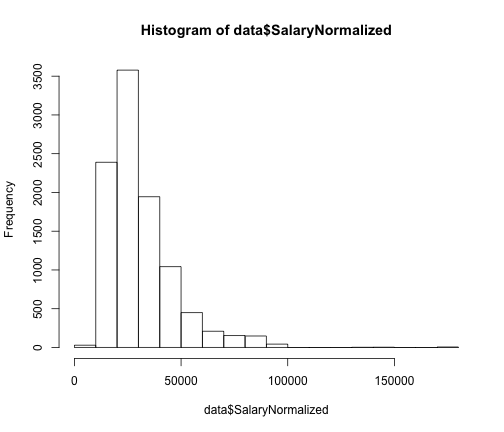

Homework 2
========================================================

[Assignment Details](https://github.com/arahuja/GADS4/wiki/Regression-Assignment)


```r
setwd("~/Documents/GeneralAssembly/GADS4/hw2/")
```


```r
trainfull_10k <- read.csv("~/Documents/GeneralAssembly/arun/GADS4/data/kaggle_salary/train.csv")
str(trainfull_10k)
```

```
## 'data.frame':	10000 obs. of  12 variables:
##  $ Id                : int  12612628 12612830 12612844 12613049 12613647 13179816 14131336 14663196 14663197 15395797 ...
##  $ Title             : Factor w/ 8274 levels ""," CHEF DE PARTIE  **** RED STAR  **** ROSETTE KITCHEN  **** to ****",..: 2298 7464 4177 2299 4903 2300 6854 5431 5421 7478 ...
##  $ FullDescription   : Factor w/ 9940 levels " A prestigious Broker has an opportunity for an experienced Commercial Insurance professional to work closely with some of its "| __truncated__,..: 2687 8354 4668 2686 6214 2688 237 8962 8994 448 ...
##  $ LocationRaw       : Factor w/ 2399 levels "Abbots Langley",..: 695 895 968 2061 2061 696 15 1379 1216 18 ...
##  $ LocationNormalized: Factor w/ 899 levels "Abbots Langley",..: 251 330 353 761 761 251 809 501 447 3 ...
##  $ ContractType      : Factor w/ 3 levels "","full_time",..: 1 1 1 1 1 1 1 1 1 1 ...
##  $ ContractTime      : Factor w/ 3 levels "","contract",..: 3 3 3 3 3 3 3 3 3 3 ...
##  $ Company           : Factor w/ 1198 levels "","1 1 Recruitment Limited",..: 478 478 478 478 478 478 542 265 265 542 ...
##  $ Category          : Factor w/ 28 levels "Accounting & Finance Jobs",..: 9 9 9 9 9 9 9 13 13 9 ...
##  $ SalaryRaw         : Factor w/ 5780 levels " 20 - 25k Basic,  70 - 75K OTE+++",..: 1368 2028 1386 2005 1368 1372 3478 1101 1105 3980 ...
##  $ SalaryNormalized  : int  25000 30000 30000 27500 25000 25000 75000 22000 23000 85000 ...
##  $ SourceName        : Factor w/ 74 levels "accountancyagejobs.com",..: 9 9 9 9 9 9 9 9 9 9 ...
```


Taken from [kaggle site](http://www.kaggle.com/c/job-salary-prediction/data).
* ID - key of the row, should be unique
* Title - Title of the job ad
* FullDescription - body of job add. Numerics have been replaced by astericks to
remove salary info, may have removed other numbers.
* LocationRaw - Location of job
* LocationNormalized - Adzuna's interpretaion of the location
* ContractType - Full time (2978), part time(578), or blank (6444)
* ContractTime - contract (605), permanent(4132), or blank (5263)
* Company - employer name
* Category - 30 standard jobs as defined by adzuna
* SalaryRaw - text of salary from employer 
* SalaryNormalized - value of salary - *Predict this*
* SourceName - website where job was advertised

We're prdiciting SalaryNormalized, so let's check it out a little:

```r
summary(trainfull_10k$SalaryNormalized)
```

```
##    Min. 1st Qu.  Median    Mean 3rd Qu.    Max. 
##    5180   20600   27500   31500   37500  173000
```

```r
hist(trainfull_10k$SalaryNormalized)
```

 

```r
hist(log(trainfull_10k$SalaryNormalized))
```

 

SalaryNormalized is pretty skewed, but log(SalaryNormalized) looks pretty
gaussian, so let's predict that instead

```r
trainfull_10k$LogSalary <- log(trainfull_10k$SalaryNormalized)
```


### Problem 1: Split the data into training and test sets.

I'll do 90/10 train/validate


```r
m = length(trainfull_10k[, 1])  # number of rows
validate_indx <- sample.int(m, size = floor(0.1 * m))
validate <- trainfull_10k[validate_indx, ]
train <- trainfull_10k[-validate_indx, ]
```


### Problem 2: Build a simple linear regression using the available categorical variables.

Before doing the regression, let's define a coupe functions to make life cleaner:


```r

mae <- function(values, predictions) {
    return(mean(abs(values - predictions), na.rm = T))
}
```


Without some text parsing, title, full description, and LocationRaw are useless.
Company has 10% the number of values as we have jobs, and using the raw company name seems limiting. You could probably do something fun with classifying the employer by name, but that's for another time (and category probably already includes some of that information)
ContractTime and ContractType worry me since over half of the jobs have blanks for these fields, but there is some additional info for some of the listings.
Category, LocationNormalized, and SourceName look like the best places to start, even if category and LocationNormalized have Adzuna's intrepretation built in.


```r
model <- lm(LogSalary ~ Category + LocationNormalized + SourceName, data = train)
summary(model)$r.squared
```

```
## [1] 0.4052
```

```r
trainPredictions <- exp(predict(model, train))
mae(train$SalaryNormalized, trainPredictions)
```

```
## [1] 8533
```

```r
testPredictions <- exp(predict(model, validate))
```

```
## Error: factor LocationNormalized has new levels Alfreton, Ashington,
## Bacup, Ballymena, Barnwood, Clayton, Cowley, Crewkerne, Cullompton,
## Culmhead, Dymock, Faringdon, Friern Barnet, Hartlepool, Looe, Louth,
## Market Harborough, Matlock, Radstock, Rushden, Shipton-Under-Wychwood,
## Silsden, Southend, Tavistock, Thame, Thorpe St. Andrew, Titchfield,
## Wareham, Westminster, Wishaw
```

```r
mae(validate$SalaryNormalized, testPredictions)
```

```
## Error: object 'testPredictions' not found
```

This regression takes too long on the 10k set, and LocationNormalized has too
many levels (there are locations in the test set that don't appear in the traing set.) Let's ditch LocationNormalized for now and go back to just Category and
just SourceName


```r
model <- lm(LogSalary ~ Category, data = train)
summary(model)$r.squared
```

```
## [1] 0.1849
```

```r

trainPredictions <- exp(predict(model, train))
mae(train$SalaryNormalized, trainPredictions)
```

```
## [1] 10174
```

```r

testPredictions <- exp(predict(model, validate))
mae(validate$SalaryNormalized, testPredictions)
```

```
## [1] 9903
```


The category factors alone are significant, but don't explain much of the variance, hence the low R squared and the relatively high MAE for both the training and test sets. Now just SourceName:


```r
model <- lm(LogSalary ~ SourceName, data = train)
summary(model)$r.squared
```

```
## [1] 0.2218
```

```r

trainPredictions <- exp(predict(model, train))
mae(train$SalaryNormalized, trainPredictions)
```

```
## [1] 9839
```

```r

newValidate <- validate
newValidate$SourceName[!(validate$SourceName %in% train$SourceName)] <- NA
testPredictions <- exp(predict(model, newValidate))
mae(validate$SalaryNormalized, testPredictions)
```

```
## [1] 9934
```

The test set has some SourceName that aren't in the training set, blerg.
I set those to NA and had predict ignore them, and mae() ignores NA as well.

So SourceName does marginally better than Category, but has issues with
having enough data in each category. This could improve with more data.

Let's check out ContractType and ContractTime


```r
model <- lm(LogSalary ~ ContractType + ContractTime, data = train)
summary(model)$r.squared
```

```
## [1] 0.103
```

```r

trainPredictions <- exp(predict(model, train))
mae(train$SalaryNormalized, trainPredictions)
```

```
## [1] 10600
```

```r

testPredictions <- exp(predict(model, validate))
mae(validate$SalaryNormalized, testPredictions)
```

```
## [1] 10246
```


These are crap for R squared, but the coefficients are significant, so may be
worth including with category. Soooo, let's see what we have with 
category and contracttime/type


```r
model <- lm(LogSalary ~ Category + ContractType + ContractTime, data = train)
summary(model)$r.squared
```

```
## [1] 0.2401
```

```r

trainPredictions <- exp(predict(model, train))
mae(train$SalaryNormalized, trainPredictions)
```

```
## [1] 9791
```

```r

testPredictions <- exp(predict(model, validate))
mae(validate$SalaryNormalized, testPredictions)
```

```
## [1] 9604
```

Getting better, but 10k mean absolute error is pretty crap when the mean is 30k.
Last attempt for This problem: Category, ContractType/Time, and SourceName, and we'll ignore the mismatched SourceNames for now.


```r
model <- lm(LogSalary ~ SourceName + Category + ContractTime + ContractTime, 
    data = train)
summary(model)$r.squared
```

```
## [1] 0.266
```

```r

trainPredictions <- exp(predict(model, train))
mae(train$SalaryNormalized, trainPredictions)
```

```
## [1] 9588
```

```r

newValidate <- validate
newValidate$SourceName[!(validate$SourceName %in% train$SourceName)] <- NA
testPredictions <- exp(predict(model, newValidate))
mae(validate$SalaryNormalized, testPredictions)
```

```
## [1] 9649
```

Well, this one has the best R-Squared of the fast models, 
and the training and test MAEs
are the lowest, but they still aren't impressive.

I just re-read the instructions and realize I forgot to try interaction terms.
Here it goes


```r
model <- lm(LogSalary ~ SourceName + Category + ContractTime + ContractTime + 
    Category:ContractTime + Category:ContractType + ContractType:ContractTime, 
    data = train)
summary(model)$r.squared
```

```
## [1] 0.3283
```

```r

trainPredictions <- exp(predict(model, train))
```

```
## Warning: prediction from a rank-deficient fit may be misleading
```

```r
mae(train$SalaryNormalized, trainPredictions)
```

```
## [1] 9134
```

```r

newValidate <- validate
newValidate$SourceName[!(validate$SourceName %in% train$SourceName)] <- NA
testPredictions <- exp(predict(model, newValidate))
```

```
## Warning: prediction from a rank-deficient fit may be misleading
```

```r
mae(validate$SalaryNormalized, testPredictions)
```

```
## [1] 9352
```

The R-Squared is better, and the training MAE is as well, but the test set MAE isn't significantly better, maybe this is approaching ooverfitting? There are plenty of Category:ContractType and Category:ContractTime that are missing in the training set. This model might be best attempted with a larger training set. I'll try a larger set before submitting the final predicitons.

### Problem 3: Install DAAG
Try out cv.lm to see about improving the models


